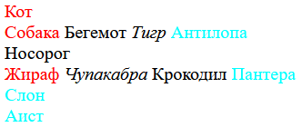
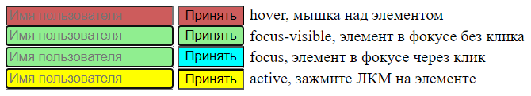

# Псевдоклассы

Псевдоклассы - это подвид селекторов. Они позволяют нам обратиться к элементам, удовлетворяющим некоторым условиям.

Синтаксис `:псевдокласс`, можно комбинировать с другими селекторами. Например, `p:first-child`.

# Псевдоклассы структурные

Группа псевдоклассов, которые выбирают элементы на основании их положения в разметке.

## -child

### :first-child, :last-child

`:first-child` позволяет выбрать первый вложенный элемент. `:last-child` - последний вложенный элемент. 



```html
<div>
  <span>Кот</span>
  <div>
    <span>Собака</span>
    <span>Бегемот</span>
    <i>Тигр</i>
    <span>Антилопа</span>
  </div>
  <span>Носорог</span>
  <div>
    <span>Жираф</span>
    <i>Чупакабра</i>
    <span>Крокодил</span>
    <span>Пантера</span>
  </div>
  <div>
    <span>Слон</span>
  </div>
  <span>Аист</span>
</div>
```

```css
span:first-child {
  color: red;
}

span:last-child {
  color: aqua;
}
```

Кот красный, потому что он идет первым в body. Аист голубой - потому что он последний в body. Аналогично с Собакой + Антилопой и Жирафом + Пантерой - они первые и последние в своих div. Интересный момент со Слоном - он в своем div единственный, т.е. как бы одновременно и первый, и последний. В данном случае он голубой, потому что правило last-child идет в стилях ниже, значит оно более специфичное и перекрывает first-child. Если их поменять местами, то Слон станет красным.

### :nth-child, :nth-last-child

Как понятно из названия, `:nth-child(2)` позволяет выбрать n-ный элемент от начала. `nth-last-child(2)` - n-ный от конца. Они принимают следующее:

* Число - выбирает конкретный элемент, например, второй `:nth-child(2)`
* `odd` - выбирает нечетные элементы `:nth-child(odd)`
* `even` - выбирает четные элементы `:nth-child(even)`
* `n` - формула. Просто `n` выберет все элементы, `2n` - 2, 4, 6. `2n +1` - 3, 5, 6 и т.д.
* `-n` - не выбирать ничего. Является трюком, использовать можно так: если надо выбрать четыре первых элемента, пишем `:nth-child(-n + 4)`. Если четыре последних `:nth-last-child(-n + 4)`.

Онлайн-тренажер для этого селектора: https://nth-child.belter.io/

```html
<ol>
  <li>Кот</li>
  <li>Собака</li>
  <li>Бегемот</li>
  <li>Антилопа</li>
  <li>Носорог</li>
  <li>Капибара</li>
  <li>Манул</li>
</ol>
```

```css
li:nth-child(2n+1) {
  color: red;
}
```

### :only-child

`:only-child` выбирает элемент, если он единственный у своего родителя.

```html
<div>
  <ol>
    <li>Кот</li>  <!-- Выберется -->
  </ol>
  <div>
    <span>Собака</span>  <!-- Выберется -->
  </div>
</div>
```

```css
:only-child {
  color: red;
}
```

## :root

`:root` этот псевдокласс находит корневой элемент документа. По сути, аналогичен использованию селектора по тегу `html`, однако у root выше специфичность.

```css
:root {  /* Аналогично html */
  color: red;
}
```

# :not

`:not(селектор)` позволяет выбрать "инверсию" указанного селектора. Например, `:not(:last-child)` выберет все, кроме последнего. `:not(.foobar)` выберет элементы, у которых нет класса foobar.

```html
<div>
  <p>Кошка</p>   <!-- Выберется -->
  <p>Собака</p>  <!-- Выберется -->
  <p>Сова</p>    <!-- Выберется -->
  <p>Бурундук</p>
</div>
```

```css
p:not(:last-child) {
  color: red;
}
```

Реальный пример использования: есть блок с подсказкой, который надо показать, если элемент активен и скрывать, если не активен. Как делать без `:not`

```html
<div class="tooltip">
    Здесь находится подсказка к элементу. Если элемент не активен, подсказку не видно.
</div>
```

```css
/* Вариант прямолинейный */
.tooltip {
  display: none;
}

.tooltip.is-active {
  display: block;
}
```

```css
/* Вариант симпатичный */
.tooltip:not(.is-active) {
    display: none;
}
```

# Псевдоклассы состояний

## :hover

`:hover` срабатывает, когда курсор мыши находится над элементом.

```css
button:hover {
  background-color: aqua;
}
```

## :focus

("тупой" фокусе) `:focus` срабатывает, когда элемент получает фокус. Щелчком мыши или переходом через Tab или еще как-то - не важно.

"Тупость" этого фокуса в том, что прописанный в нем стиль будет работать все время, пока элемент в фокусе, хотя иногда это мешает. Например, в случае с кнопкой. При щелчке мышкой по кнопке она получит фокус и получится эффект залипшей кнопки, будто она все время нажата. Поэтому этот селектор с кнопками лучше не использовать.

```css
button:focus {
  background-color: aqua;
}
```

## :focus-visible

("умный" фокус) `:focus-visible` то же самое, что и focus, но с той разницей, что браузер анализирует, что за элемент находится в фокусе и может отключать визуальный эффект, когда это выгодно. На примере с кнопкой, при щелчке эффект от focus-visible не сработает и кнопка будет в своем обычном виде. Но если на кнопку перейти через Tab, то тогда эффект применится. Таким образом мы понимаем, что кнопка в фокусе, но не была нажата.

```css
button:focus-visible {
  background-color: aqua;
}
```

## :active

`:active` срабатывает, когда на элемент щелкают ЛКМ. Срабатывает только в момент щелчка и сразу отменяется. Если удерживать ЛКМ, то отменится только в момент отпускания кнопки.

## Пример на :hover, :focus, :focus-visible, :active

Особенно ценно для понимания как работает фокус на кнопках.



```html
<div>
  <div>
    <input placeholder="Имя пользователя" class="st"/>
    <button class="st">Принять</button>
    hover, мышка над элементом
  </div>
  <div>
    <input placeholder="Имя пользователя" class="st"/>
    <button class="st">Принять</button>
    focus, элемент в фокусе без клика
  </div>
  <div>
    <input placeholder="Имя пользователя" class="st"/>
    <button class="st">Принять</button> 
    focus-visible, элемент в фокусе через клик
  </div>
  <div>
    <input placeholder="Имя пользователя" class="st"/>
    <button class="st">Принять</button> 
    active, зажмите ЛКМ на элементе
  </div>
</div>
```

```css
.st:hover {
  background-color: indianred;
}

.st:focus {  /* Визуально кнопка "залипнет" */
  background-color: aqua;
}

.st:focus-visible {
  background-color: lightgreen;
}

.st:active {
  background-color: yellow;
}
```

## :disabled

`:disabled` срабатывает на элементы, которые находятся в disabled-состоянии.

```html
<div>
  <input placeholder="Имя пользователя" disabled/>
  <button disabled>Принять</button>
</div>
```

```css
:disabled {
  background-color: indianred;
}
```

## :checked

`:checked` актуально только для чекбоксов и радиокнопок. Срабатывает, когда переключалка включена. Большую часть свойств для переключалок заменять нельзя, поэтому обычно кастомные переключалки делаются хитро. Но просто для демонстрации, что checked работает, можно например накинуть тень на переключалку.

```css
:checked {
  box-shadow: 5px 5px 0 20px greenyellow;
}
```

```html
<div>
  <input type="checkbox" id="agree" />
  <label for="agree">Я согласен с условиями</label>
  <fieldset>
    <legend>Ваш пол</legend>
    <p>
      <input type="radio" id="mal" name="gender" value="male" />
      <label for="mal">Муж.</label>
    </p>
    <p>
      <input type="radio" id="fem" name="gender" value="female" />
      <label for="fem">Жен.</label>
    </p>
  </fieldset>
</div>
```

# Кастомный чекбокс

TODO: Возможно стоит перенести этот пример в отдельный конспект с примерами, например "Кастомные чекбоксы", чтобы проще было найти.

Статья про то, как можно прятать элементы: https://htmlacademy.ru/blog/css/short-12

```html
<div>
  <label class="checkbox-emulator">
    <input
      class="checkbox-native visually-hidden"
      id="checkbox-1"
      type="checkbox"
    />
    <span class="checkbox-emulator-box"></span>
    <span class="checkbox-emulator-label">Эмулятор чекбокса</span>
  </label>
</div>
```

```css
.visually-hidden {  /* .visually-hidden правило взято из статьи, скрывает нативный чекбокс */
  position: absolute;
  width: 1px;
  height: 1px;
  margin: -1px;
  border: 0;
  padding: 0;
  white-space: nowrap;
  clip-path: inset(100%);
  clip: rect(0 0 0 0);
  overflow: hidden;
}

.checkbox-emulator {  /* Метка, внутри которой нативный чекбокс и визуальные эмуляторы */
  display: inline-flex;
  column-gap: 0.5em;
  user-select: none;
}

.checkbox-native:not(:checked) + .checkbox-emulator-box::after {  /* [a] */
  display: none;
}

.checkbox-emulator-box {
  display: inline-flex;     /* Эти три свойства, чтобы центрировать */
  justify-content: center;  /* галочку внутри чекбокса */
  align-items: center;
  width: 1em;
  height: 1em;
  border: 2px solid lightskyblue;
  border-radius: 5px;
  background-color: paleturquoise;
}

.checkbox-emulator-box::after {
  content: "×";
  color: green;
}
```

Замечания:

* Элементы в разметке должны идти именно в таком порядке, как идут. Сначала нативный чекбокс, потом спан, эмулирующий квадрат, иначе стиль `[a]` работать не будет, потому что селектор + срабатывает если правый элемент идет сразу после левого.
* На самом деле не понятно, почему фейк-чекбокс включается при щелчке на любую его часть. Я понимаю, что мы скрыли нативный чекбокс только визуально, и вероятно это не влияет на способность щелкнуть по нему. Но ведь на нем нету ни метки, ничего, он крошечный. Плюс не связан никак с визуальным эмулятором. Почему тогда такое поведение? Разобраться позже, когда буду смотреть и другие способы создать кастомные чекбоксы.

