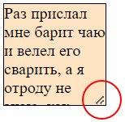

# cursor

```css
cursor: auto;  /* По умолчанию */
```

Свойство можно задать любому элементу в разметке и при наведении мыши на него курсор изменится. Возможных значений очень много, вот некоторые:

* `auto` - по умолчанию. Браузер сам определяет курсоры для разных элементов вроде ссылок, текстовых полей и т.д.
* `help`
* `wait`
* `zoom-in`, `zoom-out`

# pointer-events

```css
pointer-events: auto;  /* По умолчанию */
```

Определяет, может ли пользователь нажимать на элемент. Возможных значений всего два:

* `auto` - по умолчанию. Нажимать на элемент можно.
* `none` - нажимать на элемент нельзя.

Характеристики:

* Свойство наследуемое. Если у контейнера стоит none, то на вложенные в него элементы тоже нельзя нажимать. Однако на этот случай свойство можно переопределить у вложенных элементов.

# resize

```css
resize: none;  /* По умолчанию */
```

Определяет, можно ли изменять размер элемента, используя угловой якорь.



Возможные значения:

* `none` - по умолчанию. Изменять размер нельзя.
* `both` - можно менять размер по обеим осям.
* `horizontal` - можно менять размер по горизонтали.
* `vertical` - можно менять размер по вертикали.

Характеристики:

* Можно задать `resize` любому элементу, но только в комбинации с нестандартным значением для `overflow`, например hidden.

# user-select

```css
user-select: auto;  /* По умолчанию */
```

Определяет, можно ли выделить текст внутри элемента.

Возможные значения:

* `auto` - текст выделить можно
* `none` - текст выделить нельзя. По умолчанию в кнопках текст выделить можно, кстати говоря.
* Другие непопулярные значения.

# scroll-behavior

```css
scroll-behavior: auto;  /* По умолчанию */
```

Определяет, будет ли прокрутка плавной или мгновенной. Относится к программной прокрутке и к прокрутке, когда пользователь щелкает якорную ссылку.

Возможные значения:

* `auto` - прокрутка моментальная ("резкая").
* `smooth` - прокрутка плавная. Страница крутится до нужного места плавно, будто ее крутят вручную.