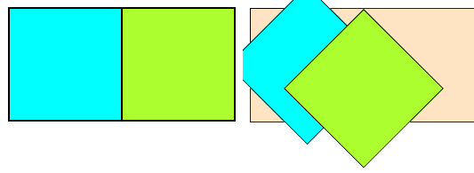

# transform

## Зачем нужно

```css
transform: none;  /* По умолчанию */
```

Отвечает за трансформации вроде смещения, масштабирования, поворота. В качестве значений свойство принимает функции, реализующие нужную трансформацию.

Трансформация исключительно визуальная. Элемент остается в потоке документа на своем месте и характер его взаимодействия с окружающими элементами не меняется.

Можно применять сразу несколько функций трансформации, описанных дальше. Например:

```css
transform: translateX(50px) rotate(45deg);
```

Для основных функций трансформации (translate, scale, rotate) есть отдельные соответствующие свойства для краткости.

## Значения

### translate

Смещает элемент по оси x и y.

```css
transform: translateX(50px);
transform: translateY(-100px);
transform: translate(50px, -100px);  /* x, y */
```

Или сокращенный синтаксис, через отдельное свойство:

```css
/*          x     y  */
translate: 30px;        /* Только x */
translate: 30px  50px;  /* x + y */
translate: 0     50px;  /* Только y */
```

Характеристики:

* Значение может быть положительным или отрицательным.
* Единицы измерения - любые (пиксели, проценты и т.д.)

### scale

Увеличивает или уменьшает элемент по оси x и y.

```css
transform: scaleX(1);
transform: scaleY(-2);
transform: scale(2, 1.5);  /* x, y */
```

Или сокращенный синтаксис, через отдельное свойство:

```css
/*     x   y  */
scale: 2;      /* x + y одинаковые */
scale: 1   2;  /* x + y разные     */
```

Характеристики:

* Значение может быть:
  * Положительным - увеличивает или уменьшает элемент.
    * Значение 1 означает, что элемент не масштабирован. Все, что больше единицы - увеличивает элемент. Все, что меньше - уменьшает. 0 делает элемент по сути невидимым, т.к. сжимает его до максимума.
  * Отрицательным - зеркатит элемент по заданной оси. -1 просто зеркатит, -2 и т.д. зеркалит и масштабирует.
* Единицы измерения нет, значение - просто цифра, коэффициент масштабирования.

### rotate

Вращает элемент по или против часовой стрелки.

```css
transform: rotate(0deg);
```

Или сокращенный синтаксис, через отдельное свойство:

```css
rotate: 45deg;
```

Характеристики:

* Единицы измерения:
  * `deg` - градусы.
  * `rad` - радианы.
  * `turn` - todo
* Положительное число вращает по часовой стрелке, отрицательное - против.

### skew

Искажает элемент по оси x или y.

```css
transform: skewX(45deg);
transform: skewY(-45deg);
transform: skew(45deg, -45deg);
```

Отдельного свойства не имеет.

## transform-origin

```css
transform-origin: 50% 50%;  /* По умолчанию */
```

Определяет точку, от которой происходит трансформация. По умолчанию она находится в центре элемента. Отличия в ее смещении проще понять на наглядном примере: у голубого квадрата ориджин в центре, а у зеленого - в левом верхнем углу. Оба квадрата повернуты на 45 градусов:



```html
<body>
  <div class="fc">
    <div class="fe fe-1"></div>
    <div class="fe fe-2"></div>
  </div>
</body>
```

```css
.fc {
  display: inline-flex;
  background-color: bisque;
  border: 1px solid black;
}

.fe-1 {
  background-color: aqua;
  border: 1px solid black;
  width: 100px;
  height: 100px;
  transform-origin: 50% 50%;  /* Дефолт */
  rotate: 45deg;
}

.fe-2 {
  background-color: greenyellow;
  border: 1px solid black;
  width: 100px;
  height: 100px;
  transform-origin: 0 0;  /* Левый верхний угол */
  rotate: 45deg;
}
```

# transition

## Зачем нужно

По умолчанию все трансформации происходят мгновенно. Например, если повесить какую-то трансформацию при наведении на элемент, то он сразу примет результирующий вид. `transition` позволяет осуществить переход в конечный вид постепенно, получается как бы анимация.

## Как правильно реализовать

transition нужно задавать в селекторе, который описывает элемент в обычном состоянии. А эффекты, которые надо применить, например, при наведении, уже в селекторе наведения:

```html
<body>
  <div class="foobar"></div>
</body>
```

```css
.foobar {
  background-color: indianred;
  border: 2px solid black;
  width: 100px;
  height: 100px;
  transition: all 0.5s ease 0s;  /* Настройки перехода */
}

.foobar:hover {  /* Эффекты при наведении */
  translate: 50px;  
  rotate: 45deg;
}
```

В этом случае после ухода наведения с элемента он вернется в исходное состояние тоже плавно. Если же разместить в данном примере transition в `.foobar:hover`, то при уходе наведения элемент вернется в исходное состояние мгновенно, рывком.

## С чем работает

transition работает не только с эффектами трансформации, но и вообще с любыми свойствами - размер, цвет и т.д.

## Формат

Объединенное свойство:

```css
transition: all 0s ease 0s;  /* По умолчанию */
```

Свойства по отдельности, соответственно:

```css
transition-property: all;
transition-duration: 0s;
transition-timing-function: ease;
transition-delay: 0s;
```

В transition-property можно указать любое свойство, а может быть даже как-то несколько свойств. В общем суть в том, что указанные настройки перехода из начального состояния в конечное будут работать только на свойство, указанное в transition-property.

### transition-timing-function

Есть несколько встроенных функций:

* ease, ease-in, ease-out, ease-in-out
* linear
* cubic-bezier ([онлайн генератор](https://tools.webdevpuneet.com/css-easing-generator/) сложных функций)

