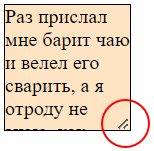

# resize

```css
resize: none;  /* По умолчанию */
```

Определяет, можно ли изменять размер элемента, используя угловой якорь.



Возможные значения:

* `none` - по умолчанию. Изменять размер нельзя.
* `both` - можно менять размер по обеим осям.
* `horizontal` - можно менять размер по горизонтали.
* `vertical` - можно менять размер по вертикали.

Характеристики:

* Можно задать `resize` любому элементу, но только в комбинации с нестандартным значением для `overflow`, например hidden.

