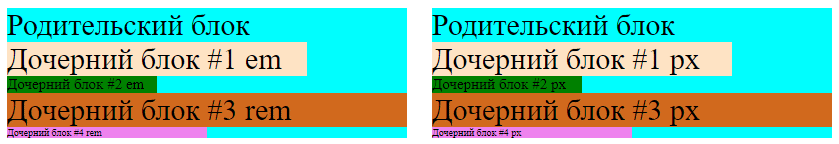

# Относительные

Относительные единицы измерения рассчитываются относительно чего-либо. Например, от текущего размера окна браузера или от размера шрифта.

# Относительно родителя (%, проценты)

Характеристики:

* Считаются от размера родительского элемента.
* Для высоты проценты работают только в том случае, если у родителя явно задана высота.
* У absolute-элементов (см. конспект про позиционирование) высота в процентах будет считаться относительно первого не-static родителя.

TODO: есть какие-то нюансы для некоторых свойств, вроде margin и т.д. Дописать, когда пригодится.

# Относительно шрифта (em и rem)

Единицы `em` и `rem`  задают размеры относительно размера шрифта. Эти единицы можно применять не только для указания размера шрифта, но и для размера ширины, высоты элементов. Например, в браузерах по умолчанию размер шрифта 16px. Значит, если какому-нибудь элементу задать ширину `1rem`, то получится 16px, если `2em` - 32px, `0.5em` - 8px и т.д.

em и rem отличаются только тем, относительно размера какого именно шрифта ведется отсчет.

* Когда em и rem используются для задания размера шрифта:
  * Для `em` опорой является размер шрифта непосредственного родителя.
  * Для `rem` опорой является размер шрифта из тега html.
* Когда em и rem используются для задания размера не шрифта, а размера самого элемента (например, ширины), то есть две особенности:
  * `em` рассчитывается относительно размера шрифта самого элемента.
  * `rem` рассчитывается относительно размера шрифта html.

Для большей наглядности рассмотрим пример:



Здесь для первого блока размеры шрифта и ширина заданы в em и rem, с комментариями о том, как производятся расчеты. А во втором блоке размеры заданы напрямую в px, чтобы убедиться, что расчеты правильные.

```html
<body>
  <div class="outer-em">
    Родительский блок
    <div class="inner-1-em">Дочерний блок #1 em</div>
    <div class="inner-2-em">Дочерний блок #2 em</div>
    <div class="inner-3-rem">Дочерний блок #3 rem</div>
    <div class="inner-4-rem">Дочерний блок #4 rem</div>
  </div>
  <div class="outer-px">
    Родительский блок
    <div class="inner-1-px">Дочерний блок #1 px</div>
    <div class="inner-2-px">Дочерний блок #2 px</div>
    <div class="inner-3-px">Дочерний блок #3 px</div>
    <div class="inner-4-px">Дочерний блок #4 px</div>
  </div>
</body>
```

```css
body {
  display: flex;
  column-gap: 20px;
}

html {
  font-size: 16px;  /* Опорный размер шрифта находится в теге html, обычно браузеры ставят его в 16px */
}

/* Первый блок, размеры через em и rem. */

.outer-em {
  font-size: 1.5em;  /* 24px (16px * 1.5), расчет относительно родительского размера шрифта. */
  background-color: aqua;
}

  .inner-1-em {
    /* font-size не указан, значит наследуется от непосредственного родителя (outer-em) - 24px. */
    width: 10em;  /* 240px (24px * 10), у em расчет относительно СОБСТВЕННОГО размера шрифта, а он унаследовался, 24px. */
    background-color: bisque;
  }

  .inner-2-em {
    font-size: 0.5em;  /* 12px (24px * 0.5), расчет относительно родительского размера шрифта. */
    width: 10em;  /* 120px (12px * 10), у em расчет относительно СОБСТВЕННОГО размера шрифта, а он рассчитался как 12px. */
    background-color: green;
  }

  .inner-3-rem {
    /* font-size не указан, значит наследуется от родителя (outer-em), 24px. */
    width: 20rem;  /* 320px (16px * 20), у rem размер собственного шрифта НЕ учитывается, рассчет от шрифта html. */
    background-color: chocolate;
  }

  .inner-4-rem {
    font-size: 0.5rem;  /* 8px (16px * 0.5), расчет относительно шрифта из html. */
    width: 10rem;  /* 160px (16 * 10), размер собственного шрифта НЕ учитывается, рассчет от шрифта html. */
    background-color: violet;
  }

/* Второй блок, размеры через px.
   Здесь я явно ставлю размеры в пикселях, рассчитанные вручную, чтобы показать,
   что описанные выше формулы действительно работают так, как написано. */

.outer-px {
  font-size: 24px;
  background-color: aqua;
}

  .inner-1-px {
    width: 240px;
    background-color: bisque;
  }

  .inner-2-px {
    width: 120px;
    font-size: 12px;
    background-color: green;
  }

  .inner-3-px {
    width: 320px;
    font-size: 24px;
    background-color: chocolate;
  }

  .inner-4-px {
    width: 160px;
    font-size: 8px;
    background-color: violet;
  }
```


# Относительно вьюпорта (vw, vh)

Характеристики:

* `v` означает viewport, или проще говоря, текущий размер окна браузера. `w` и `h` очевидно width и height.
* 1 единица означает 1% от размера окна.

```html
<body>
  <nav class="menu">
    Боковое меню
  </nav>
</body>
```

```css
.menu {
  position: fixed;
  top: 0;
  right: 0;
  background-color: bisque;
  height: 100vh;
}
```


