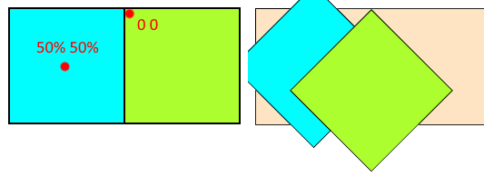

# Разметка для примеров

```html
<body>
  <div class="container">
    <div class="item change">?</div>
  </div>
</body>
```

```css
.container {
  display: flex;
  justify-content: center;
  align-items: center;
  width: 100px;
  height: 50px;
  border: 1px solid black;
}

.item {
  display: flex;
  justify-content: center;
  align-items: center;
  width: 25px;
  height: 25px;
  background-color: lightgreen;
  border: 1px solid black;
  font-size: 2rem;
}

.change {
}
```

# Трансформация

К трансформациям относится:

* Увеличение \ уменьшение.
* Смещение по X и Y.
* Поворот.
* Наклон.

Сами по себе трансформации не являются анимированными. Они просто позволяют изменить положение \ геометрию элемента.

## Смещение, translate

```css
translate: 30px;       /* Только x (именно только x, а не x + y одновременно) */
translate: 30px 50px;  /* x + y */
translate: 0    50px;  /* Только y */
```

Свойство `translate` позволяет сместить элемент относительно его исходного положения.

* Значение может быть положительным или отрицательным.
* Единицы измерения - любые (пиксели, проценты и т.д.)


## Увеличение \ уменьшение, scale

```css
scale: 2;    /* x + y одинаковые */
scale: 1 2;  /* x + y разные     */
```

Свойство `scale` позволяет изменять размер элемента, указывая коэффициент масштабирования.

* Значение может быть:
  * Положительным - увеличивает или уменьшает элемент по заданной оси.
    * Значение 1 означает, что элемент не масштабирован. Все, что больше единицы - увеличивает элемент. Все, что меньше - уменьшает. 0 делает элемент по сути невидимым.
  * Отрицательным - зеркатит элемент по заданной оси. -1 просто зеркатит, -2 и т.д. зеркалит и масштабирует.
* Единицы измерения нет, значение - просто цифра, коэффициент масштабирования.


## Вращение, rotate

```css
rotate: 45deg;
```

Свойство `rotate` поворачивает элемент по / против часовой стрелки.

* Единицы измерения:
  * `deg` - обычные градусы.
  * `rad` - радианы.
  * `turn` - "повороты", 1 поворот - это 360 градусов. 0.5turn это 180 градусов и т.д.
* Положительное число вращает по часовой стрелке, отрицательное - против.


## Наклон, skew

Наклон не имеет отдельного свойства, его можно выполнить только через свойство `transform: skew()`.

```css
transform: skewX(45deg);
transform: skewY(-45deg);

transform: skew(45deg);          /* Только для x */
transform: skew(45deg, -45deg);  /* Для x + y */
```


Трюк: вместе с блоком наклоняется и содержимое. Можно поместить содержимое в дополнительный блок и ему выставить наклон в другую сторону, тогда получится, что содержимое визуально не наклонено.

## Общее свойство, transform

```css
transform: none;  /* Дефолт */
```

Для трансформаций существует обобщенное свойство `transform`. Трансформация исключительно визуальная. Элемент остается в потоке документа на своем месте и характер его взаимодействия с окружающими элементами не меняется.

### Отдельные трансформации

У transform есть отдельные значения-функции для каждой рассмотренной трансформации:

```css
/* Смещение */
transform: translateX(50px);
transform: translateY(50px);
transform: translate(50px, 50px);
```

```css
/* Увеличение / уменьшение */
transform: scaleX(1);
transform: scaleY(-2);
transform: scale(2, 1.5);
```

```css
/* Вращение */
transform: rotate(45deg);
```

```css
/* Наклон */
transform: skewX(45deg);
transform: skewY(-45deg);
transform: skew(45deg, -45deg);
```

### Несколько трансформаций одновременно

Через transform мы можем задать сразу несколько трансформаций разом (запятая между ними *не нужна*):

```css
transform: translate(25px) rotate(45deg) scale(1.25);
```

## Ориджин трансформации, transform-origin

```css
transform-origin: 50% 50%;  /* По умолчанию */
```

Определяет точку, от которой происходит трансформация. По умолчанию она находится в центре элемента. Отличия в ее смещении проще понять на наглядном примере: у голубого квадрата ориджин в центре, а у зеленого - в левом верхнем углу. Оба квадрата повернуты на 45 градусов:



```html
<body>
  <div class="fc">
    <div class="fe fe-1"></div>
    <div class="fe fe-2"></div>
  </div>
</body>
```

```css
.fc {
  display: inline-flex;
  background-color: bisque;
  border: 1px solid black;
}

.fe-1 {
  background-color: aqua;
  border: 1px solid black;
  width: 100px;
  height: 100px;
  transform-origin: 50% 50%;  /* Дефолт */
  rotate: 45deg;
}

.fe-2 {
  background-color: greenyellow;
  border: 1px solid black;
  width: 100px;
  height: 100px;
  transform-origin: 0 0;  /* Левый верхний угол */
  rotate: 45deg;
}
```

# Переход, transition

## Зачем нужно

По умолчанию все трансформации происходят мгновенно. Например, если повесить какую-то трансформацию при наведении на элемент, то он сразу примет результирующий вид. `transition` позволяет осуществить переход в конечный вид постепенно, получается как бы анимация.

## Как правильно реализовать

transition нужно писать в самом элементе. Когда его свойства будут меняться (например, если мы напишем отдельные стили при наведении на элемент), то браузер выполнит переход от исходных значений этих свойств до новых в соответствии с правилами в transition:

```html
<body>
  <div class="foobar"></div>
</body>
```

```css
.foobar {
  background-color: indianred;
  border: 2px solid black;
  width: 100px;
  height: 100px;
  transition: all 0.5s ease 0s;  /* Настройки перехода пишем в исходном селекторе */
}

.foobar:hover {  /* Эффекты для наведения */
  translate: 50px;  
  rotate: 45deg;
}
```

В этом случае после ухода наведения с элемента он вернется в исходное состояние тоже плавно, т.к. transform описан в самом элементе. Если же разместить в данном примере transition в `.foobar:hover`, то переход "туда" будет плавный, а при уходе наведения (переход "обратно") элемент вернется в исходное состояние мгновенно, рывком, т.к. у него уже не будет правила transition, потому что оно отобралось у него вместе с hover. Поэтому-то и надо писать правило перехода в самом элементе.

## С какими свойствами работает

transition работает не только с эффектами трансформации, но и вообще с любыми свойствами - размер, цвет и т.д.

## Формат

Объединенное свойство:

```css
transition: all 0s ease 0s;  /* По умолчанию */
```

`all` означает, что переход сработает для всех свойств элемента, которые изменятся.

Настройки перехода по отдельности, соответственно:

```css
transition-property: all;  /* Свойство (или несколько св-в), на которые действует transition */
transition-duration: 0s;   /* Время, за которое должен завершиться переход */
transition-timing-function: ease;  /* Динамика перехода */
transition-delay: 0s;  /* Стартовая задержка, после которой начинается переход */
```

Пример для смены цвета:

```css
transition: background-color 1s ease 0s;  /* Через общее свойство */
/* Через отдельные свойства: */
transition-property: background-color;
transition-duration: 1s;
transition-timing-function: ease;
transition-delay: 0s;
```

### transition-timing-function

Есть несколько встроенных функций:

* ease, ease-in, ease-out, ease-in-out
* linear
* cubic-bezier ([онлайн генератор](https://tools.webdevpuneet.com/css-easing-generator/) сложных функций)

### Настройка перехода для нескольких свойств

► С помощью transition можно раздельно задать настройки перехода для нескольких свойств:

```css
transition: background-color 1s ease 0s,  /* Настройки для нескольких св-в разделяем запятой */
            width 2s ease 0s,
            height 4s ease 2s;
```

► Не обязательно указывать полный формат настроек для каждого свойства, ненужные настройки можно пропустить:

```css
transition: background-color 1s ease 4s,  /* Тут полные настройки */
            width 2s,  /* Часть настроек перехода можно пропустить */
            height 4s;
```

► Каждую конкретную настройку можно задать отдельно:

```css
transition-property: background-color, width, height;
transition-duration: 1s,               2s,    3s;
```

Если количество значений в настройках не совпадает, тогда правила такие:

* Если значений больше, лишние отбрасываются.
* Если значений не хватает, они циклически повторяются для оставшихся свойств.

```css
transition-property: background-color, width, height;
transition-duration: 1s,               2s,    3s,     5s, 6s;  /* 5 и 6 игнорируются */
```

```css
transition-property: background-color, width, height;
transition-duration: 1s,               2s; /* 1s - циклируется для тех, кому не хватило */
```

### transition и transform

Поскольку трансформацию можно задавать как отдельными свойствами, так и через обобщенное transform, то настройка перехода для этих случаев немного отличается.

► Если трансформация задана отдельными свойствами, то в transition мы должны писать именно эти отдельные свойства. В данном случае они ничем не отличаются от свойств вроде цвета, прозрачности и т.д.:

```css
.foobar:hover {
  translate: 50px;  /* Трансформация задана отдельными свойствами */
  rotate: 45deg;
}

.foobar {
  border: 2px solid black;
  width: 100px;
  height: 100px;
  transition: translate 1s,  /* Поэтому мы указываем эти отдельные свойства */
              rotate 2s;
}
```

► Когда трансформация задана через обобщенное свойство transform, то в transition мы его же и используем:

```css
.foobar:hover {
  transform: translate(100px) rotate(45deg);  /* Трансформация задана общим св-вом transform */
}

.foobar {
  background-color: indianred;
  border: 2px solid black;
  width: 100px;
  height: 100px;
  transition: transform 2s;  /* Поэтому его и указываем */
}
```

В данном случае и для смещения, и для поворота время перехода обозначено как 2с. Вероятно в данном случае невозможно отдельно задать настройки для смещения и поворота, а только вместе. Это не точно, но мне кажется так.