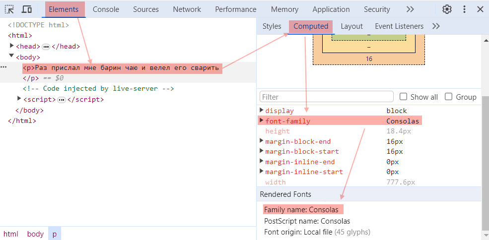

# Форматы шрифтов

Самые распространенные форматы:

* Устаревшие
  * eot
  * svg
  * ttf
  * woff
* Современные
  * woff2 - легковесный, оптимизированный, 96% поддержка браузерами.

### Сервис преобразования

https://transfonter.org/ самый популярный сервис для преобразования шрифтов из одного формата в другой. Все шрифты преобразуем в woff2 через него и потом уже пользуемся.

# Параметры шрифтов

Комбинированное свойство:

```css
font: 700 italic normal normal 16px/1.5 Arial, sans-serif;
```

Свойства по отдельности, соответственно:

```css
font-weight: 700;
font-style: italic;
font-stretch: normal;
font-variant: normal;
font-size: 16px;
line-height: 1.5;
font-family: Arial, sans-serif;
```

Все параметры шрифтов - наследуемые. Если установить для какого-то элемента настройки шрифта, то все вложенные элементы тоже унаследуют эти настройки.

## Семейство, font-family

```css
font-family: "Consolas", Arial, sans-serif;
```

Характеристики:

* Семейство шрифта - это по сути имя шрифта. Когда оно состоит из нескольких слов, нужно брать его в кавычки.
* Если нужный шрифт не удалось подключить, то используется "запасной". Запасные - это все шрифты, которые указаны через запятую после первого. Например, запись `font-family: "Consolas", Arial, sans-serif;` означает сначала попробовать подключить шрифт Consolas, а если его нет, то Arial. Если и его нет, тогда любой имеющийся шрифт без засечек.
* Чтобы узнать наверняка, какой шрифт используется на странице, нужно посмотреть это в инструментах разработчика, жмем F12, а дальше как на скрине. В пункте Renered Fonts увидим реально используемый шрифт:



```html
<body>
  <p>Раз прислал мне барин чаю и велел его сварить</p>
</body>
```

```css
body {
  font-family: "Consolas", Arial, sans-serif;
}
```

## Вес шрифта, font-weight

```css
font-weight: 400;  /* По умолчанию */
```

Вес или иначе говоря "жирность". Чем вес больше, тем визуально толще начертание шрифта. Вес - это число, обычно с шагом 100, в интервале от 100 до 900. Есть еще словесные аналоги, вроде light, bold, но цифрами нагляднее. Разные шрифты имеют разное количество весов. У некоторых отсутствуют какие-то значения, например, может не быть веса 300 и 600. Если указать отсутствующее, браузер подберет ближайшее из имеющихся.

## Размер, font-size

```css
font-size: 16px;  /* По умолчанию */
```

Для размеров есть разные единицы измерения, не только пиксели. TODO

## Межстрочное расстояние, line-height

```css
line-height: 1.5;
```

Для межстрочного расстояния есть разные единицы измерения, не только пиксели. TODO

Удобным форматом является простой коэффициент, который рассчитывает размер относительно размера шрифта. Например, размер шрифта 16px, тогда коэффициент 1.5 даст межстрочное расстояние 24px. Когда в макете используется не коэффициент, а конкретный размер, лучше переводить его на коэффициент, потому что при адаптивной верстке придется делать меньше правок.

# Подлючение шрифтов

Шрифты находятся на компьютере у пользователя. Соответственно, если указать какой-то шрифт, которого на компьютере нет, то браузер не сможет его отобразить. В этом случае шрифт нужно отдавать как ресурс. Есть несколько способов сделать это.

## Директива @font-face

Предпочитаемый способ. Пишется в css-файле:

```css
@font-face {
  font-family: "Dracula";
  src: url("./fonts/dracula.woff2") format("woff2");
  font-weight: 400;
  font-style: normal;
  font-display: swap;
}

@font-face {
  font-family: "Dracula";
  src: url("./fonts/pixy.woff2") format("woff2");
  font-weight: 700;
  font-style: normal;
  font-display: swap;
}

body {
  font-family: "Dracula", Arial;
  font-weight: 400;
}
```

Дескрипторы:

* `font-family` - имя, под которым мы будем обращаться к подключенному шрифту. Может быть любым, но обычно ставят название шрифта, для наглядности.
* `src` - путь до шрифта.
  * `url` - может быть ссылка в интернете, а может быть путь в файловой системе. `./` отсчитывает от директории, в которой лежит сам css-файл, а `/` отсчитывает от корня сайта. Ну или может быть от директории, где лежит файл, в котором используется данный css. Можно потом поэкспериментировать.
  * `format` - подсказываем браузеру, в каком формате шрифт.
* `font-weight` - вес шрифта. TODO Вообще, про эти все параметры можно дополнительно погуглить. Сейчас только могу написать такое замечание. В примере выше вторая директива подключает шрифт pixy, но под именем Dracula. От первой директивы отличается весом. Поэтому, если поставить для body вес 700, то на самом деле шрифт текста будет pixy.
* `font-style` - todo
* `font-display` - стратегия отображения шрифта. swap работает так: текст отображается сразу "запасным" шрифтом, а когда догружается нужный шрифт, то браузер заменят дефолтный на нужный. swap используется, когда показать текст является приоритетной задачей и его отображение каким-нибудь другим шрифтом не критично. "Запасной" шрифт указывается в font-family целевого элемента (в данном случае - body) через запятую. Можно указать несколько запасных.

## Директива @import

Позволяет подключить шрифт с google fonts. TODO: выяснить, а можно ли так подключить локальный шрифт или шрифт с какого-то другого сайта.

На данный момент, чтобы получить такую ссылку на шрифт, то выбираем шрифт на https://fonts.google.com, жмем Get font, потом Get embedded code. Далее вкладка Web, радиокнопка import и копируем оттуда ссылку.

```css
@import url('https://fonts.googleapis.com/css2?family=Lobster+Two:ital,wght@0,400;0,700;1,400;1,700&display=swap');

body {
  font-family: "Lobster Two";
}
```

## Тег link

Позволяет подключить шрифт с google fonts. TODO: выяснить, а можно ли так подключить локальный шрифт или шрифт с какого-то другого сайта.

На данный момент, чтобы получить такую ссылку на шрифт, то выбираем шрифт на https://fonts.google.com, жмем Get font, потом Get embedded code. Далее вкладка Web, радиокнопка link и копируем оттуда весь код себе в раздел `<head>` на страницу, где планируется использовать шрифт.

```html
<!doctype html>
<html>
  <head>
    <meta charset="UTF-8">
    <title>Тренировка css</title>
    <link rel="stylesheet" href="./css/styles.css">
    <link rel="preconnect" href="https://fonts.googleapis.com">
    <link rel="preconnect" href="https://fonts.gstatic.com" crossorigin>
    <link href="https://fonts.googleapis.com/css2?family=Lobster+Two:ital,wght@0,400;0,700;1,400;1,700&family=Rambla:ital,wght@0,400;0,700;1,400;1,700&display=swap" rel="stylesheet">
  </head>
  <body>
    <p>Once upon a time my master sent me some tea</p>
  </body>
</html>

```

```css
body {
  font-family: "Lobster Two";
}
```

