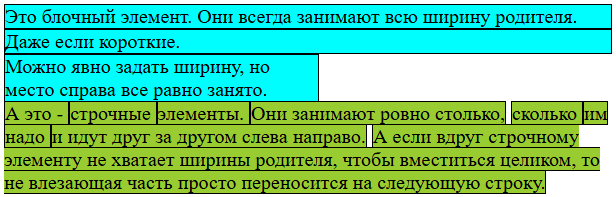

# Поток документа

`Поток документа` - это организация элементов на странице при отсутствии явно написанных стилей.

У каждого браузера есть встроенный набор стилей для всех элементов, вроде заголовков, ссылок, кнопок и т.д. Благодаря им страница уже как-то стилизована, даже если мы не напишем никаких стилей. Т.о. поток по сути это то, как располагаются элементы на странице с этими стандартными стилями. Это называется `нормальный поток`.

В каждом элементе свой поток. Грубо говоря, каждый элемент тоже можно рассматривать как страницу. Принципы организации внутри него такие же, как и у целой страницы.

# Контекст форматирования

`Контекст форматирования` характеризует направление расположения блочных и строчных элементов.

Блочные элементы формируют блочный контекст форматирования, а строчные - строчный контекст форматирования.

Например европейцы читают слева направо и сверху вниз. Т.е. *слова* в строках ("строчные элементы") идут горизонтально, слева направо. Новая строка начинается ниже предыдущей, т.е. *строки* ("блочные элементы") идут вертикально, сверху вниз. Получается такой контекст форматирования:

* Строчные элементы располагаются друг за другом слева направо. Блочные элементы располагаются сверху вниз.

А например для азиатов характерно чтение сверху вниз + справа налево. Т.е. "слова" (иероглифы) идут сверху вниз, а строки - справа налево. Получается такой контекст форматирования:

* Строчные элементы располагаются сверху вниз, а блочные - справа налево.

#  Поведение элементов в потоке

> Разговор ведется о "европейском" контексте. Проверять на "китайском" и составлять обобщенные формулировки нет времени и пока не ощущается такая необходимость.

## Блочные

Блочные элементы всегда занимают всю ширину родителя. Если явно задать блочному элементу ширину меньше родительской, то визуально элемент уменьшится, но место рядом с ним от этого не освободится, и следующий элемент все равно начнется *под* блочным.

Соответственно, у блочного элемента:

* Ширина во всю ширину родителя.
* Высота по ширине содержимого элемента.
* Можно задавать ширину и высоту явно.

## Строчные

Строчные элементы всегда занимают столько места, сколько им нужно. Сколько нужно - определяется содержимым элемента. Строчному элементу нельзя явно задать ни ширину, ни высоту.

## Пример

```html
<div>Это блочный элемент. Они всегда занимают всю ширину родителя.</div>
<div>Даже если короткие.</div>
<div style="width: 250px">Можно явно задать ширину, но место справа все равно занято.</div>
<span>А это - </span>
<span>строчные </span>
<span>элементы. </span>
<span>Они занимают ровно столько,</span>
<span>сколько </span>
<span>им </span>
<span>надо </span>
<span>и идут друг за другом слева направо.</span>
<span>А если вдруг строчному элементу не хватает ширины родителя, чтобы вместиться целиком, то не влезающая часть просто переносится на следующую строку.</span>
```



# Выход из потока

Некоторые css-свойства могут выбросить элемент из потока. Например, `float` выбивает элемент из блочного контекста, но при этом не выбивает из строчного, а `position` выбивает и из блочного, и из строчного. О том, какие именно эффекты оказывают эти свойства, см конспекты по ним самим.

Выброшенный элемент перестает взаимодействовать с элементами, оставшимися в потоке.