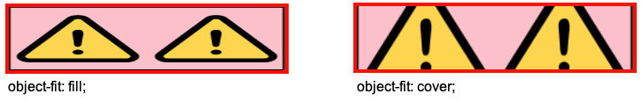
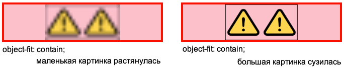
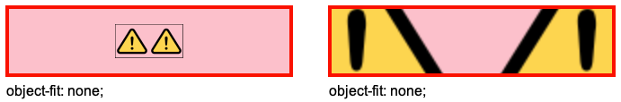

# LEGACY Код для экспериментов

```html
<body>
  <div class="container">
    
  </div>
</body>
```

```css
* {
  box-sizing: border-box;
}

.pic {
  /* width: 100%; */
  /* aspect-ratio: 16/9; */
  /* object-fit: fill; */
  /* object-fit: cover; */
  /* object-fit: contain; */
  /* object-fit: none; */
  /* object-fit: scale-down; */
  display: block;
}

.container {
  width: 100px;
  height: 150px;
  border: 4px solid red;
  background-color: pink;
}
```

# Ширина и высота

`width` и `height` - ширина и высота изображения в пикселях. Рекомендуется всегда указывать их, чтобы браузер резервировал место под картинку еще до ее загрузки. Если этого не сделать, то вместо картинки может отобразиться другой контент, который потом скакнет в другое место, когда она загрузится.

Ширина и высота картинки по умолчанию такие же, как размер самой картинки. Например, если картинка имеет размер 256х128 пикселей, то width у нее будет 256, а height - 128.

Если картинку вставить в контейнер, то по умолчанию размеры самого контейнера не повлияют на размер картинки:


P.S. Картинка png с прозрачным фоном. Черная рамка у картинки является частью самой картинки, это не css.

* а) Картинка вставлена в контейнер, который по размерам больше нее (ширина и высота контейнера заданы явно). Картинка осталась своего оригинального размера.
* б) Картинка вставлена в контейнер, который по размерам меньше нее (ширина и высота контейнера заданы явно). Картинка тоже осталась своего оригинального размера.
* в) Картинка вставлена в контейнер, который по размерам меньше нее. Ширина у контейнера задана явно, а высота не задана вообще. Картинка осталась своего оригинального размера. Высота контейнера подстроилась под высоту картинки.

Одним словом, по умолчанию картинка занимает свой оригинальный размер и ее целиком видно на экране.

# Аспект, aspect-ratio

https://developer.mozilla.org/en-US/docs/Web/CSS/aspect-ratio Свойство `aspect-ratio` применимо не только к картинкам. Но тут рассматривается именно в контексте картинки.

По умолчанию имеет значение auto, что означает естественные размеры картинки.

```css
aspect-ratio: auto;  /* Дефолт */
```

Аспект позволяет нам привести картинку к желаемому соотношению сторон. Картинка при этом искажается. Мы должны явно задать размер для любой из сторон картинки и указать аспект, а браузер автоматически вычислит размер второй стороны.

Важные замечания:

* Аспект сам по себе связан исключительно с картинкой, а к контейнеру отношения не имеет.

* Явное указание подразумевает либо непосредственное указание размера стороны картинки, например `width: 100px`, либо привязку к размеру элемента, в который картинка вложена, например `width: 100%`. В обоих случаях браузер получает конкретное значение, отталкиваясь от которого имеет возможность рассчитать размер второй стороны.

  Если задать разом и width, и height, то аспект работать не будет. По этой же причине аспект не работает, если не задать явно ни одной стороны. Тогда width и height будут auto, что предполагает исходные размеры картинки, а это равнозначно тому, что обе стороны заданы явно.


P.S. Оригинальная картинка имеет размер 256х128.

* а) Картинка имеет свои естественные размеры, потому что обе стороны auto, что логически равнозначно тому, чтобы задать обе стороны явно - в оригинальные размеры картинки.
* б) Картинка стала меньше, но сохранила свои естественные пропорции. Мы явно задали ширину в 150px, а аспект auto подразумевает сохранение оригинальных пропорций.
* в) и г) Мы явно задали ширину и браузер автоматически рассчитал высоту, исходя из указанного аспекта. В результате картинка исказилась, но приняла нужные пропорции.

# Вписка, object-fit

Использование вписки предполагает, что картинка находится внутри контейнера и мы хотим подогнать ее размер под размер контейнера.

Для этого нам нужно:

* Привязать один из размеров картинки к размеру контейнера. Например, задать картинке `width: 100%` или `height: 100%`, чтобы у браузера была отправная точка, от которой он сможет рассчитать размер второй стороны.
* Задать картинке алгоритм вписки.

В примерах используется квадратная png картинка 128x128px с прозрачным фоном. Черная рамка в картинке является частью самой картинке, а не css.

## fill и cover



* `fill` - картинка растягивается без соблюдения исходных пропорций, лишь бы полностью заполнить контейнер.
* `cover` - картинка растягивается так, чтобы полностью заполнить контейнер, но при этом сохраняет свои исходные пропорции. Поэтому получается, что часть картинки обрезается.

## contain



* `contain` - картинка сохраняет свои исходные пропорции и масштабируется так, чтобы целиком вписаться в контейнер, без обрезки. Маленькая картинка растягивается, большая - сужается.

P.S. Как видно на скрине, картинкой является блок целиком, а не только "видимая" картинка. Т.е. картинка находится в т.н. "боксе", и это именно сам тег img, а не внешний тег, в который он вложен.

## none



* `none` - изображение не масштабируется. Маленькое помещается целиком, а большое - сколько влезет.

## scale-down


* `scale-down` - "выбирает меньший вариант из none и contain", как сформулировано на w3. Но я бы сказал так:
  * Если картинка маленькая, отображает ее как есть.
  * Если большая - масштабирует ее так, чтобы она сохранила исходные пропорции и вписалась в контейнер.

# Положение, object-position

Свойство `object-position` связано с object-fit. Оно позволяет двигать картинку внутри ее бокса так, что видимой оказывается разная часть картинки, если она целиком не вмещается в бокс, или перемещает картинку в разные части бокса, если она маленькая и не заполняет его.

Когда изображение масштабировано так, что оно целиком не влезает в контейнер, мы можем "подвинуть" его, чтобы видимой оказалась нужная нам часть. Например:


Возможные значения:

* `center` (дефолт), `bottom`, `left`, `right`, `top`
* Конкретные цифры в px, % и прочих единицах.

Можно задать разные значения для x и y:

```css
object-position: 50%;      /* Для x и y одновременно */
object-position: 50% 25%;  /* Для x и y раздельно */
```

