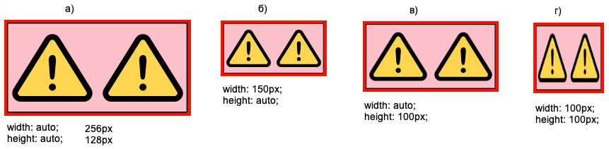
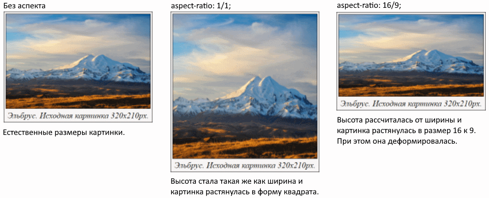
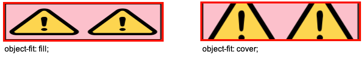
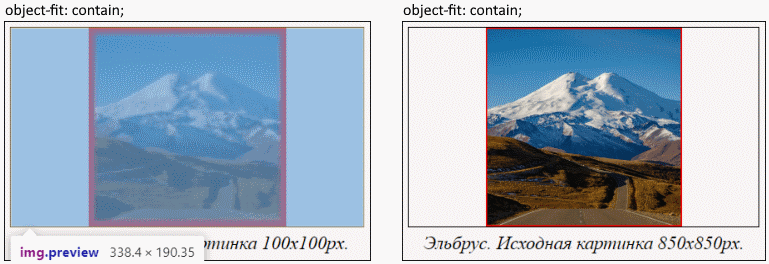
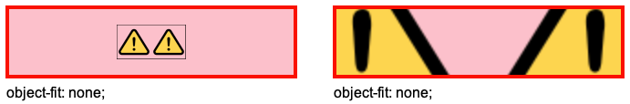
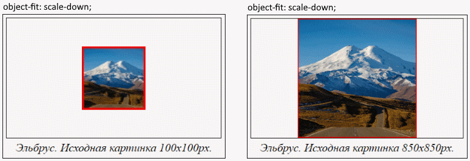
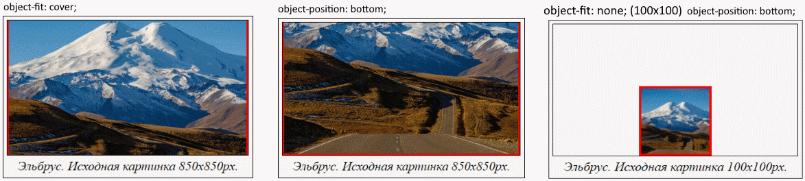

# Код для экспериментов

```html
<body>
  
</body>
```

```css
* {
  box-sizing: border-box;
}

.pic {  /* Настройки для img */
  width: auto;
  height: auto;
  /* aspect-ratio: 16/3; */
  /* object-fit: fill; */
  /* object-fit: cover; */
  /* object-fit: contain; */
  /* object-fit: none; */
  /* object-fit: scale-down; */
  /* object-position: top; */
  border: 4px solid red;
  background-color: pink;
}
```

# Тег img - это контейнер

Чтобы хорошо понять как работают размеры изображения и связанные с ними свойства, важно понять следующую ключевую мысль:

> Тег img - это контейнер для изображения, а не само изображение.

То есть не надо ставить равенство между понятиями "картинка" и "тег img". Не надо вкладывать тег img в div, чтобы "положить картинку в контейнер", она уже в контейнере. P.S. Впрочем, далее по конспекту я буду часто писать именно "картинка", имея ввиду тег img, просто потому что так удобнее. А если картинка будет вкладываться например в div, то могу называть этот див "контейнером картинки". Но по идее это не должно вызывать путаницы теперь, когда я объяснил связь между img и отображаемой картинкой.

Размер этого контейнера по умолчанию равен размеру картинки. Допустим, если картинка имеет размер 256х128px, то у элемента img будет `width: 256px` и `height: 128px`.



P.S. Картинка - это png с прозрачным фоном. На картинке изображено два одинаковых желтых треугольника, т.е. это не заполнение, не две картинки, а единая картинка с двумя треугольниками. Черная рамка у картинки является частью самой картинки, это не css. Красная рамка и розовый фон - у самого тега img. Эта же картинка используется в разделе про аспект. В разделе про вписку используется картинка с единственным треугольником, потому что нагляднее.

* а) Картинка, которую мы задали через атрибут src для img, имеет размеры 256х128px. Поэтому размер самого элемента img тоже 256x128px.

* б) Мы явно задаем элементу img ширину 150px. Т.к. браузеру известны оба размера картинки, он автоматически пропорционально вычисляет высоту для элемента img и вписывает в него картинку.

  в) То же самое, только явно задаем высоту. Браузер автоматически пропорционально вычисляет ширину, исходя из размеров картинки.

* г) Мы явно задаем и высоту, и ширину для элемента img. Браузер вписывает картинку в заданные размеры, в результате чего она деформируется.

# Ширина и высота

`width` и `height` - ширина и высота картинки в пикселях. Рекомендуется всегда указывать их, чтобы браузер резервировал место под картинку еще до ее загрузки. Если этого не сделать, то вместо картинки может отобразиться другой контент, который потом скакнет в другое место, когда она загрузится.

TODO: сделать картинку где показать, что если вложить img внутрь элемента, то img не ориентируется на размеры этого элемента и занимает столько места, сколько надо для отображения картинки.

# Аспект, aspect-ratio

https://developer.mozilla.org/en-US/docs/Web/CSS/aspect-ratio Свойство `aspect-ratio` применимо не только к картинкам. Но тут рассматривается именно в контексте картинки.

Аспект позволяет нам привести картинку к желаемому соотношению сторон. Для этого мы *обязательно* должны явно задать размер для любой из сторон картинки и указать аспект, тогда браузер автоматически вычислит размер второй стороны.

По умолчанию аспект имеет значение auto, что означает сохранение пропорций картинки:

```css
aspect-ratio: auto;  /* Дефолт */
```

```css
aspect-ratio: 16/9;  /* Ширина / Высота */
```



* а) Картинка имеет свои естественные пропорции, потому что размер ни одной стороны явно не задан, а значит width и height установлены в auto (width явно, а height неявно). Это в свою очередь значит взять размеры img такие же как у отображаемой картинки, т.е. все равно что задать обе стороны явно. А аспект предполагает, что только одна сторона должна быть задана.
* б) Картинка стала меньше, но сохранила свои естественные пропорции. Мы явно задали ширину в 150px, а аспект auto подразумевает сохранение оригинальных пропорций.
* в) и г) Мы явно задали ширину и браузер автоматически рассчитал высоту, исходя из указанного аспекта. В результате картинка исказилась, приняв нужные пропорции.

Полезные замечания:

* Когда картинка вложена в другой элемент, например в div, мы можем привязать ее размер к размеру этого элемента через `width: 100%` например. Это позволит размещать картинку внутри другого элемента, чтобы она и выглядела как надо, и за его границы не вылезала.

# Вписка, object-fit

```css
object-fit: fill;  /* Дефолт */
```

Вписка задает алгоритм, как отображаемая картинка должна заполнить собой контейнер. Не забываем, что элемент img является контейнером для отображаемой картинки. Поэтому в показанных ниже примерах подразумевается установка ширины и высоты именно для самого элемента img. И соответственно установка object-fit определяет, как картинка вписывается в img.

На картинках ниже размер элемента img выставлен в 320x80px, а размер картинки, которая в нем отображается, 256x128px.

## fill* и cover



* `fill` - картинка растягивается без соблюдения исходных пропорций, лишь бы полностью заполнить контейнер.
* `cover` - картинка растягивается так, чтобы полностью заполнить контейнер, но при этом сохраняет свои исходные пропорции. Поэтому получается, что часть картинки обрезается.

## contain



* `contain` - картинка сохраняет свои исходные пропорции и масштабируется так, чтобы целиком вписаться в контейнер, без обрезки.
  * Маленькая картинка растягивается.
  * Большая - сужается.

Здесь я взял исходную 256х128 картинку и для первого случая сильно ее уменьшил, а для второго - увеличил, чтобы она была меньше \ больше размера img (320x80). Видно, что в первом случае она растянулась, увеличилась, чтобы догнать размеры контейнера и от этого размылась. А во втором случае уменьшилась, чтобы вписаться, и осталась четкой.

## none



* `none` - изображение не масштабируется.
  * Маленькое помещается целиком.
  * Большое - сколько влезет.

## scale-down



* `scale-down` - "выбирает меньший вариант из none и contain", как сформулировано на w3. Но я бы сказал так:
  * Если картинка маленькая, отображается как есть.
  * Если большая - масштабируется так, чтобы сохранить исходные пропорции и вписать в контейнер.

# Положение, object-position

Свойство `object-position` связано с object-fit. Оно позволяет двигать картинку внутри img так, что видимой оказывается разная часть картинки, если она целиком не вмещается в img, или перемещает картинку в разные части img, если она маленькая и не заполняет его.

Когда картинка масштабирована так, что она целиком не влезает в img, мы можем "подвинуть" ее, чтобы видимой оказалась нужная нам часть. Например:



Возможные значения:

* `center` (дефолт), `bottom`, `left`, `right`, `top`
* Конкретные цифры в px, % и прочих единицах.

Можно задать разные значения для x и y:

```css
object-position: 50%;      /* Для x и y одновременно */
object-position: 50% 25%;  /* Для x и y раздельно */
```

