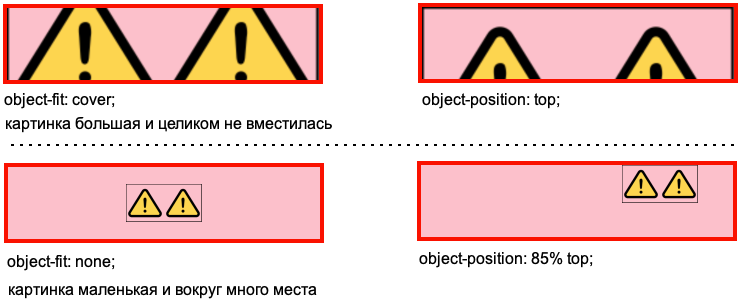

# Ширина и высота

`width` и `height` - ширина и высота изображения в пикселях. Рекомендуется всегда указывать их, чтобы браузер резервировал место под картинку еще до ее загрузки. Если этого не сделать, то вместо картинки может отобразиться другой контент, который потом скакнет в другое место, когда она загрузится.

# Аспект и вписка

```html
<div class="card">
  
  <span class="description"><i>Эльбрус. Исходная картинка 320х210px.</i></span>
</div>
```

```css
* {
  box-sizing: border-box;
}

.preview {
  width: 100%;
  /* aspect-ratio: 16/9; */
  /* object-fit: fill; */
  /* object-fit: cover; */
  /* object-fit: contain; */
  /* object-fit: none; */
  /* object-fit: scale-down; */
  display: block;
  border: 1px solid black;
}

.description {
  font-size: 18px;
}

.card {
  width: 350px;
  display: flex;
  flex-direction: column;
  row-gap: 5px;
  align-items: center;
  padding: 5px;
  border: 1px solid black;
  background-color: rgb(247, 244, 244);
}
```

## Аспект, aspect-ratio

https://developer.mozilla.org/en-US/docs/Web/CSS/aspect-ratio Свойство `aspect-ratio` применимо не только к картинкам. Но тут рассматривается именно в контексте картинки.

Используется для автоматического вычисления размера второй стороны, когда первая известна. И эта автоматическая вторая сторона будет подобрана так, чтобы картинка соответствовала указанному аспекту. Изображение при этом искажается.


## Вписка, object-fit

Задает алгоритм, по которому картинка вписывается в контейнер. Здесь исходная картинка квадратная, а через стили у нее аспект 16/9. По краям прямо в картинке красная граница, чтобы нагляднее было видно какая часть теряется при вписывании.

### fill и cover


* `fill` - картинка растягивается без соблюдения исходных пропорций, лишь бы полностью заполнить контейнер.
* `cover` - картинка растягивается так, чтобы полностью заполнить контейнер, но при этом сохраняет свои исходные пропорции. Поэтому получается, что часть картинки обрезается.

### contain


* `contain` - картинка сохраняет свои исходные пропорции и масштабируется так, чтобы целиком вписаться в контейнер, без обрезки. Маленькая картинка растягивается, большая - сужается.

P.S. Как видно на скрине, картинкой является блок целиком, а не только "видимая" картинка. Т.е. картинка находится в т.н. "боксе", и это именно сам тег img, а не внешний тег, в который он вложен.

### none


* `none` - изображение не масштабируется. Маленькое помещается целиком, а большое - сколько влезет.

### scale-down


* `scale-down` - "выбирает меньший вариант из none и contain", как сформулировано на w3. Но я бы сказал так:
  * Если картинка маленькая, отображает ее как есть.
  * Если большая - масштабирует ее так, чтобы она сохранила исходные пропорции и вписалась в контейнер.

# Положение, object-position

Свойство `object-position` связано с object-fit. Оно позволяет двигать картинку внутри ее бокса так, что видимой оказывается разная часть картинки, если она целиком не вмещается в бокс, или перемещает картинку в разные части бокса, если она маленькая и не заполняет его.

Когда изображение масштабировано так, что оно целиком не влезает в контейнер, мы можем "подвинуть" его, чтобы видимой оказалась нужная нам часть. Например:



Возможные значения:

* `center` (дефолт), `bottom`, `left`, `right`, `top`
* Конкретные цифры в px, % и прочих единицах.

Можно задать разные значения для x и y:

```css
object-position: 50%;      /* Для x и y одновременно */
object-position: 50% 25%;  /* Для x и y раздельно */
```

