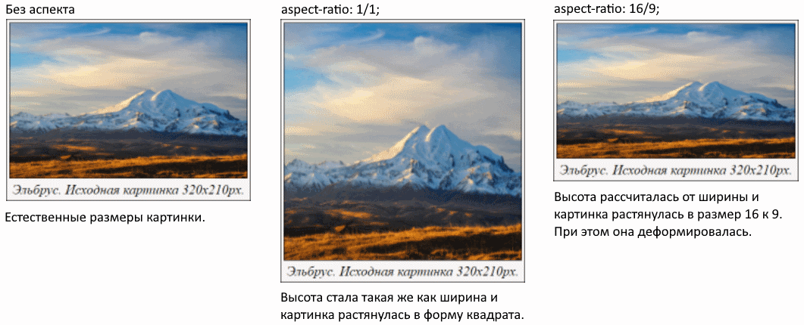
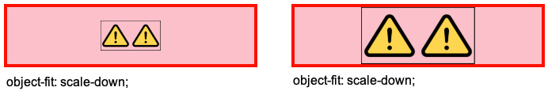

# Базовые атрибуты

Одиночный тег ``. Атрибуты:

* `src` - путь до изображения. Относительный или абсолютный.

* `alt` - текст, который отображается вместо изображения, если его невозможно загрузить или очень медленный интернет или еще какие-то причины не позволяют отобразить изображение. Этот текст также зачитывает скрин ридер. Если alt не указан, то он будет зачитывать текст из src, что является по сути бесполезным.

  alt нужно добавлять всегда, это является хорошим тоном. Но вот заполнять его нужно только для смысловых изображений, например, фотографий. Для декоративных изображений, являющихся просто частью интерфейса, просто оставляем alt пустым.

# Жадная \ ленивая загрузка

* `loading` - по умолчанию браузер загружает все изображения, которые есть в разметке. Это может быть не удобно. Например, у нас очень длинная страница с кучей изображений, но пользователь может не долистать до самого конца, следовательно, нет смысла грузить эти изображения. С помощью атрибута loading мы можем явно задать требуемое поведение.
* `eager` - загружать все изображения, которые указаны в разметке.
  * `lazy` - загружать только те изображения, которые находятся в той части страницы, которую пользователь в данный момент видит.

```html

```

# Размеры

## Ширина и высота

`width` и `height` - ширина и высота изображения в пикселях. Рекомендуется всегда указывать их, чтобы браузер резервировал место под картинку еще до ее загрузки. Если этого не сделать, то вместо картинки может отобразиться другой контент, который потом скакнет в другое место, когда она загрузится.

## Аспект и вписка, aspect-ratio и object-fit

```html
<div class="card">
  
  <span class="description"><i>Эльбрус. Исходная картинка 320х210px.</i></span>
</div>
```

```css
* {
  box-sizing: border-box;
}

.preview {
  width: 100%;
  /* aspect-ratio: 16/9; */
  /* object-fit: fill; */
  /* object-fit: cover; */
  /* object-fit: contain; */
  /* object-fit: none; */
  /* object-fit: scale-down; */
  display: block;
  border: 1px solid black;
}

.description {
  font-size: 18px;
}

.card {
  width: 350px;
  display: flex;
  flex-direction: column;
  row-gap: 5px;
  align-items: center;
  padding: 5px;
  border: 1px solid black;
  background-color: rgb(247, 244, 244);
}
```

### aspect-ratio

https://developer.mozilla.org/en-US/docs/Web/CSS/aspect-ratio Свойство `aspect-ratio` применимо не только к картинкам. Но тут рассматривается именно в контексте картинки.

Используется для автоматического вычисления размера второй стороны, когда первая известна. И эта автоматическая вторая сторона будет подобрана так, чтобы картинка соответствовала указанному аспекту. Изображение при этом искажается.



### object-fit

Задает алгоритм, по которому картинка вписывается в контейнер. Здесь исходная картинка квадратная, а через стили у нее аспект 16/9. По краям прямо в картинке красная граница, чтобы нагляднее было видно какая часть теряется при вписывании.

#### fill и cover


* `fill` - картинка растягивается без соблюдения исходных пропорций, лишь бы полностью заполнить контейнер.
* `cover` - картинка растягивается так, чтобы полностью заполнить контейнер, но при этом сохраняет свои исходные пропорции. Поэтому получается, что часть картинки обрезается.

#### contain


* `contain` - картинка сохраняет свои исходные пропорции и масштабируется так, чтобы целиком вписаться в контейнер, без обрезки. Маленькая картинка растягивается, большая - сужается.

P.S. Как видно на скрине, картинкой является блок целиком, а не только "видимая" картинка. Т.е. картинка находится в т.н. "боксе", и это именно сам тег img, а не внешний тег, в который он вложен.

#### none


* `none` - изображение не масштабируется. Маленькое помещается целиком, а большое - сколько влезет.

#### scale-down



* `scale-down` - "выбирает меньший вариант из none и contain", как сформулировано на w3. Но я бы сказал так: если картинка маленькая, отображает ее как есть, а если большая - масштабирует ее так, чтобы она сохранила исходные пропорции и вписалась в контейнер.

## Положение, object-position

Свойство `object-position` связано с object-fit. Оно позволяет двигать картинку внутри ее бокса так, что видимой оказывается разная часть картинки, если она целиком не вмещается в бокс, или перемещает картинку в разные части бокса.

Когда изображение масштабировано так, что оно целиком не влезает в контейнер, мы можем "подвинуть" его, чтобы видимой оказалась нужная нам часть. Например:


Возможные значения:

* `center` (дефолт), `bottom`, `left`, `right`, `top`
* Конкретные цифры в px, % и прочих единицах.

Можно задать разные значения для x и y:

```css
object-position: 50%;      /* Для x и y одновременно */
object-position: 50% 25%;  /* Для x и y раздельно */
```

# Проблемы

## Зазор между картинкой и контейнером


Если добавлять картинку внутрь div или другого контейнера, то между ним и картинкой может возникнуть зазор (на скрине выше показано красным). Чтобы убрать его, картинке надо поставить

```css
display: block;
```

## Верстка скачет

Проблема возникает, когда изображение долго грузится и браузер сначала отображает текст, а потом когда появляется картинка, этот текст резко соскакивает в новую позицию, потому что картинка наконец-то заняла свое место.

Чтобы такого не было, надо заранее указать размеры картинки, тогда браузер зарезервирует место под нее.

Но есть нюанс: конкретные размеры изображения не вяжутся с адаптивной версткой. Я не могу понять сейчас, считается ли например указание через css width 100% heigh auto за указание конкретных размеров или нет, поэтому отложу этот вопрос до возникновения этой проблемы на практике и тогда разберусь. Вот пара статей на эту тему:

https://www.smashingmagazine.com/2020/03/setting-height-width-images-important-again/

https://jakearchibald.com/2022/img-aspect-ratio/