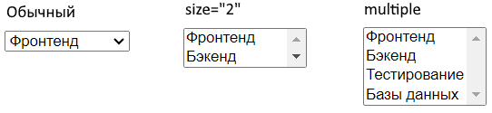
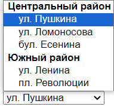

# Выпадающий список

## select

Выпадающий список. Стилизовать select невозможно, поэтому если нужен какой-то особенный или красивый, нужно писать самостоятельно.

```html
<select id="city" name="user-city">
  <option value="moscow">Москва</option>
  <option value="spb" selected>Санкт-Петербург</option>
  <option value="novosibirsk">Новосибирск</option>
</select>
```

Атрибуты:

* `multiple` - позволяет выбирать одновременно несколько пунктов списка, удерживая Shift или Ctrl.
* `size` - сколько вариантов выбора показывать одновременно. Без multiple можно по-прежнему выбрать только один вариант.



## Варианты выбора, option

Варианты выбора оформляются вложенным тегом `option`. Его атрибуты:

* `value` - обязательный атрибут, связанное с элементом значение, которое уйдет на сервер.
* `selected` - сделать указанный элемент выбранным по умолчанию. Если ни у одного пункта нет атрибута selected, то по умолчанию будет выбран первый элемент.

## Группировка пунктов списка, optgroup

Тег `optgroup` используется для группировки пунктов внутри выпадающего списка. В реальной практике используется редко.

```html
<select id="office" name="office">
  <optgroup label="Центральный район">
    <option value="center-1">ул. Пушкина</option>
    <option value="center-2">ул. Ломоносова</option>
    <option value="center-3">бул. Есенина</option>
  </optgroup>
  <optgroup label="Южный район">
    <option value="south-1">ул. Ленина</option>
    <option value="south-2">пл. Революции</option>
  </optgroup>
</select>
```

Выглядит примерно так:



## Пустой элемент

Задача такая: сделать, чтобы в списке по умолчанию не был выбран ни один элемент, но чтобы пользовать в итоге обязан был выбрать что-то.

```html
<select id="city" name="user-city" required>
    <option value="" disabled selected>Не выбрано</option>
    <option value="moscow">Москва</option>
    <option value="spb">Санкт-Петербург</option>
    <option value="novosibirsk">Новосибирск</option>
</select>
```

Решение:

* Добавляем списку атрибут `required`, чтобы браузер запрещал отправлять форму, если не выбран никакой пункт.
* Добавляем дополнительную опцию в начало списка, которая будет олицетворять то, что "ничего не выбрано".
  * Ставим ей атрибут `value=""`, чтобы браузер трактовал ее именно как "не выбранное" значение.
  * Ставим ей атрибут `selected`, чтобы при загрузке страницы этот пункт был выбран по умолчанию.
  * Ставим ей атрибут `disabled`, чтобы пользователь не мог выбрать ее явно.
* Готово. Теперь, если пользовать просто попробует отправить форму, браузер сообщит ему, что надо выбрать что-то из списка. После того, как пользователь что-то выберет, он уже не сможет вернуться на пункт "Не выбрано".

## Извлечение на сервере

```html
<form action="http://localhost:3000/info" method="post">
  <label for="spec">Специализация:</label>
  <select id="spec" name="specialization" size="2">
    <option value="frontend">Фронтенд</option>
    <option value="backend">Бэкенд</option>
    <option value="qa">Тестирование</option>
    <option value="database">Базы данных</option>
  </select>
  <input type="submit" value="Отправить" />
</form>
```

Без атрибута multiple выглядит как одиночное значение:

```
specialization: 'frontend'
```

С атрибутом multiple, однако, если выбрано только одно значение, тоже выглядит как одиночное значение:

```
specialization: 'frontend'
```

Если выбрано несколько значений, то выглядит как массив:

```
specialization: [ 'frontend', 'backend' ]
```

Поэтому может понадобиться какая-то проверка:

```javascript
const spec = request.body.specialization;
if (Array.isArray(spec)) {
  for (let s of spec) {
    console.log(s);
  }
} else {
  console.log(spec);
}
```

