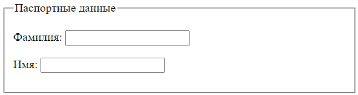

# Форма

## Создание формы

Форма - это контейнер для элементов, данные из которых уходят на сервер при отправке формы. Создается с помощью парного тега `<form> </form>`. Пример:

```html
<form action="http://localhost:3000/info" method="post">
  <fieldset>
    <legend>Паспортные данные</legend>
    <label for="lastname">Фамилия:</label>
    <input id="lastname" name="user-lastname" type="text" />
    <label for="firstname">Имя:</label>
    <input id="firstname" name="user-firstname" type="text" />
  </fieldset>
  <input type="submit" value="Отправить" />
</form>
```

## Атрибуты формы

### action

```html
action="https://foobar"
```

Задает url, который будет обрабатывать отправленные данные.

### method

```html
method="post"
```

Метод, которым будут отправлены данные. Возможные значения:

* `post` - по умолчанию. TODO: подробнее описать потом отличия.
* `get` - отправляемые данные добавляются в конец url после знака вопроса. Выглядит примерно так: `foobar?username=johny&lang=rus`. Параметров может быть много, значения могут быть более сложные, на любом языке, а при отправке все будет закодировано в общепринятый формат.

## fieldset, визуальная группировка элементов формы

Парный тег `<fieldset> </fieldset>` позволяет *визуально* сгруппировать несколько элементов формы. По умолчанию браузер выделяет группу серой рамкой.

Заголовок группы задается парным тегом `<legend> </legend>`, который должен идти первым тегом внутри `<fieldset>`.

```html
<form>
  <fieldset>
    <legend>Паспортные данные</legend>
    <!-- Тут элементы, которые хотим объединить в группу -->
  </fieldset>
</form>
```



## Привязка внешнего элемента к форме

По умолчанию элемент считается частью формы, только если он расположен внутри нее. Но иногда невозможно сверстать страницу так, чтобы все элементы, которые логически относятся к одной форме, были физически расположены внутри нее. Например, типичная страница фильтра товаров в каком-нибудь маркетплейсе, где фильтры по категории, бренду, параметрам находится в блоке слева, а по центру есть дополнительный фильтр вроде "Сортировать по популярности \ рейтингу \ цене".

Чтобы привязать *произвольный* элемент к форме, нужно:

* Задать форме атрибут `id`.
* Задать элементу атрибут `form` и указать в нем этот id.

Пример:

```html
<form id="personal">  <!-- Задали форме id -->
  <input type="text" name="firstname" />
  <input type="text" name="lastname" />

  <input type="submit" value="Готово" />
</form>

<input type="text" name="lang" form="personal" />  <!-- Привязали внешний элемент к форме -->
```

Теперь при отправке формы на сервер уйдут значения всех трех полей.


