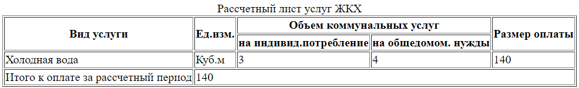

# Таблицы

Раньше таблицы использовались для верстки макета страницы. Сегодня это осталось в прошлом и таблицы надо использовать исключительно по их прямому назначению - отображение табличных данных.

Таблица оборачивается в тег `<table>`.



```html
<table border="1">
  <caption>Рассчетный лист услуг ЖКХ</caption>
  <thead>
    <tr>
      <th rowspan="2">Вид услуги</th>
      <th rowspan="2">Ед.изм.</th>
      <th colspan="2">Объем коммунальных услуг</th>
      <th rowspan="2">Размер оплаты</th>
    </tr>
    <tr>
      <th>на индивид.потребление</th>
      <th>на общедомом. нужды</th>
    </tr>
  </thead>
  <tbody>
    <tr>
      <td>Холодная вода</td>
      <td>Куб.м</td>
      <td>3</td>
      <td>4</td>
      <td>140</td>
    </tr>
  </tbody>
  <tfoot>
    <tr>
      <td>Итого к оплате за рассчетный период</td>
      <td colspan="4">140</td>
    </tr>
  </tfoot>
</table>
```

Внутренние теги:

* `<caption>` - тег заголовка таблицы. Может быть только один и располагается первым внутри таблицы.
* `<thead>` - секция под заголовки столбцов.
* `<tbody>` - секция под данные.
* `<tfoot>` - секция под "подвал", различные итоговые данные.
* Строка
  * `<tr>` - тег строки.
  * Атрибуты
    * `rowspan=2` - объединяет указанное количество строк в одну.
* Столбец
  * `<td>` - тег столбца.
  * `<th>` - тег столбца, семантически означающий роль заголовка столбца. По умолчанию браузер выделяет его жирным.
  * Атрибуты
    * `colspan="3"` - объединяет указанное количество столбцов в один.

Таблицы можно вкладывать друг в друга, но делать это не рекомендуется.