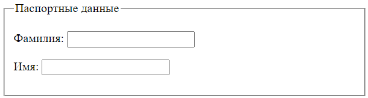
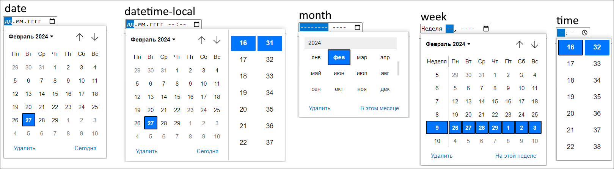

# Формы

Тег `<form>`

```html
<form action="" method="post">
  <fieldset>
    <legend>Паспортные данные</legend>
    <label for="lastname">Фамилия:</label>
    <input id="lastname" name="user-lastname"  type="text" />
    <label for="firstname">Имя:</label>
    <input id="firstname" name="user-firstname" type="text" />
  </fieldset>
</form>
```

Атрибуты:

* `action` - адрес скрипта на сервере, который будет обрабатывать отправленные данные.
* `method` - метод, которым будут отправлены данные. По умолчанию `POST`.

Вложенные теги:

* `<fieldset>` - группирует несколько элементов формы. По умолчанию браузер выделяет группу серой рамкой.
  * `<legend>` - заголовок группы, созданной через fieldset.



# Метка

Метка привязывается к элементу формы и нужна для информационных целей. Например, для чекбоксов и радио-кнопок в ней мы указываем значения, чтобы пользователь видел, что он выбирает. Метки, привязанные к тестовым полям, объясняют, для ввода чего это поле предназначено.

Чтобы привязать метку к какому-то элементу, у него должен быть задан атрибут `id`. Этот id мы указываем в атрибуте метки `for`. Например:

```html
<label for="login">Логин:</label>
<input id="login" name="user-login" value="guest" type="text" />
```

Если щелкнуть по метке, то произойдет щелчок по связанному с ней элементу. Например, курсор попадет в текстовое поле или выберется чек-бокс, радиокнопка.

# input

`<input />` это одиночный тег широкого профиля. В зависимости от атрибута `type` он может принимать вид поля ввода чего-либо (текст, телефон, почта, дата и т.д.), чекбокса или радио-кнопки.

Общие для всех вариаций атрибуты:

* `id` - идентификатор элемента, должен быть уникален в пределах страницы.

## Поле ввода \ выбора

Возможные значения для атрибута `type` в качестве поля ввода \ выбора:

* `text` - элемент представляет собой поле для ввода текста.
* `email` - поле для ввода электронной почты. При отправке будет проверка, есть ли в введенном значении @ и .
* `url` - поле для ввода ссылки. При отправке будет проверка на корректность.
* `tel` - поле для ввода телефона. Проверок не делает, но для мобильных устройств покажет клавиатуру с цифрами вместо букв для более удобного ввода.
* `search` - поле ввода поискового запроса. В правой части браузер отобразит крестик, с помощью которого можно разом стереть все содержимое поля.
* `number` - поле ввода числа. Браузер добавит в правую часть кнопки для увеличения и уменьшения значения на единицу. В поле будет невозможно ввести что-то кроме числа. Просто как будто бы кнопки клавиатуры не будут работать.
* `password` - поле ввода пароля. Браузер будет скрывать вводимые символы маской в виде толстых точек.
* Дата
  * `date` - год, месяц и день.
  * `datetime-local` - год, месяц, день и время.
  * `month` - год и месяц.
  * `week` - неделя.
  * `time` - время.
* `color` - выбор цвета.
* `file` - отображается кнопка и метка. При нажатии на кнопку открывается диалоговое окно, в котором пользователь может выбрать файл на своем компьютере. Название выбранного файла отобразится в метке.
  * `multiple` - позволяет выбрать несколько файлов.

Вариации полей ввода дат:



## Чекбокс

`type=checkbox` - превращает input в чекбокс. Требуется связанный label.

* `checked` - при наличии такого свойства, чекбокс изначально будет выделен.
* `value` - 

TODO: разобраться с этим позже

## Радио-кнопки

`radio` - превращает input в радио-кнопок.

* `checked`
* `value`
* `name` - уникальное для всей группы радио-кнопок, среди которых пользователь может выбрать одно значение.

```html
<form action="" method="post">
  <fieldset>
    <legend>Ваш пол</legend>
    <p>
      <input 
        type="radio"
        id="mal"
        name="gender"
        value="male"
        checked
      />
      <label for="mal">Муж.</label>
    </p>
    <p>
      <input 
        type="radio"
        id="fem"
        name="gender"
        value="female"
      />
      <label for="fem">Жен.</label>
    </p>
  </fieldset>
</form>
```

## Ползунок диапазона значений

`range`

* `min="1"`
* `max="100"`