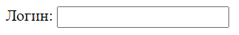

# Метка

Метка это строчный элемент. Она привязывается к элементу формы и нужна для информационных целей. Например, для чекбоксов и радиокнопок в ней мы указываем значения, чтобы пользователь видел, что он выбирает. Метки, привязанные к тестовым полям, объясняют, для ввода чего это поле предназначено.

Если щелкнуть по метке, то произойдет щелчок по связанному с ней элементу. Например, курсор попадет в текстовое поле или выберется чек-бокс, радиокнопка.

Чтобы привязать метку к какому-то элементу, нужно:

* Задать элементу атрибут `id`. 
* Указать этот id мы в атрибуте метки `for`.

Пример:

```html
<label for="login">Логин:</label>  <!-- 2. Указали id элемента в for метки -->
<input id="login" name="user-login" type="text" />  <!-- 1. Задали id элементу -->
```



Расположение метки и элемента друг относительно друга в разметке важно. Если разместить метку после элемента, то на картинке она оказалась бы справа.