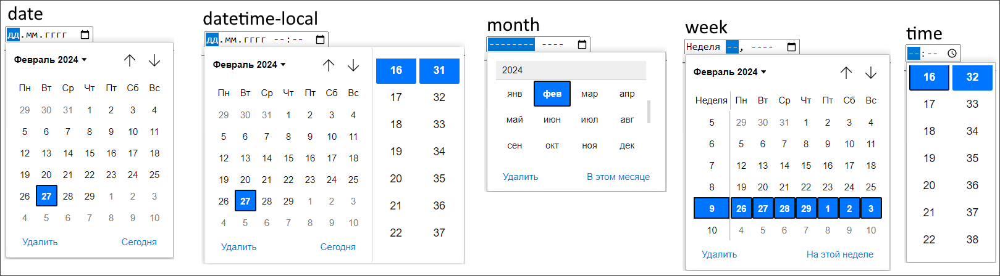

* Дата
  * `date` - год, месяц и день.
  * `datetime-local` - год, месяц, день и время.
  * `month` - год и месяц.
  * `week` - неделя.
  * `time` - время.
* `color` - выбор цвета.
* `file` - отображается кнопка и метка. При нажатии на кнопку открывается диалоговое окно, в котором пользователь может выбрать файл на своем компьютере. Название выбранного файла отобразится в метке.
  * `multiple` - позволяет выбрать несколько файлов.

Вариации полей ввода дат:

