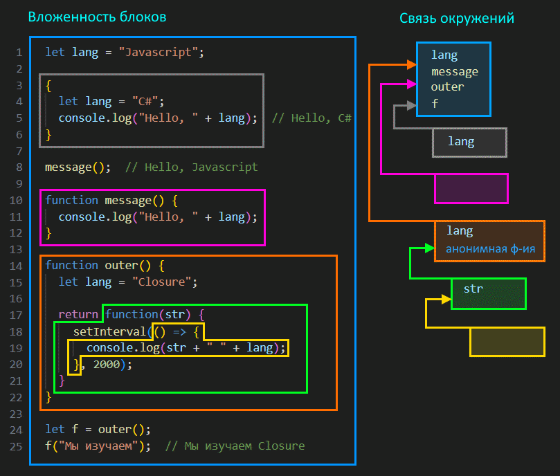

# Предисловие

Про устройство JS написано много статей, про всякие "лексические окружения", this и т.д. Приведены картинки, даже какие-то ссылки на спецификацию и т.д. Я таких статей прочитал несколько, помедитировал над ними и у меня как будто картина сложилась, я понял как работают синтаксические конструкции и главное, якобы, *почему* они так работают. И написал исходную версию этого конспекта под влиянием этих статей.

Однако вот [этот комментарий](https://habr.com/ru/companies/lanit/articles/733064/#comment_25536620) к очередной статье про "устройство JS" привел меня к выводу, что скорее всего львиная доля всех технических деталей в этих статьях, а следовательно и в моем конспекте, - это мифы и заблуждения. Т.е. вообще не факт, что оно все так устроено.

Поэтому старую версию конспекта я решил оставить, но переименовать в legacy, и написать новую версию. Пусть старая останется как напоминание о возможных заблуждениях, на случай, если вдруг когда-то мне потребуется все хорошенько вспомнить и чтобы я знал, что это заблуждения (возможно).

В общем, эта новая версия конспекта максимально огорожена от каких бы то ни было технических деталей и объяснения основаны исключительно на внешнем виде самого кода. Т.е. можно сказать, что объяснение получается в стиле "этот код работает так, потому что он выглядит так", а не "этот код работает так, потому что под капотом там вот так".

[Ссылка на спецификацию](https://tc39.es/ecma262/#sec-execution-contexts), если вдруг надо.

# Внешние переменные

Функции имеют доступ к внешним переменным, могут их изменять. Если внутри функции есть переменная с таким же именем, как и внешняя, то функция будет пользоваться той, что "ближе" к ней, т.е. локальной.

```javascript
let username = "Alice";

function hello() {
  let username = "Bob";  // <-- Функция воспользуется локальным username
  console.log("Привет, " + username);  // Привет, Bob
}

console.log(username);  // Alice
hello();  // Привет, Bob
```

```javascript
let username = "Alice";

function hello() {
  username = "Sam";  // Перезаписали внешнюю переменную.
  console.log("Привет, " + username);
}

console.log(username);  // Alice
hello();  // Привет, Sam
console.log(username);  // Перезаписалось и стало Sam
```

Возможность работать с внешними переменными связана с понятием окружения.

# Окружение

Код логически представляет собой блоки, вложенные друг в друга. Самый внешний блок - это скрипт в целом. Функция внутри скрипта - это вложенный блок. Функция внутри функции - еще один вложенный блок и т.д.

У каждого блока есть так называемое *окружение* (environment), в котором находятся все вещи, присутствующие в этом блоке. Например, для функции это параметры, локальные переменные, вложенные функции. Для обычного блока, заключенного в `{ }`, это переменные и функции. Для скрипта - тоже переменные и функции.

Каждый блок кроме своего окружения имеет доступ к "внешнему окружению" - окружению внешнего блока. В итоге формируется цепочка, по которой самый внутренний блок может добраться до окружения самого внешнего блока. За счет этого, когда мы обращаемся к какому-то элементу, которого нет в собственном окружении блока (например, к переменной), он ищет его в окружении внешнего блока. Если элемента нет и там, то ищет еще выше и т.д. до самого верха.

Пример:



Желтый блок - лямбда с пустым окружением, т.к. у нее нет ни параметров, ни локальных переменных. Но в ней используются переменные str и lang. Поскольку в своем окружении она их не находит, она проверяет окружение внешнего блока - зеленого. Там она обнаруживает str. Но ей все еще нужен lang. Она опять идет выше, в оранжевый блок, и находит lang в его окружении.

Еще раз стоит вспомнить, что функции - это объекты, поэтому они хранятся и отыскиваются в окружениях как и прочие значения. Это к вопросу о том, что внутри окружения функции outer хранится не только переменная lang, но и функция, которую мы возвращаем.

Важный момент - внешнее окружение функции определяется по моменту ее создания, а не моменту ее выполнения. Например, обведенная зеленым функция создается внутри функции outer, а выполняется внутри скрипта. Для нее внешним окружением является outer, а не скрипт. Особенно этот момент будет важен для понимания вычисления this для лямбд.

> Я намеренно не писал здесь, что окружение - это объект или что-то другое, потому что достоверно выяснять как оно реализовано в языке смысла нет. Имхо достаточно логического понимания как оно работает и что в нем находится. При попытке раскопать технические детали велика вероятность раскопать мифы и заблуждения. Также я не писал, в какой момент окружение создается и как именно блоки хранят ссылки на свое и внешнее окружение. Имхо, достаточно знать, что во время выполнения блока окружение существует и что есть ссылка на внешнее.

# Замыкание

## Что такое замыкание

Замыкание (closure), как термин CS, означает функцию, которая пользуется свободными переменными. Свободные переменные - это переменные, не являющиеся ее локальными переменными или параметрами, одним словом, "внешние" по отношению к ней.

Не во всех языках можно обращаться к внешним переменным, но в JS - можно. Пример срача на тему что такое замыкание и является ли функция, приведенная автором, замыканием, можно почитать [тут](https://qna.habr.com/q/1113012). Итог обсуждения - вопрос "приведите пример замыкания" - дискуссионный и требует уточнить у спрашивающего, что лично он понимает под замыканием.

Вот например про такую функцию можно сказать, что она не является замыканием, потому что не пользуется свободными переменными:

```javascript
let name = "Tom";

function message() {
  console.log("Hello");
}
```

А вот про такую - можно сказать, что она является замыканием, потому что пользуется свободной переменной:

```javascript
let name = "Tom";

function message() {
  console.log("Hello, " + name);  // <-- Используем свободную переменную name
}
```

Однако может попасться человек, который и вторую функцию не назовет замыканием. Для таких замыканием является только что-то вроде такого:

```javascript
function counter() {
  let count = 0;
  return function() {
    count++;  // <-- Функция пользуется свободной переменной и описана внутри другой функции
  }
}

let cnt = counter();
cnt();  // Переменная count станет 1
cnt();  // Переменная count станет 2
```

Так что в случае споров нужно уточнять у спрашивающего, что именно он понимает под замыканием.

## Замыкание и окружение

В замыкании важен факт, что оно удерживает внешнее окружение в памяти, за счет чего можно реализовать инкапсуляцию и состояние.

Возьмем такой код:

```javascript
function foobar() {
  let lang = "Javascript";  
  console.log("Мы изучаем " + lang);
}

foobar();  // Мы изучаем Javascript
```

Здесь нет замыкания. После выполнения функции foobar, ее окружение удалится из памяти.

А теперь вот такой код:

```javascript
function foobar() {
  let lang = "Javascript";

  return function(str) {  // <-- Условно назовем эту функцию "R"
    console.log("Мы изучаем " + lang);
  }
}

let f = foobar();
f("Мы изучаем");  // Мы изучаем Javascript
```

Здесь есть замыкание: возвращаемая из foobar функция (назовем ее R) использует переменную lang из окружения foobar. Стало быть, когда мы будет вызывать R, ей для получения значения lang потребуется окружение foobar, а значит его нельзя удалять из памяти. Поэтому оно останется там до тех пор, пока существует ссылка на R. В данном примере, если бы мы в конец добавили например `f = null;`, то потеряли бы ссылку на R, а стало быть и ссылку на окружение foobar. Вот в этом случае сборщик мусора удалил бы его.
