Этот конспект может быть наполнен мифами и заблуждениями из интернетов и оставлен просто для исторических целей. Читать его всерьез не следует, впоследствии вероятно его вообще лучше удалить.

# Внешние переменные

Функции имеют доступ к внешним переменным, могут их изменять. Если внутри функции есть переменная с таким же именем, как и внешняя, то локальная перекрывает ее.

```javascript
let username = "Alice";

function hello() {
  let username = "Bob";  // Локальная переменная перекрывает одноименную внешнюю.
  console.log("Привет, " + username);  // Привет, Bob
}

console.log(username);  // Alice
hello();
console.log(username);  // Осталось Alice
```

```javascript
let username = "Alice";

function hello() {
  username = "Sam";  // Перезаписали внешнюю переменную.
  console.log("Привет, " + username);
}

console.log(username);  // Alice
hello();  // Привет, Sam
console.log(username);  // Перезаписалось и стало Sam
```

Возможность работать с внешними переменными связана с понятием окружения.

# Лексическое окружение

## Что такое

Лексическое окружение - это специальный объект, который создается при выполнении:

* Скрипта.
* Блока кода.
* Функции.

В этом объекте в виде свойств хранятся:

* Служебный объект EnvironmentRecord, содержащий локальные данные скрипта \ блока \ функции (например, локальные переменные, параметры, function-definitions).
* Ссылка на внешнее лексическое окружение (в специальном свойстве `[[Environment]]`).

Например:

```javascript
let lang = "Javascript";

{
  let lang = "C#";
  console.log("Hello, " + lang);  // Hello, C#
}

message();  // Hello, Javascript

function message() {
  console.log("Hello, " + lang);
}
```

За время выполнения этого скрипта будет создано 3 лексических окружения:



Зеленое - окружение скрипта в целом. Желтое - окружение блока из строк 3-6. Красное - окружение, которое создается при вызове message() на 8 строке. И как видно, у окружения блока и функции есть ссылка на внешнее окружение (в данном случае окружение скрипта), а у окружения скрипта эта ссылка равна null.

Состав каждого окружения тоже наглядный:

* В окружении скрипта хранится переменная lang и функция (function definition) message.
* В окружении блока есть только собственная переменная lang, которая перекрывает внешнюю lang. TODO: а можно ли обратиться к внешней переменной lang отсюда?
* В окружении функции нет ничего ничего, потому что там не объявлено никаких переменных, вложенных функций. Одним словом, ничего нет.

## Замыкание

Замыкание, как термин CS, означает функцию, которая пользуется свободными переменными. Свободные переменные - это переменные, не являющиеся ее локальными переменными или параметрами, одним словом, "внешние" по отношению к ней.

Не во всех языках можно обращаться к внешним переменным, но в JS - можно. Пример срача на тему что такое замыкание и является ли функция, приведенная автором, замыканием, можно почитать [тут](https://qna.habr.com/q/1113012). Итог обсуждения - вопрос "приведите пример замыкания" - дискуссионный и требует уточнить у спрашивающего, что лично он понимает под замыканием.

Вот например про такую функцию можно сказать, что она не является замыканием, потому что не пользуется свободными переменными:

```javascript
let name = "Tom";

function message() {
  console.log("Hello");
}
```

А вот про такую - можно сказать, что она является замыканием, потому что пользуется свободной переменной:

```javascript
let name = "Tom";

function message() {
  console.log("Hello, " + name);  // <-- Используем свободную переменную name
}
```

Однако может попасться человек, который и вторую функцию не назовет замыканием. Для таких замыканием является только что-то вроде такого:

```javascript
function counter() {
  let count = 0;
  return function() {
    count++;
  }
}

let cnt = counter();
cnt();  // Переменная count станет 1
cnt();  // Переменная count станет 2
```

Так что в случае споров нужно уточнять у спрашивающего, что именно он понимает под замыканием.

## Функции и лексическое окружение

Функция запоминает лексическое окружение, в котором она была создана. Иначе говоря, в объект окружения функции добавляется ссылка на объект внешнего окружения и т.о. в момент выполнения функции у нее есть и свое окружение, и внешнее.

Если в функции обратиться к переменной, которой нет в ее собственном окружении, то функция попытается найти эту переменную во внешнем окружении. Если и там нет, то происходит переход по ссылке на окружение уровнем выше и так пока не дойдет до самого верхнего окружения - окружения скрипта.

### Пример 1

```javascript
let name = "Tom";

message();

function message() {
  console.log(name);  // Tom
}
```

Функция запомнила лексическое окружение скрипта и воспользовалась переменной name именно из него.

### Пример 2

```javascript
// <-- У скрипта свое окружение, с переменными name, f и ссылкой на внешнее окружение, равной null
let name = "Tom";

let f;

{  // <-- У этого блока свое окружение, с переменной name, функцией message 
   // и ссылкой на внешнее окружение - окружение скрипта.
  let name = "Huck";

  function message() {  // <-- У этой функции нет ни параметров, ни локальных переменных,
      // поэтому в ее окружении только ссылка на внешнее окружение - окружение блока.
    console.log(name);  
  }

  f = message;
}

f();  // Huck
```

Функция message нашла переменную name в окружении блока кода и воспользовалась ею. В обычной ситуации окружение блока удалилось бы из памяти после выполнения этого блока. Но в данном случае оно не удалится, потому что мы сохранили функцию, а поскольку ее окружение ссылается на окружение блока, то оно не удаляется. P.S. Скорее всего, если бы функция не использовала переменную name, то окружение блока бы удалилось, потому что сборщик мусора это бы заметил и наверняка оптимизировал. Но это не точно. Просто замечание.

Т.о., объект лексического окружения удерживается в памяти ("лексическое окружение живет"):

* На время выполнения скрипта \ блока кода \ функции.
* Пока на окружение есть ссылка.

## Инициализация окружения

Когда скрипт \ блок \ функция начинают выполнение, то в окружении сразу появляются поля под переменные, параметры и функции. Функции, которые function declaration, сразу попадают в поля. Остальные же вещи - по мере выполнения. Т.е. например значение переменной попадет в соответствующее поле только в момент, когда движок дойдет до объявления переменной. Поэтому FD-функции можно использовать сразу, а необъявленные переменные использовать не получается до их объявления.