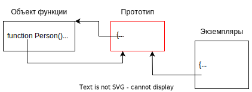

# Классы "старой школы"

До появления ключевого слова `class` тоже можно было создавать классы объектов. В JS вся "классовость" является синтаксическим сахаром над созданием объекта и установкой ему прототипа. Класс является скорее концепцией, вроде "набор объектов, у которых один и тот же прототип".

Поэтому, прежде чем переходить к сахару, посмотрим на то как можно создавать классы объектов "без классов".

## Пример 1, каменный век

Суть в том, что:

* Объявляется "фабричная" функция, через которую будут создаваться объекты.
* К этой функции добавляется какое-нибудь свойство, в которую мы кладем прототип для будущих объектов.

```javascript
function person(firstname, lastname) {  // <-- "Фабричная функция" для производства объектов
  const p = Object.create(person.basis);
  p.firstname = firstname;
  p.lastname = lastname;

  return p;
}

person.basis = {  // <-- Основа для будущих объектов
  fullname() {
    return `${this.firstname} ${this.lastname}`;
  }
};

const huck = person("Huck", "Finn");
console.log(huck.fullname());  // Huck Finn

const becky = person("Becky", "Thatcher");
console.log(becky.fullname());  // Becky Thatcher
```

В итоге у нас получились объекты huck и becky, которые образуют класс объектов person. Реализация не пользуется никакими специальными конструкциями языка, но по сути создает объекты с общим прототипом.

## Пример 2, средневековье

```javascript
function Person(firstname, lastname) {  // <-- Функция-конструктор
  this.firstname = firstname;
  this.lastname = lastname;
}

Person.prototype = {  // <-- Задаем прототип
  fullname() {
    return `${this.firstname} ${this.lastname}`;
  }
};

const huck = new Person("Huck", "Finn");
console.log(huck.fullname());  // Huck Finn

const becky = new Person("Becky", "Thatcher");
console.log(becky.fullname());  // Becky Thatcher
```

Здесь уже используется языковая возможность `функции-конструктора`, синтаксис которой позволяет нам автоматически создать и вернуть новый объект, а также установить ему нужный прототип.

# Принадлежность к классу

## a instanceof b

Оператор `instanceOf` определяет принадлежность объекта `a` к классу `b`. В качестве b должен быть конструктор. Проверяется принадлежность по цепочке, а не только непосредственная:

```javascript
function Person(firstname, lastname) {  // <-- Первый конструктор
  this.firstname = firstname;
  this.lastname = lastname;
}

function Human(fullname) {  // <-- Второй конструктор
  const name = fullname.split(" ");
  this.firstname = name[0];
  this.lastname = name[1];
}

const foobar = {  // <-- Общий для обоих конструкторов прототип
  fullname() {
    return `${this.firstname} ${this.lastname}`;
  }
};

Person.prototype = foobar;  // <-- Выставим одинаковые прототипы
Human.prototype = foobar;

const huck = new Person("Huck", "Finn");  // <-- Создали Гека через конструктор Person

const huckIsPerson = huck instanceof Person;  // <-- Очевидно Гек это Person
console.log(huckIsPerson);  // true
huckIsHuman = huck instanceof Human;  // <-- Но он так же и Human
console.log(huckIsHuman);  // true
```

Как видно, хотя huck был создан с помощью конструктора Person, но instanceOf выдает true даже при сравнении с Human. Все потому, что у Person и Human выставлены одинаковые прототипы, а оператор instanceof ориентируется по прототипам. Если прототипом объекта `a` является объект из `b.prototype`, то считается что a является экземпляром класса b.

## a.isPrototypeOf(b)

С помощью instanceof нельзя проверить прототипность двух объектов непосредственно. Например:

```javascript
const a = { };
const b = Object.create(a);

const bIsA = b instanceof a;  // <-- Ошибка!
console.log(bIsA);
```

Для этих случаев есть метод `a.isPrototypeOf(b)`:

```javascript
const a = { };
const b = Object.create(a);

const bIsA = a.isPrototypeOf(b);  // true
console.log(bIsA);
```

# Связь объекта и его конструктора

Когда мы хотим, чтобы создаваемые с помощью функции-конструктора объекты имели определенный прототип, то мы кладем нужный объект в свойство `prototype` ФК. Но на самом деле, у любой функции уже есть объект в этом свойстве. И у этого объекта единственное свойство - `constructor`, которое указывает на саму функцию. Выглядит это примерно так:



В чем тут суть? В том что когда мы создаем объект с помощью ФК, то в prototype этого объекта попадает тот самый прототип со свойством constructor и т.о. вновь созданный объект имеет ссылку на ФК, с помощью которой он был создан.

Из этого следует, что когда мы хотим сделать наследуемые методы, то нам не обязательно создавать отдельный объект и класть его в prototype ФК. Мы можем добавлять их в уже имеющийся там объект:

```javascript
function Person(firstname, lastname) {  // <-- Функция-конструктор
  this.firstname = firstname;
  this.lastname = lastname;
}

Person.prototype.fullname = function() {  // <-- Добавляем методы в дефолтный прототип
  return `${this.firstname} ${this.lastname}`;
};

const huck = new Person("Huck", "Finn");
console.log(huck.fullname());  // Huck Finn

const becky = new Person("Becky", "Thatcher");
console.log(becky.fullname());  // Becky Thatcher
```

Либо, если все же делаем через отдельный объект, то можем вручную восстановить свойство constructor:

```javascript
function Person(firstname, lastname) {  // <-- Функция-конструктор
  this.firstname = firstname;
  this.lastname = lastname;
}

Person.prototype = {  // <-- Перезаписываем прототип
  constructor: Person,  // <-- И вручную восстанавливаем свойство constructor
  fullname() {
    return `${this.firstname} ${this.lastname}`;
  }
};

const huck = new Person("Huck", "Finn");
console.log(huck.fullname());  // Huck Finn

const becky = new Person("Becky", "Thatcher");
console.log(becky.fullname());  // Becky Thatcher
```

