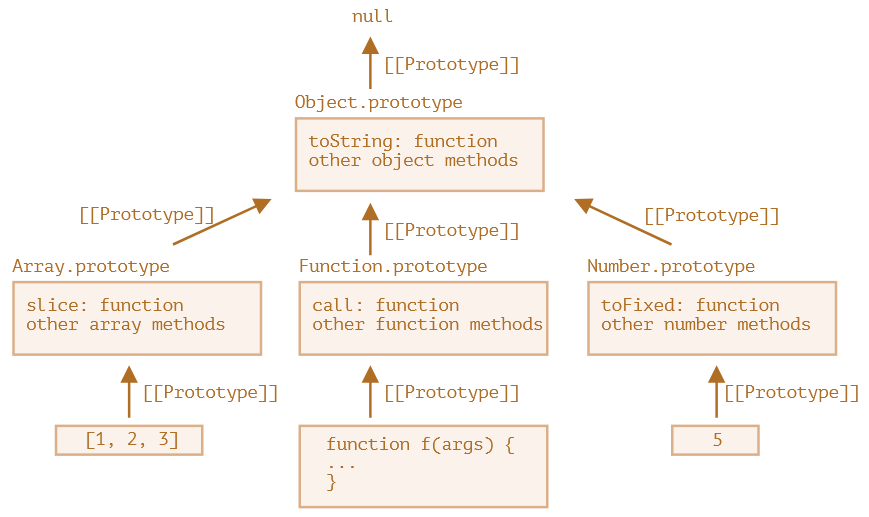

# Объекты и прототипы

## Объект

`Объект` - это тип данных, обычно состоящий из нескольких свойств. В Javascript объекты являются основой для построения всех остальных сложных структур данных - массивов, мапы, сета и т.д. Даже функции являются объектами.

## Прототип

`Прототип` - это объект, который служит основой для другого объекта. Как например в C# или Java есть базовый объект Object, от которого наследуются все остальные, так и в JS есть подобные базовые объекты. Примеры таких объектов:

* Object.prototype - является прототипом для *всех* объектов.
* Array.prototype - является прототипом для массивов.
* Date.prototype - является прототипом для объектов даты.
* Map.prototype - является прототипом для мап.



Как видно по схеме, в основе всех объектных типов лежит объект Object.prototype. У него самого нет прототипа, его свойство prototype = null. Object тут - это функция-конструктор.

## Зачем нужен прототип

Благодаря прототипам объекты "наследуют" свойства. Если объекту C поставить в качестве прототипа объект P, а затем вызвать какой-нибудь метод или обратиться к свойству, которого нет в C, то этот метод или свойство будут искаться в объекте P. Если их нет и там, то в прототипе P и т.д. до самого верхнего объекта.

Например объекты имеют метод toString() за счет того, что он определен в объекте Object.prototype. А у массивов этот метод работает по-своему, потому что переопределен в объекте Array.prototype и т.д.

Прототип можно задать в момент создания объекта. TODO: а можно изменить прототип у уже созданного объекта? Здесь только базовая информация о прототипах, а более подробно - в отдельном конспекте.

# Создание объекта

## Функция-конструктор

Синтаксис создания объекта через оператор `new` называется "Конструктор объекта". В нем используется `функция-конструктор` (в данном случае Object является функцией-конструктором. Подробнее про функцию-конструктор - в отдельном конспекте):

```javascript
let user = new Object();
```

Тут создается пустой объект, без свойств. Прототипом созданного объекта является объект, лежащий в свойстве `prototype` функции-конструктора `Object`. (Object.prototype)

## Объектный литерал

Такой синтаксис, когда используются фигурные скобки, а внутри описываются свойства, называется "Объектный литерал" и является предпочтительным:

```javascript
let user = {};
```

Тут создается пустой объект, без свойств. Прототипом созданного объекта является Object.prototype

```javascript
let user = {  // <-- А тут создается объект с двумя свойствами
  login: "Tom",
  password: "marktwain"
}
```

## Метод Object.create()

### Указание прототипа

С помощью метода `Object.create` мы можем создать объект и явно указать, какой прототип для него нужно использовать:

```javascript
const humanRace = {  // <-- У этого объекта прототипом будет Object.prototype, по умолчанию
  race: "human",
  hp: 100,
  mana: 50
};

const player = Object.create(humanRace);  // <-- А у объекта player прототипом будет объект humanRace

console.log(player.race);  // human <-- Поэтому все свойства humanRace появились и у player
console.log(player.hp);  // 100
console.log(player.mana);  // 50
```

### Добавление новых свойств

Через второй (опциональный) параметр Object.create мы можем передать `дескрипторы свойств`. Тогда эти свойства добавятся в новый объект:

```javascript
const humanRace = {
  race: "human",
  hp: 100,
  mana: 50
};

const player = Object.create(humanRace, { // <-- Второй параметр - это дескрипторы свойств
  honor: { value: 1000, writable: true, enumerable: true },  // <-- Добавим объекту player два новых свойства
  nickname: { value: "JohNy", writable: false, enumerable: true }
});

console.log(player.nickname);  // JohNy
console.log(player.honor);  // 1000
```

Синтаксис дескрипторов можно посмотреть в конспекте про свойства (раздел "Добавление свойств", там методы Object.defineProperty и Object.defineProperties).

### Объект без прототипа

Можно создать объект, у которого не будет прототипа. Для этого нужно в Object.create передать null:

```javascript
const hasProt = Object.create({});  // <-- У этого будет прототип Object.prototype
console.log(hasProt.toString());  // [object Object]

const noProt = Object.create(null);  // <-- У этого не будет прототипа
console.log(noProt.toString());  // Ошибка! TypeError: noProt.toString is not a function
```

Поскольку у второго объекта нет прототипа, то соответственно нет и функции toString(), поэтому возникла ошибка.

# Свойства нового объекта

Свойства созданного объекта являются его собственными. Т.е. если их изменить, то они изменятся именно в самом объекте, а не в прототипе. Этим можно пользоваться, чтобы безопасно передавать свои объекты в сторонние функции. Если эти функции вдруг изменят значения в свойствах, то оригинальный объект не пострадает:

```javascript
let o = { x: "Не изменяйте это значение!" };
library.function(Object.create(o));  // <-- Защитились от случайного изменения оригинального объекта
```