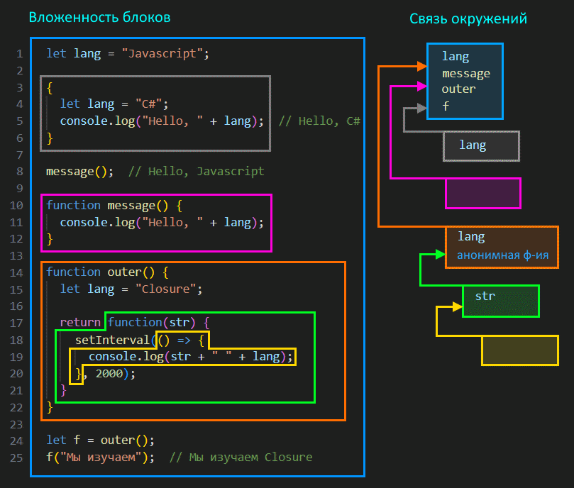

# Предисловие

Про устройство JS написано много статей, про всякие "лексические окружения", this и т.д. Приведены картинки, даже какие-то ссылки на спецификацию и т.д. Я таких статей прочитал несколько, помедитировал над ними и у меня как будто картина сложилась, я понял как работают синтаксические конструкции и главное, якобы, *почему* они так работают. И написал исходную версию этого конспекта под влиянием этих статей.

Однако вот [этот комментарий](https://habr.com/ru/companies/lanit/articles/733064/#comment_25536620) к очередной статье про "устройство JS" привел меня к выводу, что скорее всего львиная доля всех технических деталей в этих статьях, а следовательно и в моем конспекте, - это мифы и заблуждения. Т.е. вообще не факт, что оно все так устроено.

Поэтому старую версию конспекта я решил оставить, но переименовать в legacy, и написать новую версию. Пусть старая останется как напоминание о возможных заблуждениях, на случай, если вдруг когда-то мне потребуется все хорошенько вспомнить и чтобы я знал, что это заблуждения (возможно).

В общем, эта новая версия конспекта максимально огорожена от каких бы то ни было технических деталей и объяснения основаны исключительно на внешнем виде самого кода. Т.е. можно сказать, что объяснение получается в стиле "этот код работает так, потому что он выглядит так", а не "этот код работает так, потому что под капотом там вот так".

[Ссылка на спецификацию](https://tc39.es/ecma262/#sec-execution-contexts), если вдруг надо.

# Внешние переменные

Функции имеют доступ к внешним переменным, могут их изменять. Если внутри функции есть переменная с таким же именем, как и внешняя, то функция будет пользоваться той, что "ближе" к ней, т.е. локальной.

```javascript
let username = "Alice";

function hello() {
  let username = "Bob";  // <-- Функция воспользуется локальным username
  console.log("Привет, " + username);  // Привет, Bob
}

console.log(username);  // Alice
hello();  // Привет, Bob
```

```javascript
let username = "Alice";

function hello() {
  username = "Sam";  // Перезаписали внешнюю переменную.
  console.log("Привет, " + username);
}

console.log(username);  // Alice
hello();  // Привет, Sam
console.log(username);  // Перезаписалось и стало Sam
```

Возможность работать с внешними переменными связана с понятием окружения.

# Окружение

## Связь окружений

Код логически представляет собой блоки, вложенные друг в друга. Самый внешний блок - это скрипт в целом. Функция внутри скрипта - это вложенный блок. Функция внутри функции - еще один вложенный блок и т.д.

У каждого блока есть так называемое *окружение* (environment), в котором находятся все вещи, присутствующие в этом блоке. Например, для функции это параметры, локальные переменные, вложенные функции. Для обычного блока, заключенного в `{ }`, это переменные и функции. Для скрипта - тоже переменные и функции.

Каждый блок кроме своего окружения имеет доступ к "внешнему окружению" - окружению внешнего блока. В итоге формируется цепочка, по которой самый внутренний блок может добраться до окружения самого внешнего блока. За счет этого, когда мы обращаемся к какому-то элементу, которого нет в собственном окружении блока (например, к переменной), он ищет его в окружении внешнего блока. Если элемента нет и там, то ищет еще выше и т.д. до самого верха.

Пример:



Желтый блок - лямбда с пустым окружением, т.к. у нее нет ни параметров, ни локальных переменных. Но в ней используются переменные str и lang. Поскольку в своем окружении она их не находит, она проверяет окружение внешнего блока - зеленого. Там она обнаруживает str. Но ей все еще нужен lang. Она опять идет выше, в оранжевый блок, и находит lang в его окружении.

Еще раз стоит вспомнить, что функции - это объекты, поэтому они хранятся и отыскиваются в окружениях как и прочие значения. Это к вопросу о том, что внутри окружения функции outer хранится не только переменная lang, но и функция, которую мы возвращаем.

Важный момент - внешнее окружение функции определяется по моменту ее создания, а не моменту ее выполнения. Например, обведенная зеленым функция создается внутри функции outer, а выполняется внутри скрипта. Для нее внешним окружением является окружение outer, а не окружение скрипта.

> Я намеренно не писал здесь, что окружение - это объект или что-то другое, потому что достоверно выяснять как оно реализовано в языке смысла нет. Имхо достаточно логического понимания как оно работает и что в нем находится. При попытке раскопать технические детали велика вероятность раскопать мифы и заблуждения.
>
> Также я не писал, в какой момент окружение создается и как именно блоки хранят ссылки на свое и внешнее окружение. Имхо, достаточно знать, что во время выполнения блока окружение существует и что есть ссылка на внешнее.

В целом, чтобы понять связь окружений, лучше просто визуально посмотреть на код, а не задумываться о технической части. Визуал отражает связь максимально точно. Что во что вложено визуально, то в то и будет вложено при обращении в работе.

Код с картинки:

```javascript

let lang = "Javascript";

{
  let lang = "C#";
  console.log("Hello, " + lang);  // Hello, C#
}

message();  // Hello, Javascript

function message() {
  console.log("Hello, " + lang);
}

function outer() {
  let lang = "Closure";

  return function(str) {
    setInterval(() => {
      console.log(str + " " + lang);
    }, 2000);
  };
}

let f = outer();
f("Мы изучаем");  // Мы изучаем Closure
```

## Дополнительные объяснения

В предыдущем разделе функции были вложены в функции, причем вложенные функции возвращались. Это позволяет понять основую идею окружений. Но нужно разобрать еще некоторые случаи, которые работают по тому же принципу, но выглядят по-другому и чтобы не сомневаться, их надо тоже увидеть.

### Функция просто вложена в функцию

Когда функция просто описана внутри другой функции, их окружения тоже связаны:

```javascript
function outer() {
  function inner() {
    console.log(message);
  }

  let message = "Эта переменная описана в функции outer."
  inner();
}

outer();  // "Это переменная описана в функции outer."
```

Здесь функция `inner()` видит переменную `message`, описанную в функции `outer()`, потому что окружение inner имеет ссылку на окружение outer. Опять же, видим что визуально одна функция вложена в другую, значит их окружения связаны.

### Функции вложены в объекты

Если из функции возвращается не функция, а объект с функциями (методами), то это не влияет на принципы организации связи окружений этих функций. Связь окружений по-прежнему можно определить визуально:

```javascript
const person = {
  firstname: "Huck",
  lastname: "Finn",
  foobar() {
    let fn = this.firstname;
    let ln = this.lastname;
    // let fn = firstname;  // Так была бы ошибка [1]
    // let ln = lastname;
    return {
      next() {
        return {
          fn2: fn, // [2]
          ln2: ln,
          nomatter() {
            let obj = {
              value1: fn + " " + ln,
              value2: this.fn2 + " " + this.ln2
              // value2: fn2 + " " + ln2  // Так была бы ошибка [3]
            }
            return obj;
          }
        }
      }
    }
  }
};

const foo = person.foobar();
const obj = foo.next().nomatter();
console.log(obj.value1);  // Huck Finn
console.log(obj.value2);  // Huck Finn
```

Здесь у нас объект person с двумя полями firstname и lastname и методом foobar(). В этом методе создается две переменные и в них кладутся значения из полей. Поскольку метод foobar вызывается на объекте person, то this указывает на person и все работает. Если же написать без this, как в показано в `[1]`, то будет ошибка. Т.к. в функции foobar нет переменных firstname и lastname, она будет искать их в окружении скрипта. Там их тоже нет, поэтому и ошибка.

Далее из метода foobar возвращается объект с методом next(). Именно что не функция next() возвращается, а объект с методом next(), это важно. А этот метод тоже возвращает объект, в котором два поля fn2 и ln2 и метод nomatter(). Тут специально намешано таких вложений объектов и методов, чтобы показать, что все эти вложения никак не влияют на связь окружений. Так вот, в моменте `[2]` мы обращаемся к идентификаторам fn и ln. Это обращение происходит, по сути, внутри функции next(). Т.е. неважно, что эта строчка написана внутри объекта, это не меняет факта, что обращение происходит внутри функции next(). В собственном окружении next таких идентификаторов нет, поэтому она ищет их во внешнем окружении, т.е. в окружении функции foobar. Там они есть, поэтому значения берутся из них и успешно попадают в поля объекта.

Далее идет метод nomatter. В нем создается объект obj с двумя полями. В одном идет обращение к fn и ln, а в другом - к this.fn2 и this.ln2. Касаемо fn и ln, таких идентификаторов в собственном окружении у функции nomatter нет, поэтому она ищет их во внешнем окружении - в окружении функции next. Там их тоже нет, поэтому ищет дальше - в окружении foobar. Там они есть, поэтому все работает. Ну а к fn2 и ln2 обращени идет через this, соответственно this указывает на объект, на котором nomatter вызывается как метод.

Вся эта писанина просто для того, чтобы продемонстрировать, что когда речь идет об окружениях, то "визуальный" метод работает одинаково, где бы функции ни находились - хоть непосредственно возвращаются из функций, хоть находятся в составе объектов, хоть как.

# Замыкание

## Что такое замыкание

Замыкание (closure), как термин CS, означает функцию, которая пользуется свободными переменными. Свободные переменные - это переменные, не являющиеся ее локальными переменными или параметрами, одним словом, "внешние" по отношению к ней.

Не во всех языках можно обращаться к внешним переменным, но в JS - можно. Пример срача на тему что такое замыкание и является ли функция, приведенная автором, замыканием, можно почитать [тут](https://qna.habr.com/q/1113012). Итог обсуждения - вопрос "приведите пример замыкания" - дискуссионный и требует уточнить у спрашивающего, что лично он понимает под замыканием.

Вот например про такую функцию можно сказать, что она не является замыканием, потому что не пользуется свободными переменными:

```javascript
let name = "Tom";

function message() {
  console.log("Hello");
}
```

А вот про такую - можно сказать, что она является замыканием, потому что пользуется свободной переменной:

```javascript
let name = "Tom";

function message() {
  console.log("Hello, " + name);  // <-- Используем свободную переменную name
}
```

Однако может попасться человек, который и вторую функцию не назовет замыканием. Для таких замыканием является только что-то вроде такого:

```javascript
function counter() {
  let count = 0;
  return function() {
    count++;  // <-- Функция пользуется свободной переменной и описана внутри другой функции
  }
}

let cnt = counter();
cnt();  // Переменная count станет 1
cnt();  // Переменная count станет 2
```

Так что в случае споров нужно уточнять у спрашивающего, что именно он понимает под замыканием.

## Замыкание и окружение

В замыкании важен факт, что оно удерживает внешнее окружение в памяти, за счет чего можно реализовать инкапсуляцию и состояние.

Возьмем такой код:

```javascript
function foobar() {
  let lang = "Javascript";  
  console.log("Мы изучаем " + lang);
}

foobar();  // Мы изучаем Javascript
```

Здесь нет замыкания. После выполнения функции foobar, ее окружение удалится из памяти.

А теперь вот такой код:

```javascript
function foobar() {
  let lang = "Javascript";

  return function(str) {  // <-- Условно назовем эту функцию "R"
    console.log(str + " " + lang);
  }
}

let f = foobar();
f("Мы изучаем");  // Мы изучаем Javascript
```

Здесь есть замыкание: возвращаемая из foobar функция (назовем ее R) использует переменную lang из окружения foobar. Стало быть, когда мы будем вызывать R, ей для получения значения lang потребуется окружение foobar, а значит его нельзя удалять из памяти. Поэтому оно останется там до тех пор, пока существует ссылка на R. В данном примере, если бы мы в конец добавили например `f = null;`, то потеряли бы ссылку на R, а стало быть и ссылку на окружение foobar. Вот в этом случае сборщик мусора удалил бы его.
