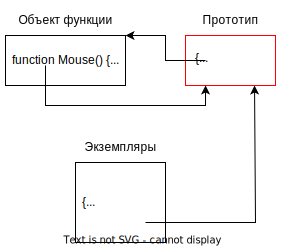

# Функция-конструктор

## Оператор new

Технически ФК - это обычная функция, без каких-либо особенностей. От прочих функций ФК отличается только концептуально - она предназначена для создания объектов, а не для вычислений.

Вся "магия" создания объекта через ФК заключается не в самой ФК, а в операторе `new`:

```javascript
function User(name) {  // <-- При вызове функции через new
  // this = {};  // <-- неявно создается новый пустой объект и помещается в this
  this.name = name;  // <-- Теперь в этот объект мы можем накидать свойств (и методов)
  // return this;  // <-- А в конце функции этот this неявно возвращается
};

let tom = new User("Tom");  // <-- Используем new для вызова ФК, чтобы заработала "магия"
let huck = new User("Huck");
```

Итого, оператор new дает нам три вещи ("магия"):

* При вызове функции неявно создает пустой объект и помещает его в this.
* Устанавливает этому объекту прототип, лежащий в свойстве `.prototype` ФК. Для примера выше это объект из `User.prototype` (там по умолчанию уже лежит объект, но мы можем его перезаписать, покажу дальше).
* Неявно возвращает созданный объект из функции.

Для описания ФК есть некоторые соглашения:

* Имя ФК должно начинаться с большой буквы.
  * Технически это не обязательно, но принято с большой, чтобы сразу было видно, что это именно ФК.
* Вызывать ФК нужно с помощью оператора `new`, иначе не будет работать магия.

## Вызов без new

Технически, можно вызывать конструктор без new, но тогда объект не создастся, результатом будет undefined:

```javascript
function User(name) {
  this.name = name;
}

let tom = User("Tom");

console.log(tom);  // undefined
```

Внутри конструктора с помощью конструкции `new.target` можно проверить, вызван ли конструктор без new:

* `new.target === undefined` - значит вызвано без new. Если же функция-конструктор вызвана как положено, с new, тогда в new.target будет лежать объект функции.

```javascript
function User(name) {
  if (new.target === undefined) {  // Если вызвано без new, мы за сами перевызовем как надо.
    return new User(name);
  }
  this.name = name;
}

let tom = User("Tom");

console.log(tom);  // User {name: 'Tom'}, теперь объект создался.
```

# Прототипы и ФК

## Установка прототипа для создаваемого объекта

При создании объекта может понадобиться установить ему прототип. Это можно легко сделать с помощью ФК. Для этого в свойство ФК `.prototype` кладем нужный объект и он станет прототипом для созданных через эту ФК объектов:

```javascript
let device = {  // <-- Прототип для всех устройств
  connectable: true
};

function Mouse(buttons, wired) {  // <-- ФК для создания мышей
  this.buttons = buttons;
  this.wired = wired;
}

Mouse.prototype = device;  // <-- Задаем, какой прототип ставить объектам, созданным через ФК Mouse

let mouse = new Mouse(5, true);  // <-- Теперь объект device будет прототипом объекта mouse

console.log(mouse.connectable);  // true  // <-- У mouse нет свойства connectable, но оно есть у прототипа
```

## Свойство .prototype у функции

### Дефолтное значение .prototype

На самом деле, в свойстве .prototype у любой функции уже лежит объект по умолчанию:

```javascript
let device = {
  connected: false
};

function Mouse(buttons, wired) {
  this.buttons = buttons;
  this.wired = wired;
}
console.log(Mouse.prototype);  // <-- Тут уже лежит объект { constructor: ƒ Mouse(buttons, wired) }

// Mouse.prototype = device;  // <-- Т.е. так мы бы его по сути не определили, а ПЕРЕопределили
let mouse = new Mouse(5, true);
console.log(mouse.constructor);  // <-- ƒ Mouse(buttons, wired), ФК через которую мы создали объект
```

У этого объекта единственное свойство - `constructor`, которое указывает на саму функцию. Выглядит это примерно так:



Теперь должно быть понятно, что значит `{ constructor: ƒ Mouse(buttons, wired) }` - это объект со свойством constructor и оно указывает на функцию Mouse.

Когда мы создаем объект O с помощью ФК, то в его prototype попадает этот самый объект со свойством constructor и т.о. O имеет ссылку на ФК, с помощью которой он был создан.

Из этого следует, что когда мы хотим сделать наследуемые методы, то нам не обязательно создавать отдельный объект и класть его в prototype ФК. Мы можем добавлять их в уже имеющийся там объект:

```javascript
function Person(firstname, lastname) {  // <-- Функция-конструктор
  this.firstname = firstname;
  this.lastname = lastname;
}

Person.prototype.fullname = function() {  // <-- Добавляем методы в дефолтный прототип
  return `${this.firstname} ${this.lastname}`;
};

const huck = new Person("Huck", "Finn");
console.log(huck.fullname());  // Huck Finn

const becky = new Person("Becky", "Thatcher");
console.log(becky.fullname());  // Becky Thatcher
```

### Восстановить свойство constructor

Либо, если все же делаем через отдельный объект, то можем вручную восстановить свойство constructor:

```javascript
function Person(firstname, lastname) {  // <-- Функция-конструктор
  this.firstname = firstname;
  this.lastname = lastname;
}

Person.prototype = {  // <-- Перезаписываем прототип
  constructor: Person,  // <-- И вручную восстанавливаем свойство constructor
  fullname() {
    return `${this.firstname} ${this.lastname}`;
  }
};

const huck = new Person("Huck", "Finn");
console.log(huck.fullname());  // Huck Finn

const becky = new Person("Becky", "Thatcher");
console.log(becky.fullname());  // Becky Thatcher
```

### .prototype - это не прототип самой функции

Свойство `.prototype` есть только у функций и надо понимать, что это *не прототип самой функции*:

```javascript
function Mouse(buttons, wired) {  // <-- ФК
  this.buttons = buttons;
  this.wired = wired;
}

function foobar() {  // <-- Обычная функция
}

// <-- Объекты в свойствах prototype у них разные
console.log(Mouse.prototype);  // <-- Объект { constructor: ƒ Mouse(buttons, wired) }
console.log(foobar.prototype);  // <-- Объект { constructor: ƒ foobar() }

// <-- А вот собственный прототип у них один и тот же
const mouseRealProto = Object.getPrototypeOf(Mouse);
const foobarRealProto = Object.getPrototypeOf(foobar);
console.log(mouseRealProto);  // <-- ƒ () { [native code] }
console.log(foobarRealProto);  // <-- ƒ () { [native code] }
console.log(mouseRealProto === foobarRealProto);  // true, у всех функций одинаковый прототип

// <-- У массивов нет свойства .prototype, а прототип конечно же есть
const arr = [5, 7, 3, 8];
console.log(arr.prototype);  // <-- undefined, у массивов нет свойства .prototype
const arrayRealProto = Object.getPrototypeOf(arr);  // <-- Но конечно у них есть прототип
console.log(arrayRealProto);  // <-- [at: ƒ, concat: ƒ, copyWithin: ƒ, fill: ƒ, find: ƒ, …]
```

# Методы в ФК

Поскольку методы объекта - это просто функции, положенные в свойства, то мы легко можем внутри ФК снабдить объект методами:

```javascript
function User(name) {
  this.name = name;

  this.hello = function hello() {  // <-- Кладем функции в поля наряду с обычными значениями
    console.log(`Hello, my name is ${this.name}!`);
  }
}

let tom = new User("Tom");
tom.hello();  // Hello, my name is Tom!  // <-- Метод имеется
```

Стоит отметить, что вот так добавить функции не получится:

```javascript
function User(name) {
  this.name = name;

  // <-- Такой синтаксис - это просто описание функции внутри ФК
  function hello() {  // <-- Так метод не появится в объекте
    console.log(`Hello, my name is ${this.name}!`);
  }
    
  // this.hello = hello;  // <-- Вот если дополнительно сделать так - тогда всё ок
}

let tom = new User("Tom");
tom.hello();  // Ошибка: TypeError: tom.hello is not a function
```

```javascript
function User(name) {
  this.name = name;
  // SyntaxError: In strict mode code, functions can only be declared at top level or inside a block.
  hello: function() {  // <-- Так нельзя добавить метод объекту
    console.log(`Hello, my name is ${this.name}!`);
  }
}
```

В общем, не надо путать ФК с литералом объекта. В ФК мы работаем со свойствами объекта и можем класть туда функции, если хотим добавить метод, и никакой другой синтаксис для этого не подойдет.

# Одноразовая ФК

Если при создании объекта нужна какая-то сложная логика, но при этом объект планируется сделать только один, то мы можем эту логику создания поместить в безымянную функцию, которая тут же выполнится. Получится своеобразный "одноразовый конструктор":

```javascript
let tom = new function() {  // new заставит функцию выполниться сразу
  if (2 > 1) {  // Имитация сложной логики
      this.name = "Tom";
  } else {
      this.name = "Huck";
  }
}
```

# return в ФК

`return` в ФК писать не принято. Однако, синтаксически это возможно. Здесь два варианта:

* Если return пустой или содержит примитив, то из ФК ничего не вернется, будто return нет вовсе.
* Если return возвращает объект, то вернется именно этот объект.

Например:

```javascript
function User(name) {
  this.name = name;
  return 100;  // <-- return с примитивом
}

let tom = new User("Tom");

console.log(tom);  // User {name: 'Tom'}, return'а как будто и не было
```

```javascript
function User(name) {
  this.name = name;
  return { age: 30 };  // <-- return с произвольным объектом
}

let tom = new User("Tom");

console.log(tom);  // {age: 30}, вернулся объект из return, а не тот, который мы хотели создать.
```

