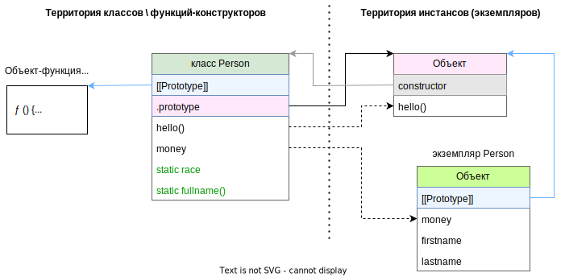

P.S. Этот конспект ориентирован на получение хорошего понимания, что такое классы в JS по своей сути. Его надо читать, если вдруг подзабыл что к чему или вообще не знал. Если вдруг надо просто вспомнить синтаксис, то для этого есть отдельный конспект, где упор на простой показ синтаксиса, без объяснений как это работает под капотом.

# Ключевое слово class и функция-конструктор

Ключевое слов `class` является синтаксическим сахаром над функцией-конструктором. По сути, класс и есть ФК:

```javascript
class Person { }
function foobar() { }

const classProto = Object.getPrototypeOf(Person);
const functionProto = Object.getPrototypeOf(foobar);
console.log(classProto === functionProto);  // true  // <-- Класс и функция - родственники
```

Напоминаю, что не надо путать объект из свойства .prototype у функции и прототип функции - это разные вещи.

## Сравнение класса и ФК, static- и обычные элементы

* `[[Prototype]]` - это непосредственный прототип самой вещи (класса, функции, экземпляра).
* `.prototype` - это свойство, которое есть у всех функций (и только у функций). Оно содержит объект, который устанавливается в качестве прототипа экземпляру класса.

Вот пример класса с последующим разбором того, где располагаются описанные в нем элементы:

```javascript
class Person {
  static race = "Human";  // <-- Статическое св-во класса - это св-во самой ФК
  money = 6000;  // <-- Обычное св-во класса - это св-во созданного объекта

  constructor(firstname, lastname) {  // <-- Конструктор класса - это тело ФК
    this.firstname = firstname;  // <-- Добавляем новому объекту поля
    this.lastname = lastname;
  }

  static fullname(firstname, lastname) {  // <-- Статический метод класса - это св-во самой ФК
    return `${firstname} ${lastname}`;
  }

  hello() {  // <-- Обычный метод класса - это метод созданного экземпляра (но хранится не в нем, а в прототипе)
    const fullname = Person.fullname(this.firstname, this.lastname);
    console.log(`Hello, my name is ${fullname}, I am a ${Person.race}. I have ${this.money}$.`);
  }
}

const tom = new Person("Tom", "Sawyer");
tom.hello();  // Hello, my name is Tom Sawyer, I am a Human. I have 6000$.
```

Диаграмма для этого примера:



### static поля и методы

static-поля и static-методы находятся непосредственно в классе:

```javascript
console.log(Person.hasOwnProperty("race"));  // true
console.log(Person.hasOwnProperty("fullname"));  // true
```

### Обычные поля и методы

Обычных полей и обычных методов в классе нет:

```javascript
console.log(Person.hasOwnProperty("money"));  // false
console.log(Person.hasOwnProperty("hello"));  // false
```

Обычные методы класса хранятся в объекте из свойства `.prototype` класса:

```javascript
console.log(Person.prototype.hasOwnProperty("hello"));  // true

console.log(Person.prototype);  // <-- Объект из свойства .prototype у класса
// {  // <-- Сюда попадают обычные методы класса
//   constructor : class Person
//   hello : ƒ hello()  // <-- Вот обычный метод
// }
```

Следовательно, экземпляр класса может пользоваться обычными методами благодаря тому, что они есть в его (экземпляра) прототипе. Сам же экземпляр этими методами не обладает:

```javascript
console.log(tom.hasOwnProperty("hello"));  // false
```

А вот обычные поля находятся как раз в самом экземпляре, а в прототипе их нет:

```javascript
console.log(Person.prototype.hasOwnProperty("money"));  // false
console.log(tom.hasOwnProperty("money"));  // true
```

### Реализация через ФК

Так что то же самое можно реализовать через ФК:

```javascript
function Person(firstname, lastname) {  // <-- Тело ФК - это конструктор класса
  this.firstname = firstname;  // <-- Это св-ва, добавляемые новому объекту в конструкторе класса
  this.lastname = lastname;
  this.money = 6000;  // <-- А это было объявлено как поле класса
}

Person.prototype.hello = function hello() {  // <-- Этот метод был обычным методом класса
  const fullname = Person.fullname(this.firstname, this.lastname);
  console.log(`Hello, my name is ${fullname}, I am a ${Person.race}. I have ${this.money}$.`);
};

Person.fullname = function fullname(firstname, lastname) {  // <-- А это был static-метод класса
  return `${firstname} ${lastname}`;
}
Person.race = "Human";  // <-- Это было static-поле класса

const tom = new Person("Tom", "Sawyer");
tom.hello();

// <-- { hello: ƒ hello(), constructor: ƒ Person(firstname, lastname) }
const tomRealPrototype = Object.getPrototypeOf(tom);
console.log(tomRealPrototype === Person.prototype);  // <-- true
```

## Выводы

Итого:

* class - это синтаксический сахар над функцией-конструктором.
* Конструктор класса - это тело ФК.
* Статические свойства и методы класса являются свойствами и методами самой ФК.
* Обычные методы попадают в объект, который ставится как прототип для экземпляров.
* Обычные свойства попадают непосредственно в экземпляры.

# this в классах

## this в static-методах

Поскольку static-методы класса - это методы ФК, и вызываются они тоже на ФК, то this внутри них будет указывать на саму ФК. Стало быть, в JS, в отличие от например Java и C#, использование this в static-методах классов вполне обычное дело:

```javascript
class Person {
  static race = "Human";

  static whoami() {
    console.log(this.race);
  }
}

Person.whoami();  // Human
```

## this в обычных методах

В обычных методах для обращения к полям нужно обязательно использовать this, иначе будет как обращение к необъявленному идентификатору:

```javascript
class Person {
  constructor(fullname) {
    this.fullname = fullname;
  }

  hello() {
    // <-- this обязательно для доступа к полям объекта
    console.log(`Hello, my name is ${this.fullname}.`);
  }

  goodbye() {
    // <-- Без this получим ReferenceError: fullname is not defined
    console.log(`Goodbye, my name is ${fullname}.`);
  }
}

const tom = new Person("Tom Sawyer");
tom.hello();  // Hello, my name is Tom Sawyer.
tom.goodbye();
```

# Добавление методов в существующий класс

Поскольку класс - это только синтаксический сахар над объектом и его прототипом, то если знать как это все работает без class, то можно делать все, что хочешь, например добавлять новые методы классу уже после того как объекты созданы, и тогда эти методы у объектов появятся:

```javascript
class User {  // <-- В классе User нет метода goodbye
  constructor(name) {
    this.name = name;
  }

  hello() {
    console.log(`Hello, ${this.name}!`);
  }
}

const user = new User("Tom");
user.hello();  // Hello, Tom!
// user.goodbye();  // Ошибка! user.goodbye is not a function  // <-- Нет такого метода

User.prototype.goodbye = function() {  // <-- Добавляем "метод в класс"
  console.log(`Goodbye, ${this.name}!`);
}

user.goodbye();  // Goodbye, Tom!  // <-- И он появляется у уже созданных объектов
```

# Имя класса - это идентификатор

## Имя класса - это имя переменной

Имя класса - это переменная, в которой лежит функция-конструктор:

```javascript
class Person {  // <-- Person - это, по сути, имя переменной, в которой лежит ссылка на функцию
  static race = "Human";
  nickname = "johny";

  static foobar() {
    console.log(this.race);
  }
}

const temp = Person;  // <-- Сохраним эту функцию во временную переменную
Person = 5;  // <-- А Person перезапишем как обычную переменную
console.log(Person);  // 5  <-- Теперь в Person лежит число 5

temp.foobar();  // Human  // <-- А переменная temp стала "классом"
const pers = new temp();  // и можно через temp создавать экземпляры Person
console.log(pers.nickname);
```

## Передача классов

Поскольку класс это функция, то с ним можно делать все то же самое, что с функцией - например, передавать куда-то и там использовать:

```javascript
class User {
  constructor(name) {
    this.name = name;
  }
}

function create(klass, username) {
  return new klass(username);
}

let user = create(User, "Huck");
console.log(user.name);  // Huck
```

# Экземпляры и объекты

Объект, созданный из класса, лучше называть самостоятельным термином - экземпляр (или инстанс).

# Абстрактные классы

Отдельного понятия "абстрактный класс" в JS нет.
