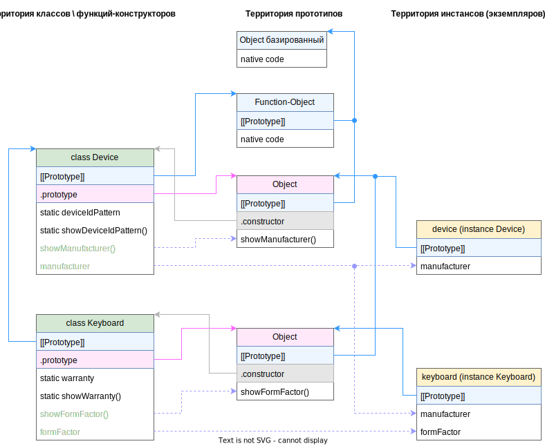

# Наследование, extends

Наследование выполняется ключевым словом `extends`:

```javascript
class MyArray extends Array {  // <-- extends
  get first() {
    return this[0];
  }
  get last() {
    return this.at(-1);
  }
}

const arr = new MyArray(5, 7, 4, 10, 15);
arr.unshift(3);  // <-- Объект унаследовал все методы
arr.push(20);
console.log(arr.length); // 7  // <-- И свойства массивов.
console.log(arr.first);  // 3  // <-- Приобрел свои собственные методы.
console.log(arr.last);   // 20
console.log(arr[5]);  // 15  // <-- Весь синтаксис обычных массивов продолжает работать
console.log(MyArray.isArray(arr));  // true  // <-- А сам класс MyArray также унаследовал статику от Array
```

Что получаем:

* Объекты, созданные через MyArray имеют все те же методы и свойства, что и объекты, созданные через Array.
* Сам MyArray унаследовал всю статику от Array.
* Весь синтаксис, применимый к массивам, работает и с потомком.

# Конструктор

## Собственный и родительский конструктор

Если мы хотим создать для потомка собственный конструктор, то *обязаны* вызвать в нем родительский конструктор (через `super()`) и сделать это *до* первого использования this. Родительский конструктор нужно вызывать, даже если ничего в него не передается.

```javascript
class Animal {
  constructor(name) {
    this.name = name;
  }
}

class Rabbit extends Animal {
  constructor(name, earLeng) {
    super(name);  // <-- super() вызываем обязательно, причем до первого использования this
    this.earLeng = earLeng;  // <-- Нельзя написать это перед вызовом super
  }
}

let rabbit = new Rabbit("Белый кролик", 20);

console.log(rabbit.name);     // Белый кролик
console.log(rabbit.earLeng);  // 20
```

## Переопределенные поля в родительском конструкторе

TODO: Когда-нибудь потом разобраться, почему технически это так работает. Пока обойдусь внешними проявлениями.

У родительского конструктора есть особенность: он всегда использует поля из собственного класса. Пример для наглядности, что имеется ввиду:

```javascript
class Animal {
  name = "Животное";

  constructor() {
    console.log(this.name);  // <-- Всегда будет использовать "Животное"
    this.move();  // <-- А тут зависит от того, кто вызывает
  }

  move() {
    console.log(`${this.name} передвигается.`);
  }
}

class Rabbit extends Animal {
  name = "Кролик";
  // constructor(...args) {  // <-- Неявно
  //   super(...args);
  // }
  move() {
    console.log(`${this.name} прыгает.`);
  }
}

let rabbit = new Rabbit();
/*
  Животное
  Животное прыгает
*/
rabbit.move();  // Кролик прыгает.
```

В чем здесь интерес? Rabbit является потомком Animal и имеет такое же поле (name) и такой же метод (move). Кролик наследует конструктор животного, в котором выводится значение поля и вызывается метод move. При этом видно, что значение name берется из класса Animal, а реализация метода - из класса Rabbit (иначе было бы написано "Животное передвигается"). В этом и заключается тонкость - родительский конструктор всегда использует поля из собственного класса. Подробнее об этом тут https://learn.javascript.ru/class-inheritance

## Выражение после extends

После `extends` можно указывать любое выражение, результатом которого является класс:

```javascript
function foobar() {
  return class {  // return class Animal {  // Можно указывать имя класса
    constructor(name) {
      this.name = name;
    }

    run() {
      console.log(`${this.name} бежит.`);
    }
  }
}

class Rabbit extends foobar() {  // <-- Вызываем функцию, которая возвращает класс
  hide() {
    console.log(`${this.name} спрятался.`);
  }
}

let rabbit = new Rabbit("Белый кролик");

rabbit.run();
rabbit.hide();
```

# Обращение к родителю, super

Ссылку на родителя из потомка можно получить через `super`. Например, если нужно вызвать из дочернего конструктора \ метода родительский:

```javascript
class TypedMap extends Map {
  #keyType;
  #valueType;

  constructor(keyType, valueType, entries) {
    if (!keyType || !valueType) {
      throw new Error("Для TypedMap требуется указать типы ключа и значения.");
    }
    if (entries) {
      for (const entry of entries) {
        const [key, value] = entry;
        if (typeof key !== keyType || typeof value !== valueType) {
          throw new TypeError("Неверный тип ключа или значения.");
        }
      }
    }
    
    super(entries);  // <-- Вызываем родительский конструктор и отдаем ему записи
    // Хотя super вызывается далеко не в начале, это ничего, ведь выше мы не юзали this.

    this.#keyType = keyType;
    this.#valueType = valueType;
  }

  set(key, value) {
    if (typeof key !== this.#keyType) {
      throw new TypeError("Неправильный тип ключа.");
    }
    if (typeof value !== this.#valueType) {
      throw new TypeError("Неправильный тип значения.");
    }

    super.set(key, value);  // <-- Вызываем родительскую реализацию метода
  }
}


const tmap = new TypedMap("number", "string");
tmap.set(1, "Tom");
// tmap.set("2", "Huck");  // Ошибка! Неправильный тип ключа.

console.log(tmap.get(1));
```

Несколько правил относительно super:

* `super` в конструкторе потомка нужно обязательно вызывать ДО первого использования this, иначе будет ошибка:

  ```javascript
  childConstructor(foobar, zxc) {
    super(zxc);  // <-- Так правильно - используем super ДО обращения к this.
    this.foobar = foobar;
    // super(zxc);  // <-- Ошибка! super нельзя использовать ПОСЛЕ обращения к this.
  }
  ```

* `super` в методах потомка можно вызывать в любом месте.

# О методах

## Поиск методов

Поиск методов осуществляется в таком порядке:

* Непосредственно в объекте, на котором метод вызван.
* В прототипе объекта.
* В прототипе прототипа.

## Переопределение методов

* Чтобы переопределить метод родителя, достаточно в потомке создать аналогичный метод. Никаких особенных ключевых слов не требуется.
* Для вызова родительской реализации есть ключевое слово `super.метод()`.

# Наследование под капотом

## Выводы

* Все наследование под капотом тоже строится на основе прототипов.
* Классы:
  * Прототипы классов:
    * У "корневого" родителя прототипом является объект-функция.
    * У потомка прототипом является класс родителя.
  * Свойство .prototype у классов:
    * И у родителей, и у потомков в свойстве .prototype лежит стандартный объект со свойством constructor, указывающим на сам класс.
      * В этом же стандартном объекте размещаются обычные методы класса.
  * Статические методы и свойства:
    * Статические методы и свойства располагаются в том классе, где объявлены.
    * Потомок "наследует" статические методы и свойства родителя. "Наследование" заключается в следующем:
      * Непосредственно в потомке нет статических свойств и методов родителя.
      * При попытке в потомке прочитать статические методы и свойства, он берет их из прототипа (т.е. из родительского класса).
      * При попытке в потомке записать статические методы и свойства, которые есть в родителе, у потомка они появляются свои и к родителю уже никакого отношения не имеют.
* Экземпляры:
  * Прототипы экземпляров:
    * Прототипом экземпляра является объект, лежащий в свойстве .prototype класса.
      * А прототипом этого прототипа, в свою очередь, является объект из .prototype родительского класса (на схеме это нагляднее и понятнее).
* Расположение обычных свойств и методов:
  * Экземпляр потомка обладает унаследованными свойствами. Т.е. они находятся непосредственно в объекте экземпляра, он не ищет их в прототипе.
  * Экземпляр потомка не содержит методов (ни своих, ни тем более унаследованных), он берет их из прототипа.

## Диаграмма

На этой диаграмме схематично отображены все взаимоотношения классов, прототипов и экземпляров. Каждая линия связи проверена и о ней можно найти в примере с исследованиями:



## Пример с исследованиями

```javascript
class Device {  // <-- Родитель
  static deviceIdPattern = "XXXX-XXXX-XX-XX";
  static showDeviceIdPattern() {
    console.log(this.deviceIdPattern);
  }

  constructor(manufacturer) {
    this.manufacturer = manufacturer;
  }

  showManufacturer() {
    console.log(this.manufacturer);
  }
}

class Keyboard extends Device {  // <-- Потомок
  static warranty = 5;
  static showWarranty() {
    console.log(this.warranty);
  }

  constructor(formFactor, manufacturer) {
    super(manufacturer);
    this.formFactor = formFactor;
  }

  showFormFactor() {
    console.log(this.formFactor);
  }
}
```

### Прототипы классов

У класса, с которого начинается иерархия ("корневой родитель"), прототипом является объект-функция:

```javascript
console.log("Прототип у Device (корневой родительский класс): ");
let dp = Object.getPrototypeOf(Device);
console.log(dp);  // ƒ () { [native code] }
```

У потомка прототипом является родительский класс:

```javascript
console.log("Прототип у Keyboard (дочерний класс): ");
let kp = Object.getPrototypeOf(Keyboard);
console.log(kp);
/*
class Device {  // <-- Родитель
  static deviceIdPattern = "XXXX-XXXX-XX-XX";
  ...
*/
```

Раз у потомка прототип - это родительский класс, значит мы можем обратиться из потомка к статическим членам родителя. У него самого их нет, поэтому он полезет за ними в свой прототип:

```javascript
console.log(Keyboard.deviceIdPattern);  // XXXX-XXXX-XX-XX
Keyboard.showDeviceIdPattern();  // XXXX-XXXX-XX-XX
```

### .prototype свойство классов

У всех классов в `.prototype` лежит свой объект со свойством `.constuctor`, которое указывает на сам класс. В этом же объекте располагаются обычные методы класса. Об этом уже рассказывалось в конспекте про устройство классов. Здесь же будет пара дополнительных фактов, связанных с наследованием.

В `Device.prototype` ожидаемо лежит объект со свойством `.constructor` и обычным методом showManufacturer:

```javascript
console.log("Device.prototype: ");
dp = Device.prototype;
console.log(dp);
/*
  { 
    .constructor: class Device, 
    showManufacturer: ƒ showManufacturer() 
  }
*/
```

Если проверить содержимое `Keyboard.prototype`, то есть нюанс: почему-то выводится слово Device:

```javascript
console.log("Keyboard.prototype: ");
kp = Keyboard.prototype;
console.log(kp);
/*
  Device {
    constructor: class Keyboard,
    showFormFactor: ƒ showFormFactor()
  }
*/
```

Из-за этого можно подумать, что Keyboard.prototype как-то связан с классом Device. Однако это не так и можно это доказать, если например обратиться через Keyboard.prototype к статическому свойству Device:

```javascript
console.log(Keyboard.prototype.deviceIdPattern);  // undefined
```

Оно undefined, а это значит, что его в Keyboard.prototype нету, стало быть там не лежит класс Device. А вот если обратиться к свойству showManufacturer, то мы увидим, что в нем лежит функция:

```javascript
console.log(Keyboard.prototype.showManufacturer);
/*
  ƒ showManufacturer() {
    console.log(this.manufacturer);
  }
*/
```

И это показывает, что в Keyboard.prototype лежит вполне обычный объект, который есть у всех функций-конструкторов. Причем прототипом этого объекта является объект, лежащий в Device.prototype. Убедимся в этом, вызвав Keyboard.prototype.showManufacturer. У самого Keyboard.prototype этого метода нет, поэтому он попытается взять его из своего прототипа:

```javascript
console.log(Keyboard.prototype.showManufacturer);
/* Метод найден в прототипе, значит прототип - это объект из Device.prototype
  ƒ showManufacturer() {
    console.log(this.manufacturer);
  }
*/
```

### static методы и свойства

Статические методы и свойства лежат непосредственно в классах. Т.е. являются свойствами самой функции-конструктора:

```javascript
console.log(Object.hasOwn(Device, "deviceIdPattern"));      // true
console.log(Object.hasOwn(Device, "showDeviceIdPattern"));  // true

console.log(Object.hasOwn(Keyboard, "warranty"));      // true
console.log(Object.hasOwn(Keyboard, "showWarranty"));  // true
```

Т.к. прототипом потомка является класс родителя, то потомок может читать родительские свойства, но очевидно не обладает ими:

```javascript
console.log(Keyboard.deviceIdPattern);      // XXXX-XXXX-XX-XX
console.log(Keyboard.showDeviceIdPattern);  // ƒ showDeviceIdPattern()

console.log(Object.hasOwn(Keyboard, "deviceIdPattern"));      // false
console.log(Object.hasOwn(Keyboard, "showDeviceIdPattern"));  // false
```

### Прототипы экземпляров

У экземпляров прототипами являются объекты из свойства `.prototype` их классов:

```javascript
let device = new Device("Logitech");
let dp = Object.getPrototypeOf(device);
console.log("Прототип экземпляра Device:");
console.log(dp);  // Объект из Device.prototype

let keyboard = new Keyboard("TKL", "Red Square");
let kp = Object.getPrototypeOf(keyboard);
console.log("Прототип экземпляра Keyboard:");
console.log(kp);  // Объект из Keyboard.prototype
```

### Обычные методы и свойства

Экземпляр потомка *обладает* унаследованными свойствами. Это вполне логично, потому что при создании экземпляра обычно идет инициализация свойств в конструкторе и поэтому свойства добавляются в создающийся объект:

```javascript
let keyboard = new Keyboard("TKL", "Red Square");
console.log(Object.hasOwn(keyboard, "formFactor"));    // true
console.log(Object.hasOwn(keyboard, "manufacturer"));  // true
```

А что касается методов - то они располагаются в прототипе, так что потомок не обладает даже методами своего класса, не говоря уж о унаследованных:

```javascript
let keyboard = new Keyboard("TKL", "Red Square");
console.log(Object.hasOwn(keyboard, "showFormFactor"));    // false
console.log(Object.hasOwn(keyboard, "showManufacturer"));  // false
```

