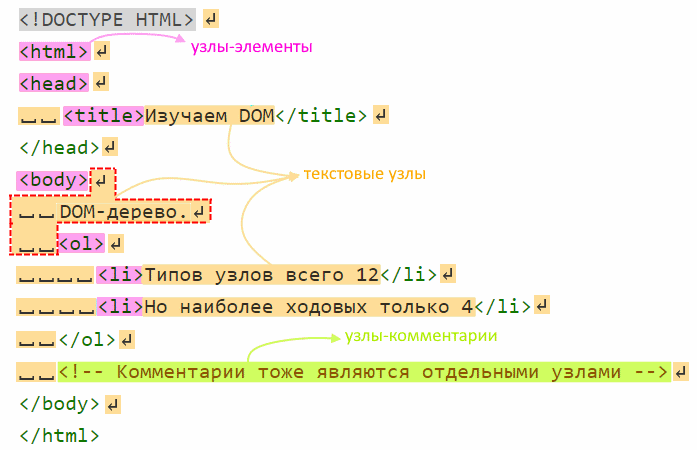

# DOM-дерево, типы узлов

Все элементы html-страницы образуют объекты, из которых формируется `DOM-дерево`. Например:

```html
<!DOCTYPE HTML>
<html>
<head>
  <title>Изучаем DOM</title>
</head>
<body>
  DOM-дерево.
  <ol>
    <li>Типов узлов всего 12</li>
    <li>Но наиболее ходовых только 4</li>
  </ol>
  <!-- Комментарии тоже являются отдельными узлами -->
</body>
</html>
```

Всего существует 12 `типов узлов`, но наиболее широко используемыми являются эти четыре:

* `document` - входная точка в DOM.
* `узлы-элементы` - это HTML-теги.
* `текстовые узлы` - текстовое содержимое тегов.
* `комментарии`.



Практически все, что есть в разметке, формирует узлы. Принцип такой - при разборе разметки узел "накапливается" до момента обнаружения следующего узла. Поэтому в примере выше, после body перенос строки, два пробела, надпись "DOM-дерево", еще перенос строки и два пробела образуют единый текстовый узел, а не разные.

Несколько особенностей:

* При построении дерева браузер может самостоятельно исправлять некоторые ошибки, вроде не закрытых тегов.
* Все, что написано между `</body>` и `</html>` браузер автоматически переносит в конец body.
* Между `<html>` и `<head>` пробелы игнорируются, поэтому нет и текстового узла.
* Хотя текстовые узлы, состоящие из одних пробелов, являются полноценными членами DOM-дерева, но они не показываются в инструментах разработки, чтобы экономить место.

