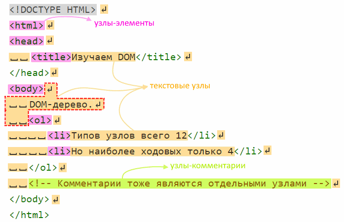

# DOM-дерево, типы элементов

Все элементы html-страницы образуют объекты, из которых формируется `DOM-дерево`. Например:

```html
<!DOCTYPE HTML>
<html>
<head>
  <title>Изучаем DOM</title>
</head>
<body>
  DOM-дерево.
  <ol>
    <li>Типов узлов всего 12</li>
    <li>Но наиболее ходовых только 4</li>
  </ol>
  <!-- Комментарии тоже являются отдельными узлами -->
</body>
</html>
```

Всего существует 12 типов элементов, но наиболее широко используемых - четыре:

* `document` - входная точка в DOM.
* `теги` - это HTML-теги.
* `текст` - текстовое содержимое тегов.
* `комментарии` - комментарии внутри конструкции `<!-- hello -->`



Практически все, что есть в разметке, формирует элементы. Принцип такой - при парсинге разметки элемент "накапливается" до момента обнаружения следующего элемента.

Поэтому на картинке выше все, что находится, например, между `body` и `ol` - это самостоятельный, полноценный текстовый элемент. Он состоит из переноса строки, двух пробелов, надписи "DOM-дерево.", еще одного переноса строки и еще двух пробелов. Между `ol` и первым `li` - аналогично, это тоже полноценный текстовый элемент из переноса строки и четырех пробелов.

Несколько особенностей:

* При построении дерева браузер может самостоятельно исправлять некоторые ошибки, вроде не закрытых тегов.
* Все, что написано между `</body>` и `</html>` браузер автоматически переносит в конец body.
* Между `<html>` и `<head>` пробелы игнорируются, поэтому нет и текстового элемента.
* Хотя текстовые элементы, состоящие из одних пробелов, являются полноценными членами DOM-дерева, они не показываются в инструментах разработки, чтобы экономить место.

## Узнать тип элемента, .nodeType

У всех элементов есть свойство `.nodeType`, в котором в виде числа хранится тип элемента:

```html
<body>
  <h1>Стихотворение</h1><!-- Комментарий -->
  <p>Раз прислал мне барин чаю и <i>велел</i> его сварить.</p>
</body>
```

```javascript
console.log(document.body.nodeType);  // 1
console.log(document.nodeType);       // 9
console.log(document.querySelector("p").firstChild.nodeType);    // 3
console.log(document.querySelector("h1").nextSibling.nodeType);  // 8
```

* `1` - тег. Любой элемент, являющийся html-тегом, имеет тип 1.
* `3` - текстовый элемент.
* `8` - комментарий.
* `9` - Document. Базовый объект, корень всего содержимого страницы.