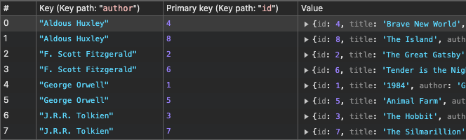
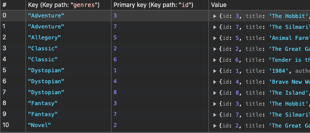
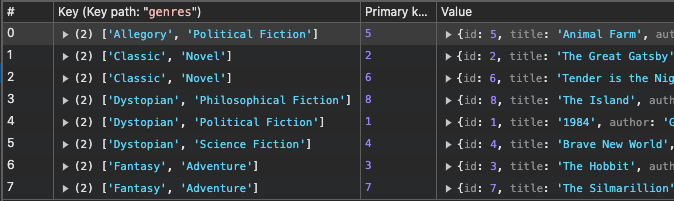

# Типы и общая идея

| Тип              | Документация                                                 | Комментарий                       |
| ---------------- | ------------------------------------------------------------ | --------------------------------- |
| `IDBIndex`       | [MDN](https://developer.mozilla.org/en-US/docs/Web/API/IDBIndex) | Интерфейс индекса.                |
| `IDBObjectStore` | [MDN](https://developer.mozilla.org/en-US/docs/Web/API/IDBObjectStore) | Имеет метод для создания индекса. |

Изначально БД умеет искать записи только по полю, которое используется в качестве ключа. Для того, чтобы можно было искать по другим полям, нужно создать индекс для этих полей. Например, если в хранилище лежат объекты вида

```
{
  name: "Tom Sawyer",
  state: "Missouri"
}
```

то чтобы искать объекты по полю name, надо создать индекс по этому полю.

Допустим, у нас такой набор данных:

```javascript
{ id: 1, title: "1984", author: "George Orwell", genres: ["Dystopian", "Political Fiction"] },
{ id: 2, title: "The Great Gatsby", author: "F. Scott Fitzgerald", genres: ["Classic", "Novel"] },
{ id: 3, title: "The Hobbit", author: "J.R.R. Tolkien", genres: ["Fantasy", "Adventure"] },
{ id: 4, title: "Brave New World", author: "Aldous Huxley", genres: ["Dystopian", "Science Fiction"] },
{ id: 5, title: "Animal Farm", author: "George Orwell", genres: ["Allegory", "Political Fiction"] },
{ id: 6, title: "Tender is the Night", author: "F. Scott Fitzgerald", genres: ["Classic", "Novel"] },
{ id: 7, title: "The Silmarillion", author: "J.R.R. Tolkien", genres: ["Fantasy", "Adventure"] },
{ id: 8, title: "The Island", author: "Aldous Huxley", genres: ["Dystopian", "Philosophical Fiction"] }
```

Индекс выглядит как дополнительное хранилище. Если создать индекс по полю author, то это "дополнительное хранилище" будет выглядеть примерно так:



Записи хранятся в сортированном виде, а сортировка идет по полю, указанному при создании индекса. За счет этого мы получаем возможность искать данные по этому полю.

# Болванка для примеров

```html
<body>
  <button id="deleteDb">Удалить БД</button>
  <button id="dosome">Выполнить код</button>
</body>
```

```javascript
let db;
const dbname = "idb";
const dbversion = 1;
const storageName = "person";

const data = [
  { id: 1, title: "1984", author: "George Orwell", genres: ["Dystopian", "Political Fiction"] },
  { id: 2, title: "The Great Gatsby", author: "F. Scott Fitzgerald", genres: ["Classic", "Novel"] },
  { id: 3, title: "The Hobbit", author: "J.R.R. Tolkien", genres: ["Fantasy", "Adventure"] },
  { id: 4, title: "Brave New World", author: "Aldous Huxley", genres: ["Dystopian", "Science Fiction"] },
  { id: 5, title: "Animal Farm", author: "George Orwell", genres: ["Allegory", "Political Fiction"] },
  { id: 6, title: "Tender is the Night", author: "F. Scott Fitzgerald", genres: ["Classic", "Novel"] },
  { id: 7, title: "The Silmarillion", author: "J.R.R. Tolkien", genres: ["Fantasy", "Adventure"] },
  { id: 8, title: "The Island", author: "Aldous Huxley", genres: ["Dystopian", "Philosophical Fiction"] }
];

const openRequest = window.indexedDB.open(dbname, dbversion);

openRequest.onupgradeneeded = (event) => {
  const database = event.target.result;
  const storage = database.createObjectStore(storageName, { keyPath: "id" });
  // <-- Сюда пишем код создания индексов.
  data.forEach(d => storage.add(d));
}

openRequest.onsuccess = (event) => {
  db = event.target.result;
}

document.querySelector("#deleteDb").addEventListener("click", () => {
  if (db) {
    db.close();
    const delReq = indexedDB.deleteDatabase(dbname);
    delReq.onsuccess = (event) => {
      console.log("БД удалена.");
    }
  }
});

document.querySelector("#dosome").addEventListener("click", () => {
  const tx = db.transaction(storageName, "readwrite");
  const storage = tx.objectStore(storageName);

  // <-- Сюда пишем код по извлечению данных.
});
```


# Создание индекса

Создание индекса выполняется на объекте хранилища методом [createIndex()](https://developer.mozilla.org/en-US/docs/Web/API/IDBObjectStore/createIndex). Параметры:

* Имя индекса - строка с названием для индекса. Используется, чтобы потом открывать индекс по этому имени.
* Поле объекта - указываем, по какому полю объекта надо строить индекс.
* Опции - дополнительные опции индекса, см в отдельном разделе.

```javascript
const storage = database.createObjectStore(storageName, { keyPath: "id" });
storage.createIndex("author_index", "author");  // <-- Создаем индекс на хранилище.
```

Особенности индексов:

* Создать индекс можно только внутри version change transaction, т.е. только внутри upgradeneeded события запроса открытия БД.
* Индексом может быть любое значение, даже сложный объект, потому что значение сериализуется через structured clone algorithm.
* Операция создания индекса, похоже, синхронная, потому что она возвращает объект IDBIndex, а не запрос.

## Опции индекса

При создании индекса, в третьем параметре можно передать опции ([документация](https://developer.mozilla.org/en-US/docs/Web/API/IDBObjectStore/createIndex#options)).

### unique

```javascript
storage.createIndex("author_index", "author", 
                    { unique: true | false* }
                   );
```

Опция unique определяет, должны ли в индексе быть только уникальные значения. По умолчанию false. Значение true можно использовать только если поле действительно уникальное, иначе будут ошибки. Например, если сделать индекс по полю name с unique:true это плохая идея, потому что имена частно повторяются и построить такой индекс будет невозможно.

### multiEntry

```javascript
storage.createIndex("genre_index", "genres", 
                    { multiEntry: true | false* }
                   );
```

Опция multiEntry актуальна для случая, когда индекс формируется по полю, которое является массивом. Тут возможны два значения (на примере данных из начала конспекта):

* `multiEntry: true` - по каждому значению массива сформируется отдельный индекс:

  

* `multiEntry: false` - массив сериализуется и индекс формируется как бы по массиву целиком:

  

# Использование индекса

Индекс можно использовать только для чтения данных. Мы можем открыть индекс на хранилище методом [.index(name)](https://developer.mozilla.org/en-US/docs/Web/API/IDBObjectStore/index), а потом применять к нему методы чтения данных.

```javascript
const index = storage.index("author_index");  // <-- Отркываем индекс.
```

Все методы вроде get, getAll, openCursor работают так же как с хранилищами (см про эти методы в конспекте по чтению и записи в хранилищах). Индекс строится и модифицируется автоматически, поэтому методы записи недоступны, только чтение:

```javascript
const index = storage.index("author_index");  // <-- Открываем индекс.
const items = index.getAll("George Orwell");  // <-- Делаем запрос на выбор данных.
items.onsuccess = (event) => {
  const data = event.target.result;
  data.forEach(d => console.log(d));  // <-- Перебираем записи.
}
```

