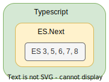
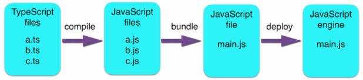

# Факты о Typescript

TS - это компилирумый в JS язык. Появился в 2012 году как разработка Microsoft. Программы на TS сначала *транспилируются* в JS и полученную программу затем можно выполнить в браузере или движке JS.

> Компиляция - преобразует исходный код в байткод или машинный код.
>
> Транспиляция - преобразует исходный код на одном языке в исходный код на другом языке.
>
> Тем не менее, обычно говорят, что TS "компилируется", имея ввиду транспиляцию.

TS является надмножеством JS. На практике это ознчает следующее:

* TS умеет все, что умеет JS и даже больше. В основном это "больше" связано с поддержкой статической типизации. 
* Поэтому среднестатистическую JS-программу можно просто переименовать в .ts и она будет работать, если не содержит ошибок, связанных с типами.
* Можно использовать вперемешку с обычными JS-программами. Например, пользоваться библиотеками, написанными на JS.

> ES - это стандартизированный JS, ES.Next - это самый свежий JS, в котором есть фишки, еще не вошедшие в стандарт.

# TS workflow

