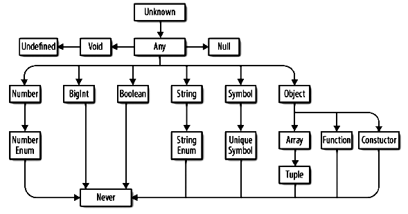

# Карта типов

В typescript набор примитивных типов такой же как в JS + один новый - литерал:

* string - обычные строки.
* boolean - обычный boolean с двумя значениями: true и false.
* number - для любых чисел - целых, десятичных, а также NaN и Infinity.
* bigint - для чисел, больших чем $2^{53}$.
* symbol - обычный symbol из JS.
* null - "пусто".
* undefined - "не задано"

## Литерал

Про литералы отдельный конспект.