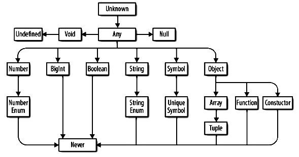

# Карта типов



# any

Означает любой тип. Например, в переменную any можно положить и строку, и число, и дату, и Person и что угодно. На any можно вызывать любые методы, умножать, делить и т.д.

Используется, чтобы работал обычный JS-код, который пока еще не успели типизировать или который не хочется типизировать. Для остальных случаев не рекомендуется использовать any, потому что по сути теряется возможность проверки на ошибки типов во время компиляции.

any необходимо прописывать явно, либо использовать опцию компилятора `"noImplicitAny": false`, чтобы он сам выставлял any в места, где тип не указан и не ругался. 

# unknown

Грубо говоря, unknown это как any, но на нем нельзя выполнять все что угодно, компилятор не позволит, пока мы явно не произведем проверку на принадлежность корректному типу и не докажем, что действие позволительно. 

> TODO: Насколько я понял, unknown нужен для ситуаций, когда хочется, чтобы функция принимала любые типы, а внутри проверяла значение на конктретный тип и в зависимости от этого выполняла действия. Хотя не особо понятно, какой в этом смысл. Если ты знаешь, что твоя функция адекватно работает, например, со строкой, числом, и какой-нибудь конкретной объектом-оберткой, то и напиши в типе эти конкретные типы.
>
> Так что надо дописать сюда, когда увижу что-то реальное, где используется unknown, а не синтетика из статей.

Изначально для unknown доступны такие операторы:

* `==`, `===`
* `||`, `&&`
* `?`, `!`

Пример: (плохие, но что-то вменяемое не получилось, так что TODO: переделать, чтобы например проверять на массив)

```typescript
function sum(a: any, b: any): void {  // <-- any
  const s = a + b;  // Ошибок нет, т.к. с any можно делать все что угодно
  console.log(s);
}

sum("Hello", 7);  // Hello7, хотя предполагалось, что будут складываться числа
```

```typescript
function sum(a: unknown, b: unknown): void {  // <-- Заменяем any на unknown
  const s = a + b;  // compile-ошибка: 'a' is of type 'unknown', а складывать unknown нельзя
  console.log(s);
}

sum("Hello", 7);
```

```typescript
function sum(a: unknown, b: unknown): void {
  if (typeof a === 'number' && typeof b === 'number') {  // <-- Доказываем TS'у, что a и b - числа
    const s = a + b;  // <-- Тогда он разрешает их сложить
    console.log(s);
  }
}

sum("Hello", 7);  // ничего
sum(5, 7);  // 12
```

# never

`never` - это тип для функций, которые физически не могут вернуть значение. Например, в них бесконечный цикл или они всегда выбрасывают ошибку. Т.е. такие функции, по сути, никогда не могут дойти до конца:

```typescript
function foobar(): never {
  while (true) {
    console.log("TODO: вписать фразу из сияния make Jack a dull boy.");
  }
}
```

```typescript
function foobar(): never {
  throw new Error("Я никогда не верну никакого значения.");
}
```

А вот такая функция не может быть never, потому что она выполняется и возвращает undefined:

```typescript
function foobar(): never {
  // Ошибка: A function returning 'never' cannot have a reachable end point.
}
```

# void

`void` - это тип для функций, которые не должны *явно* возвращать значение. По умолчанию в JS, если функция ничего не возвращает, то возвращается undefined:

```typescript
function foobar(): void {
  
}

let zxc = foobar();  // <-- Переменная zxc станет типа undefined
```

Явно вернуть нельзя:

```typescript
function foobar(): void {
  return "Hello";  // Ошибка: Type 'string' is not assignable to type 'void'
}
```

Т.о., void - это защита от того, чтобы кто-то не решил вернуть из функции значение явно.


