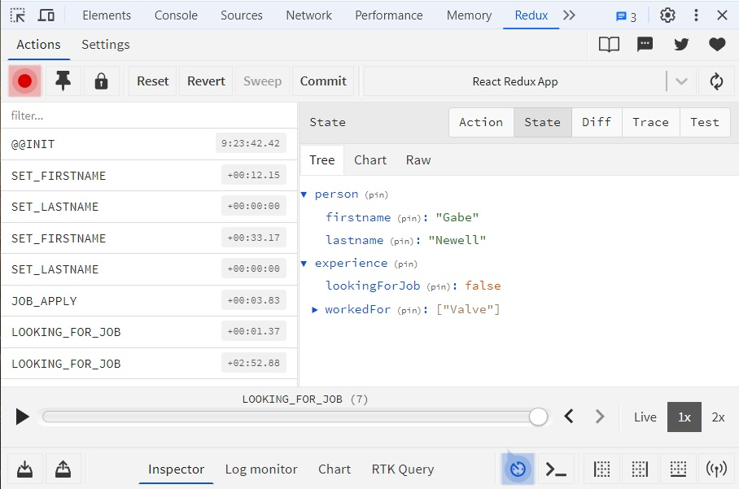

# devtools

devtools позволяет смотреть содержимое хранилища при отладке приложения в браузере. Чтобы все работало, понадобится установить расширение для браузера, а в программе добавить библиотеку и подключить ее в миддлвар при создании хранилища.

* Устанавливаем пакет с расширением

  ```
  npm i redux-devtools-extension
  ```

* Импортируем функцию и передаем результат ее работы в createStore:

  ```javascript
  import { createStore } from 'redux';
  import { composeWithDevTools } from 'redux-devtools-extension';  // <-- Импортируем функцию
  
  import { rootReducer } from './reducers/rootReducer';
  
  export const myStore = createStore(rootReducer, composeWithDevTools());  // <-- Используем
  ```

  Не забываем сохраниться и возможно даже перезапустить приложение.

* Устанавливаем расширение `react devtools` для своего браузера. Вот ссылка для хрома:

  ```
  https://chromewebstore.google.com/detail/redux-devtools/lmhkpmbekcpmknklioeibfkpmmfibljd
  ```

  * После запуска приложения, в браузере нажимаем F12 и ищем среди вкладок вкладку "Redux". Там все наглядно понятно, основные вкладки - State и Tree.



