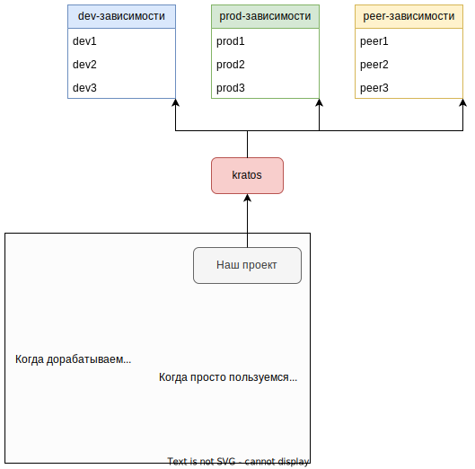

# Установка пакетов

## npm install

* Команда `npm install` (или просто `i`). Существуют и другие псевдонимы, например `add` и еще менее распространенные.
* Если пакетов несколько, их имена разделяются пробелом.

```
npm i имяПакета1 имяПакета2
```

Установка пакета подразумевает скачивание этого пакета в определенную директорию:

* Если пакет устанавливается глобально (с флагом `-g`), то он скачивается в глобальную директорию модулей Node (указал ее в отдельном разделе, чтобы не дублировать).
* Если пакет устанавливается не глобально (без флага `-g`), то он скачивается в папку `node_modules`, которая есть в корне каждого node-проекта.

# Удаление пакетов

## npm uninstall

* Команда `npm uninstall` (или просто `r`):
* Если пакетов несколько, их имена разделяются пробелом.

```
npm r имяПакета1 имяПакета2
```

*  Пакеты, установленные глобально, при удалении исчезают из списка зависимостей, но не удаляются с диска. Удалять их надо вручную.
* Пакеты, установленные не глобально, при удалении исчезают из списка зависимостей, а также удаляются с диска.

# Глобальная директория модулей Node

В Windows это

```
C:\Users\ИМЯ-ПОЛЬЗОВАТЕЛЯ\AppData\Roaming\npm\node_modules
```

# Разные виды зависимостей

TODO: тема зависимостей оказалась тем еще болотом. Тут очень все запутанно и неоднозначно. Бытовая логика тут не применима, догадаться о чем-то, домыслить - означает риск оказаться в очень крупной заблуждении. Так что раздел under construction как говорится, читать его особого смысла нет.

## Что такое зависимость

Важно понимать концепцию разных видов зависимостей, чтобы разобраться с ключами установки пакетов вроде `-D`, `-P` и т.д.

Зависимость - это пакет, который нужен другому пакету для работы или для других целей (например, компиляции, тестирования). Предположим, человек написал библиотеку А, которая использует библиотеку axios для работы с http-запросами. Значит у библиотеки А есть зависимость axios. Предположим, мы пишем программу и используем эту библиотеку А, значит у нашей программы есть зависимость А и axios. Причем axios является *транзитивной* зависимостью, т.к. наша библиотека зависит от нее косвенно, через А. Если кто-то будет использовать наш модуль, то у этого пользователя будут такие зависимости: наш модуль, А и axios. На деле конечно у axios тоже куча зависимостей, а у каждой из них - еще, поэтому общее количество зависимостей весьма большое.

## Виды зависимостей

### Зависимость разработки (dev-зависимость)

Зависимости разработки нужны только на этапе разработки проекта, а для его использования - не нужны. Например, `typescript` - типичная dev-зависимость для проекта на Typescript, т.к. чтобы скомпилировать TS-программу, нужен компилятор. Но компилятор очевидно не нужен, чтобы пользоваться уже скомпилированной программой. Еще примеры dev-зависимостей: линтеры, минификаторы, библиотеки для юнит-тестов. Здесь аналогично - минификатор сжимает программу и больше не нужен. Юнит-тесты проверяют программу и потом не нужны и т.д.

### Зависимость выполнения (prod-зависимость)

Зависимости выполнения нужны на этапе использования программы ("работа в продакшене"). Например, `axios` - если программа использует для отправки запросов axios, то очевидно этот пакет должен присутствовать в системе, где выполняется программа.

### Peer-зависимость

Концептуально пир-зависимость не является чем-то отдельным - она может требоваться как на этапе разработки пакета А, так и для его использования, т.е. быть или dev- или prod-зависимостью. Ее главной особенностью является то, что эту зависимость должен предоставить тот, кто пользуется пакетом А.

## Практическое отличие видов зависимостей

Представим гипотетический модуль kratos, у которого есть все три вида зависимостей:



Всего возможно два способа пользования этим пакетом:

* Мы скачиваем себе исходники kratos, чтобы его продебажить, изучить как работает и возможно даже модифицировать. По сути, мы планируем его дорабатывать + запускать (т.е. использовать). Следовательно, нам понадобятся и его dev-зависимости, и его prod-зависимости. Peer-зависимости тоже нужны, т.к. они есть.

  Чтобы установить себе зависимости kratos'а, мы выполняем `npm install` из его корня. 

* Мы устанавливаем себе kratos исключительно чтобы пользоваться.


Когда мы пишем модуль А и скачиваем нужные нам зависимости, то можем для каждой скачиваемой зависимости указать тип. Это позволит пользователю модуля А не тянуть себе лишние зависимости. Каким образом? Допустим, модуль А - это проект на Typescript, использующий axios для работы с запросами. Значит ему нужны пакеты `typescript` и `axios`. Пакет typescript устанавливаем как dev-зависимость, потому что он нужен только чтобы скомпилировать программу, а после компиляции она может работать и без него. Пакет axios устанавливаем как prod-зависимость, потому что во время выполнения программа пользуется функциями этого пакета, значит без него работать не может.

Соответственно, если кто-то будет устанавливать себе наш модуль А в качестве зависимости, то ему автоматически установится axios, потому что это prod-зависимость. Но typescript ему не установится, потому что это dev-зависимость.

Аналогично со всеми зависимостями, которые мы устанавливаем себе - нам автоматически устанавливаются их prod-зависимости и не устанавливаются dev-зависимости. А вот если мы решим, например, принять участие в доработке пакета axios, тогда нам придется скачать себе его dev-зависимости.

TODO: переосмыслить все это применительно к бандлу. дев-зависимости в бандл не попадают, прод-зависимости - попадают. пир-зависимости - не попадают, но нужны, так что их должен предоставить пользователь.

# Ключи npm install

## Формат указания ключей

* Ключи могут иметь полную форму или сокращенную.
  * Например, `-P` - сокращенная форма, а `--save-prod` - полная форма того же самого ключа.
  * Некоторые ключи имеют только одну из форм, некоторые - обе.
* Можно указывать сразу несколько ключей:
  * Полные формы указываются раздельно через пробел, например `npm install --sample-k1 --sample-k2`.
  * Краткие формы можно указывать отдельно `npm install -x -Y` или совмещать для краткости `npm install -xY`

## Обычная установка и глобальная (-g)

* Глобальная установка проводится с ключом `-g`
* При глобальной установке пакет скачивается в глобальную директорию модулей Node и если нескольким проектам требуется один и тот же пакет, то глобальная установка избавляет их от необходимости иметь собственную копию пакета.

```
npm install typescript -g
```

## Тип зависимости

### Где в конфиге указываются зависимости

Зависимости перечисляются в конфиге проекта, `package.json`. Тип - задается ключом при установке пакета и определяет раздел конфига, в который попадет зависимость. Например, установка пакета eslint с ключом `-D` установит его как dev-зависимость в раздел `devDependencies`:

```
npm install eslint -D
```

Пример конфига с разделом зависимостей:

```json
{
  ...
  "author": "",
  "license": "ISC",
  "devDependencies": {  // <-- Раздел зависимостей
    "html-webpack-plugin": "^5.6.0",
    "terser-webpack-plugin": "^5.3.10",
    "ts-loader": "^9.5.1",
    "typescript": "^5.5.4",
    "webpack": "^5.93.0",
    "webpack-bundle-analyzer": "^4.10.2",
    "webpack-cli": "^5.1.4",
    "webpack-dev-server": "^5.0.4",
    "webpack-merge": "^6.0.1"
  }
}
```

### Возможные значения ключей

* `-D` (или `--save-dev`) - зависимость для разработки (dev-зависимость).

  ```json
  "devDependencies": {  // <-- dev-зависимости появляются в этом разделе
    "some-fake-dependency": "^4.0.0"
  }
  ```

* `-P` (или `--save-prod`) - зависимость для продакшена (prod-зависимость).

  ```json
  "dependencies": {  // <-- prod-зависимости
    "some-fake-dependency": "^4.0.0"
  }
  ```

* `--save-peer` (нет краткой формы) - пир-зависимость.

  ```json
  "peerDependencies": {  // <-- peer-зависимости
    "some-fake-dependency": "^4.0.0"
  }
  ```

* `-O` (или `--save-optional`) - TODO

  ```json
  "optionalDependencies": {  // <-- optional-зависимости
    "some-fake-dependency": "^4.0.0"
  }
  ```

* `-B` (или `--save-bundle`) - TODO

  ```json
  "dependencies": {  // <-- B-зависимости появляются
    "some-fake-dependency": "^4.0.0"
  },
  "bundleDependencies": [  // <-- в двух разделах
    "some-fake-dependency"
  ]
  ```

* `-E`(или `--save-exact`) - зафиксировать версию.

  TODO: тут как будто еще возможно что-то написать вменяемое.


