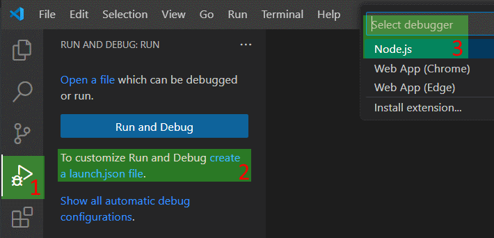
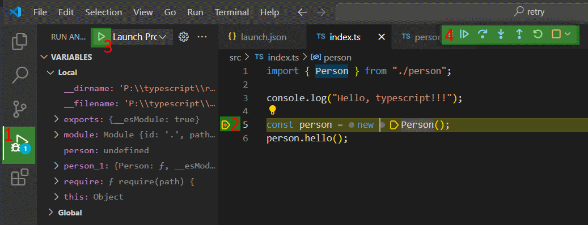

# Typescript

## Установка Typescript

Выполняем через консоль (из любого места) команду для установки Typescript:

```
npm i -g typescript
```

## Проверка установленной версии

Если показывает, значит все установилось нормально:

```
tsc -v
```

## Обновление

```
npm update -g typescript
```

# Создание typescript-проекта

* Создаем директорию под проект, переходим туда и выполняем команду `npm init`. Отвечаем на вопросы, в итоге получаем файл `package.json` в этой директории.

* В этой же директории выполняем команду для превращения проекта в TS-проект:

  ```
  tsc --init --sourceMap --rootDir src --outDir dist
  ```

  В директории появится файл `tsconfig.json`. Этот файл содержит опции компилятора. Описание тех, что мы уже задали:

  * `--rootDir` - папка с исходными файлами.
  * `--outDir` - папка, куда попадают скомпилированные файлы.
  * `--sourceMap` - при использовании дебагера будем как будто дебажить исходный ts-код, хотя на самом деле исполняется скомпилированный js-код.

* Создаем на одном уровне с файлом tsconfig.json папки `src` и `dist`, поскольку мы указали их при создании конфига.

  * В src создаем файл `index.ts` и файл `person.ts`. Два файла, чтобы в будущем настроить связывание файлов.

    ```typescript
    // index.ts
    import { Person } from "./person"
    
    console.log("Hello, typescript!");
    
    const person = new Person();
    person.hello();
    ```

    ```typescript
    // person.ts
    export class Person {
      hello() {
        console.log("Hello, world!");
      }
    }
    ```

# Настройка VS Code

## Настройка отладки

* Открываем чистый ts-проект, созданный в предыдущем разделе, через VS Code.

* Через консоль переходим в корневую директорию проекта (там где лежат package.json и ts.config) и выполняем команды:

  * `npm i --save-dev typescript` - чтобы установить пакет для обнаружения изменений в коде и автоматической компиляции в этом случае.
  *  `tsc` - чтобы скомпилировать проект. В результате в папке `dist` появятся скомпилированные файлы index.js и person.js

* В VS Code открываем файл `/src/index.ts`. Важно, чтобы он был открыт и окно редактора стояло на нем, потому что именно открытый активный файл попадет в конфиг на следующем шаге.

* Создаем конфиг запуска:

  

  * После этого в корневой директории проекта появится папка `.vscode`, а в ней файл `launch.json`. После создания этого файла станут доступны настройки, описанные далее.

  * Открываем launch.json и изменяем одну строчку:

    ```yaml
    "program": "${workspaceFolder}\\src\\index.ts"   # Эту
    "program": "${workspaceFolder}\\dist\\index.js"  # На эту (поменяли src на dist и ts на js)
    ```

    В итоге файл должен выглядеть примерно вот так:

    ```json
    {
      // Use IntelliSense to learn about possible attributes.
      // Hover to view descriptions of existing attributes.
      // For more information, visit: https://go.microsoft.com/fwlink/?linkid=830387
      "version": "0.2.0",
      "configurations": [
        {
          "type": "node",
          "request": "launch",
          "name": "Launch Program",
          "skipFiles": [
            "<node_internals>/**"
          ],
          "program": "${workspaceFolder}\\dist\\index.js",  // <-- Должен быть пункт program
          "outFiles": [  // <-- И пункт outFiles
            "${workspaceFolder}/**/*.js"
          ]
        }
      ]
    }
    ```

* В VS Code Нажимаем F1, ищем следующую настройку и выбираем для нее значение:

  ```yaml
  tasks: configure default build task  # Настройка
  tsc: watch - tsconfig.json  # Значение для настройки
  ```

  После этого в папке .vscode появится файл `tasks.json`, в нем ничего не трогаем.

* Нажимаем F1 и ищем следующую команду:

  ```
  tasks: run build task
  ```

  После ее отработки в консоли самого VS Code видим следующее:

  ```
  [14:02:31] Starting compilation in watch mode...
  [14:02:31] Found 0 errors. Watching for file changes.
  ```

  Если возникают какие-то ошибки, то убеждаемся, что установили пакет --save-dev typescript в самом начале и все предыдущие пункты выполнили точно по инструкции.

* Все, дебаг работает, можно ставить точки останова прямо в VS Code и дебажить:

  

