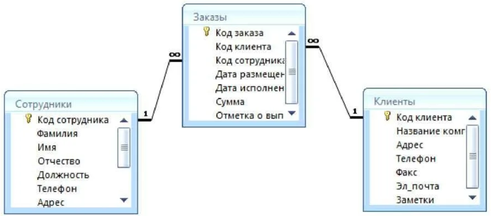
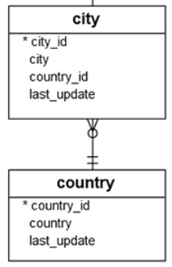

# Резюме

* Главная и подчиненная таблицы
* Владелец отношения
* Жадная и ленивая загрузка
* Разница между отношениями 1М и М1
* Однонаправленная и двунаправленная связь

# Главная и подчиненная таблицы

Вернемся к основам. Связь в БД может быть только между двумя таблицами. Даже когда две таблицы A и B связаны через третью C, то все равно мы говорим о связи между парами A + C и B + C. И в этой связи одна таблица всегда главная, а другая - подчиненная.

Если в таблице A есть ссылка на таблицу B, то таблица A является подчиненной, а B - главной. Т.е. главная таблица как бы независимая, самостоятельная, она ничего не знает о других таблицах.

Слева таблица стран, а справа - таблица городов.


Главная таблица здесь именно со странами, потому что она ничего не знает о городах. А таблица городов- подчиненная, потому что она ссылается на страны.

Для случая *ММ* (многие ко многим): здесь в паре Сотрудники-Заказы таблица Сотрудники является главной, а Заказы подчиненной. В паре Клиенты-Заказы аналогично, Клиенты - главная таблица, а Заказы - подчиненная.



# Связи в БД и в ООП

## Виды связей

Выделяют три основные связи в БД:

* Один-ко-многим

  И Многие-к-одному - говорят, что "это то же самое, что 1М, только наоборот". Имхо, с точки зрения БД и таблиц это так, но когда дело доходит до реализации в ООП, оказывается, что есть большая разница между 1М и М1. Об этом будет ниже.

* Многие-ко-многим - реализуется всегда через третью, связующую, таблицу.

* Один-к-одному

В БД все довольно - например, в 1М связи только одна таблица имеет ссылку на другую. Но при программировании может быть и второй вариант - когда оба объекта имеют ссылку на друг друга. Это называется двунаправленная связь, bidirectional. Грубо говоря:

```java
// Города
class City {
    private String name;
    private Country country;  // Ссылка на страну
    ...
}

// Страны
class Country {
    private String name;
    private Set<City> cities;  // Ссылки на города
    ...
}
```

Т.е. реализовать одну и ту же БД-связь можно двумя способами:

* Как однонаправленную - в классе City есть поле со страной, а в классе Country нет поля с набором городов.
* Как двунаправленную - в обоих классах есть ссылки друг на друга: в классе City есть поле со страной и в классе Country есть поле с набором городов.

Теоретически, авторы говорят, что любую программу можно написать, используя только однонаправленную связь. ???Но вероятно это было бы не всегда удобно и пришлось бы писать дополнительные запросы.

## Различия 1М и М1

Теперь о разнице 1М и М1. Если мы говорим о классах, то тут появляется принципиальное различие, в зависимости от того, с какой стороны смотреть. Если со стороны "многих" (городов) к "одному" (одной стране), то получается так:

```java
class City {
    private String name;
    private Country county;  // Есть ссылка на страну
}

class Country {
    private String name;
    // Нет никаких упоминаний городов
}
```

А если со стороны "одного" (одной страны) ко "многим" (городам), то так:

```java
class City {
    private String name;
    // Нет ссылки на страну
}

class Country {
    private String name;
	private Set<City> cities;  // Есть ссылки на города
}
```

И программная реализация первого варианта - проще. Т.о. кроме различия связей "однонаправленная" и "двунаправленная" есть еще различия в реализации однонаправленной.

# Реализуем связи в хибере

В БД "dvd rental" таблицы городов и стран выглядят так:



Перед дальнейшим чтением нужно упомянуть вот что: промежуточная таблица может использоваться не только для реализации ММ, но и М1 в том случае, когда на стороне "многих" нежелателен null. Например, User может купить Item на аукционе, значит у Item должно быть поле для хранения покупателя. Но до тех пор, пока никто Item не купил, это поле будет null. К слову, хранения null в БД вообще желательно избегать, т.к. они понижают качество данных. Поэтому для избежания null можно ввести промежуточную таблицу, например Buyer, в которой запись с id Item и id User появляется только после покупки и т.о. мы избегаем null.

## Многие к одному

### Мэппинг и выборка

Не знаю, честно говоря, как сделать лучше - копировать подробные куски или только часть, отвечающую за конкретное сопоставление. По задумке этот конспект не должен быть перегружен. Каждый пример - минимален, чтобы просто хватило понять. Поэтому все-таки я удалю аннотации, относящиеся к другим темам. Возможно, приложу более-менее полноценную программу целиком отдельно к конспекту и буду в потенциально сложных местах указывать, в каком другом моем конспекте можно почитать связанную информацию:

```java
@Table(name = "city")
public class City {
    @ManyToOne(fetch = FetchType.LAZY)
    @JoinColumn(name = "country_id", nullable = false)
    private Country country;
```

```java
@Table(name = "country")  // Таблица и колонка в БД просто называются одинаково
public class Country {
    @Column(name = "country", length = 50)
    private String name;
```

Итак, получилась однонаправленная связь М1 - города к странам. Мы добавили во "многие" ссылку на "одного" - поле country типа Country в классе City. Такого поля, как видно из схемы, нету в таблице БД, оно выполняет служебную роль в программе.

Здесь не указано маппинг id и вообще ничего про id нет, потому что подразумевается, что ты в данный момент уже прочитал про этот маппинг в файле *"01. Подключение к БД, простая сущность, и ее сохранение.md"* и понял, что к чему.

### @JoinColumn

С помощью @JoinColumn в классе City ~~мы указали связующее поле другой *таблицы* (а не класса). Т.е. класс Country мапится на таблицу country и в этой таблице есть поле country_id.~~

На самом деле это как раз столбец из таблицы текущей сущности. Т.е. в таблице city есть столбец country_id и поэтому если мы хотим в объект City вытащить объект Country, то должны использовать значение из этого столбца чтобы искать страну в той таблице, с которой сопоставлен класс Country. Изначально путаница вышла из-за того, что в обоих таблицах поле называется country_id.

Через параметр nullable обозначили, что поле country обязательно должно быть заполнено. Тут надо понимать, что это ограничение работает именно на программной стороне, а не на стороне БД и они взаимно не связаны.

Например, если в БД стоит ограничение not null на это поле, а в программе - не стоит, то программа попытается сохранить город с пустым полем country и мы получим ошибку от СУБД. А если в БД такого ограничения нет, а в программе - есть, то уже программа не позволит нам сохранить город с незаполненной страной, хотя в БД это будет вполне законно.

???Вроде при генерации БД по модели данных это ограничение приведет к тому, что и в БД установится ограничение.

### @ManyToOne

@ManyToOne указывает характер связи, что это именно М1 и задает тип выборки:

* LAZY, ленивая

  Означает, что при выборе города выберется только город, а страна будет довыбрана только если к полю страны будет обращение.

  ```java
  private void getCityWithCountry(long cityId) {
      System.out.println("Пытаемся выбрать город");
      City city = manager.find(City.class, cityId);
      System.out.println(String.format("Город %s", city.getName()));
  }
  ```

  ```
  Пытаемся выбрать город
  Hibernate: select c1_0.city_id,c1_0.country_id,c1_0.city from city c1_0 where c1_0.city_id=?
  Город Ziguinchor
  ```

  Поскольку мы не обращались к стране, она и не выбралась - это видно по единственному запросу хибера.

  А теперь обратимся к стране:

  ```java
  private void getCityWithCountry(long cityId) {
      System.out.println("Пытаемся выбрать город");
      City city = manager.find(City.class, cityId);
      System.out.println(String.format("Город %s", city.getName()));
      System.out.println("А теперь обратимся к стране");
      System.out.println(String.format("Страна %s", city.getCountry().getName()));  // <-- Туть
  }
  ```

  ```
  Пытаемся выбрать город
  Hibernate: select c1_0.city_id,c1_0.country_id,c1_0.city from city c1_0 where c1_0.city_id=?
  Город Ziguinchor
  А теперь обратимся к стране
  Hibernate: select c1_0.country_id,c1_0.country from country c1_0 where c1_0.country_id=?
  Страна Senegal
  ```

  Видно, что хибер сделал второй дополнительный запрос, чтобы довыбрать страну, только когда мы уже обратились к ней.

* EAGER, жадная

  Это режим по умолчанию. При выборе города сразу будет выбираться и страна.

  ```sql
  select c1_0.city_id,c2_0.country_id,c2_0.country,c1_0.city 
  from city c1_0 join country c2_0 on c2_0.country_id=c1_0.country_id 
  where c1_0.city_id=?
  ```

  ```java
  private void getCityWithCountry(long cityId) {
      System.out.println("Пытаемся выбрать город");
      City city = manager.find(City.class, cityId);
      System.out.println(String.format("Город %s", city.getName()));
  }
  ```

  ```
  Пытаемся выбрать город
  Hibernate: select c1_0.city_id,c2_0.country_id,c2_0.country,c1_0.city from city c1_0 join country c2_0 on c2_0.country_id=c1_0.country_id where c1_0.city_id=?
  Город Ziguinchor
  ```

  Видно, что хибер сгенерировал запрос с соединением сразу же, независимо от того, будем ли мы реально обращаться к полю со страной или нет.

## Один ко многим

1М реализуется как дополнение к М1. Т.е. мы изначально должны сделать М1, а потом если нам хочется, добавить уже 1М.

Сущность City остается без изменений. Она называется *владельцем* (*owner*) отношения, т.к. в БД именно она содержит ссылку на таблицу стран.

```java
public class City {
    @Column(name = "city", length = 50)
    @Size(min = 2, max = 50)
    private String name;
    @ManyToOne(fetch = FetchType.LAZY)
    @JoinColumn(name = "country_id", nullable = false)
    private Country country;
```

А вот в сущности Country мы должны указать поле "владельца" отношения, с помощью которого (поля) производится соединение таблиц:

```java
public class Country {
    @Column(name = "country", length = 50)
    @Size(min = 2, max = 50)
    private String name;
    @OneToMany(mappedBy = "country", fetch = FetchType.LAZY)  // <-- Туть
    private Set<City> cities = new HashSet<>();
```

Я специально оставил здесь больше полей, чтобы явно показать, что `mappedBy = "country"` имеет отношение к полю country сущности City, а не к чему-то еще.

Теперь можем выбрать любую страну и список ее городов:

```java
private void getCountry(long id) {
    Country country = manager.find(Country.class, id);
    System.out.println(String.format("В стране %s есть такие города:", country.getName()));
    for (City city : country.getCities()) {
        System.out.println(city.getName());
    }
}
```

## Многие ко многим

На примере жанров фильмов. Один фильм может включать в себя несколько жанров, ну и конечно к одному жанру могут принадлежать много фильмов.

Здесь особенность ММ в том, что в ООП можно сделать двумя способами: сделать три класса, т.е. и в ООП использовать промежуточную сущность. А можно без третьей сущности. Вариант через три класса считается предпочтительнее, т.к. если связующая таблица содержит какие-нибудь дополнительные поля (например, есть таблица Users и Roles, и в связующей таблице можно хранить информацию о том, кто назначил пользователю ту или иную роль), то вариант через три класса нагляднее и проще для развития.

### Без промежуточной сущности

Здесь, опять же, можно сделать как двунаправленную, так и однонаправленную связь, смотря как нам надо. Пусть можно будет получить все жанры, к которым относится фильм, и все фильмы какого-то жанра, т.е. связь двунаправленная.

Основное "мясо" соединения можно описать в любом из двух классов. Тогда во втором классе все будет просто. Сделаем мясо в классе фильма:

```java
@Entity
@Table(name = "film_s")
public class Film extends AbstractEntity {
    @ManyToMany(cascade = CascadeType.PERSIST, fetch = FetchType.LAZY)
    @JoinTable(name = "film_category",
            joinColumns = @JoinColumn(name = "film_id"),
            inverseJoinColumns = @JoinColumn(name = "category_id"))
    private Set<Category> categories = new HashSet<>();

```

```java
@Entity
@Table(name = "category")
public class Category extends AbstractEntity {
    @Column(name = "name", nullable = false)
    private String name;
	@ManyToMany(mappedBy = "categories", fetch = FetchType.LAZY, cascade = CascadeType.PERSIST)
    private Set<Film> films = new HashSet<>();
```

* @JoinTable:
  * name - указываем имя *таблицы* (именно таблицы, а не класса), которая является в БД промежуточной и связывает фильмы и категории.
  * joinColumns - поскольку мы описываем "мясо" в классе Film, мы должны указать в joinColumns поле связующей таблицы, которое указывает на таблицу Film. Это поле film_id (т.е. этот film_id не из таблицы film, а именно из таблицы film_category, т.е. из промежуточной)
  * inverseJoinColumns - здесь указываем столбец связующей таблицы, который указывает на "противоположную" таблицу. Поскольку мясо мы пишем в классе Film, то противоположная таблица - это очевидно category. А в промежуточной таблице film_category на таблицу category указывает поле category_id.

### С промежуточной сущностью

Тут придется посмотреть на большое количество кода. Начнем с простых частей: фильм и категория:

```java
@Entity
@Table(name = "film_s")
public class Film extends AbstractEntity {
    @OneToMany(fetch = FetchType.LAZY, mappedBy = "film")
    private Set<FilmCategory> filmCategory = new HashSet<>();

    public Set<FilmCategory> getFilmCategory() {
        return filmCategory;
    }

    public void setFilmCategory(Set<FilmCategory> filmCategory) {
        this.filmCategory = filmCategory;
    }
```

```java
@Entity
@Table(name = "category")
public class Category extends AbstractEntity {
    @OneToMany(fetch = FetchType.LAZY, mappedBy = "category")
    private Set<FilmCategory> filmCategory = new HashSet<>();
```

У них просто поле с типом промежуточной сущности и указано, какое именно поле этой промежуточной сущности отвечает за мапинг фильма\категории.

А вот сама промежуточная сущность:

```java
@Entity
@Table(name = "film_s_category")
//@org.hibernate.annotations.Immutable  // потом посмотрим, на что это влияет
public class FilmCategory {
    @Embeddable  // 1. Почему? 2. Почему эти поля просто не сделать частью внешнего класса?
    public static class Id implements Serializable {
        @Column(name = "category_id")
        protected Long categoryId;  // Почему protected, а не private?
        @Column(name = "film_id")
        protected Long filmId;

        public Id() { }

        public Id(Long categoryId, Long filmId) {
            this.categoryId = categoryId;
            this.filmId = filmId;
        }

        @Override
        public boolean equals(Object o) {
            if (this == o) return true;
            if (o == null || getClass() != o.getClass()) return false;
            Id id = (Id) o;
            return Objects.equals(categoryId, id.categoryId)
                    && Objects.equals(filmId, id.filmId);
        }

        @Override
        public int hashCode() {
            return Objects.hash(categoryId, filmId);
        }
    }

    @EmbeddedId
    protected Id id = new Id();

    @Column(name = "last_update", insertable = false, updatable = false)
    @org.hibernate.annotations.Generated(
            value = org.hibernate.annotations.GenerationTime.ALWAYS)
    @Temporal(value = TemporalType.TIMESTAMP)
    protected LocalDateTime lastModified;

    @ManyToOne(fetch = FetchType.LAZY)//, cascade = CascadeType.PERSIST)  // а cascade нужен?
    @JoinColumn(name = "category_id", insertable = false, updatable = false)  // Потом чекнуть, зачем это
    //org.hibernate.MappingException: Repeated column in mapping for entity: johny.dotsville.domain.FilmCategory column: category_id (should be mapped with insert="false" update="false")
    // Скорее потому, что фильм и категория
    protected Category category;

    @ManyToOne(fetch = FetchType.LAZY)//, cascade = CascadeType.PERSIST)
    @JoinColumn(name = "film_id", insertable = false, updatable = false)  // Потом чекнуть, зачем это
    protected Film film;

    public FilmCategory() { }

    public FilmCategory(Category category, Film film) {
        this.category = category;
        this.film = film;

        this.id.categoryId = category.getId();
        this.id.filmId = film.getId();

        category.getFilmCategory().add(this);
        film.getFilmCategory().add(this);
    }

    ...
}
```

Тут посложнее, но ничего криминального на самом деле.

* Сам класс FilmCategory - самостоятельная сущность, которая сохраняется в свою отдельную таблицу film_category
* Вложенный класс Id - это составной первичный ключ. Просто он так оформляется - делаем вложенный класс и помечаем его как Embeddable, потому что он хоть и должен сохраняться, но не в отдельную таблицу, а как часть film_category. Его содержимое тривиально - это просто поля из таблицы film_category.
* Поле id в классе FilmCategory, аннотированное через @EmbeddableId - просто так помечаются составные ключи, вместо обычной аннотации @Id
* Поля category и film - здесь из особенностей я две вещи заметил:
  * Без cascade работает нормально. Здесь особенность в том, что надо сначала сохранить фильмы и категории, чтобы они получили свои id, и только потом сохранять объект FilmCategory. Я думал, что если использовать cascade, то придется меньше вызывать метод .persist (дальше будет, в примерах использования), но это не сработало. Так что cascade не используем.
  * insertable = false, updatable = false - это похоже нужно затем, чтобы


И наконец как этим пользоваться:

```java
Category adventure = new Category();
adventure.setName("Приключения");

Category horror = new Category();
horror.setName("Ужасы");

Category zombie = new Category();
zombie.setName("Зомби");

Film rotld = new Film();
rotld.setTitle("Возвращение живых мертвецов");
rotld.setLength(95);
rotld.setReleaseYear(1984);

Film ij = new Film();
ij.setTitle("Индиана Джонс и ковчег судьбы");
ij.setLength(103);
ij.setReleaseYear(1987);

manager.getTransaction().begin();
manager.persist(adventure);
manager.persist(horror);
manager.persist(zombie);
manager.persist(rotld);
manager.persist(ij);

FilmCategory fcRotldHorror = new FilmCategory(horror, rotld);
FilmCategory fcRotldZombie = new FilmCategory(zombie, rotld);
FilmCategory fcIjAdventure = new FilmCategory(adventure, ij);

manager.persist(fcRotldHorror);
manager.persist(fcRotldZombie);
manager.persist(fcIjAdventure);
manager.getTransaction().commit();
```

```java
private void getFilmWithCategories3Entiry(long filmId) {
    Film film = manager.find(Film.class, filmId);
    System.out.println(String.format("Фильм %s относится к этим категориям:", film));
    for (FilmCategory fc : film.getFilmCategory()) {
        System.out.println(fc.getCategory().getName());
    }
}
```

Единственно я думаю, что надо убрать геттер\сеттер с filmCategory и сделать нормальный бизнес-метод, который будет возвращать набор строк с категориями. Ну или набор с объектами типа Category, т.е. чтобы эта внутренняя реализация через 3 сущность была скрыта.

## Сохранение

??? Сохранение лучше описать потом, в книге есть отдельный раздел про это.

Сейчас могу написать только несколько вещей, которые экспериментально заметил:

### Cascade

* Во-первых, нужно организовывать связи между объектами так, как будто никакого хранения нет. Например, если у нас в City должна быть страна, а в Country должен быть набор городов, мы должны сделать "двойную работу" по добавлению одного в другое:

  ```java
  city.setCountry(country);
  country.getCities().add(city);
  ```

  Обычно такое взаимное добавление лучше оформлять в виде отдельного метода, чтобы не забыть второго участника. Вообще, если использовать каскадное сохранение (об этом ниже), тогда данные-то в БД сохранятся, но вот в POJO не появятся. Пример:

  ```java
  Country country = new Country();
  country.setName("Зимбабве");
  
  City city = new City();
  city.setName(name);
  city.setCountry(country);
  manager.getTransaction().begin();
  manager.persist(city);
  manager.getTransaction().commit();
  ```

  В БД сохранится и город, и страна. Но поскольку мы в страну город не добавили, то в списке городов объекта country - города не будет.

* Во-вторых, при сохранении можно вызывать сохранение каждого элемента руками, а можно воспользоваться каскадным сохранением. Параметр cascade поддерживается как @OneToMany, так и @ManyToOne:

  ```java
  public class City extends AbstractEntity {
      @ManyToOne(fetch = FetchType.LAZY, cascade = CascadeType.PERSIST)
      @JoinColumn(name = "country_id", nullable = false)
      private Country country;
      ...
          
  public class Country extends AbstractEntity {
      // Через { } можно задавать сразу несколько правил каскада, например, разом и на удаление, и на обновление
      @OneToMany(mappedBy = "country", fetch = FetchType.LAZY, cascade = { CascadeType.PERSIST })
      private Set<City> cities = new HashSet<>();
  ```

  Соответственно, если каскад задан на City, то код:

  ```java
  Country country = new Country();
  country.setName(countryName);
  
  City city = new City();
  city.setName(cityName);
  city.setCountry(country);
  
  manager.getTransaction().begin();
  manager.persist(city);  // <-- Сохраняем явно только город
  manager.getTransaction().commit();
  ```

  Сохранит и страну тоже. А если каскад задан на Country, то код:

  ```java
  Country country = new Country();
  country.setName("Странная");
  
  City city1 = new City();
  city1.setName("Нижнестранновск");
  city1.setCountry(country);
  country.getCities().add(city1);
  
  City city2 = new City();
  city2.setName("Станничанск");
  city2.setCountry(country);
  country.getCities().add(city2);
  
  manager.getTransaction().begin();
  manager.persist(country);  // <-- Сохраняем явно только страну
  manager.getTransaction().commit();
  ```

  Сохранит и два города тоже.

* Если не заполнить страну в городе, и попытаться его сохранить, то тут можем получить ошибку как от СУБД, так и от программы, в зависимости от того, где запрещен null. Т.е. "позволение" null со стороны программы не позволит избежать ошибки, если null запрещен на стороне СУБД.
* Без использования каскада, если мы создадим объект новой страны, город, и засунем страну в город и попробуем город сохранить, хибер скажет "сперва сохраните страну". Т.е. он не будет автоматически разбираться, что там надо сохранить вперед, похоже это наша задача.

Сохранение работает аналогично для всех типов связей. Не забываем взаимопомещение объектов и все дб нормально.


# Черновик

* Родитель-потомок

  Когда речь идет о хранении, понятие потомок означает, что некий ???объект сохраняется и извлекается только вместе с другим объектом (родителем). Т.е. жизненный цикл потомка полностью определяет родитель - если объект родителя уничтожается, то уничтожается и объект потомка.

  Но когда речь идет о сущностях, то сущности вообще-то живут независимо друг от друга и при чем тут тогда родитель-потомок? Сами не знают, блет.


##  Связи

* 
* @JoinColumn(name = "DEP_ID", referencedColumnName = "ID") референсед это что?