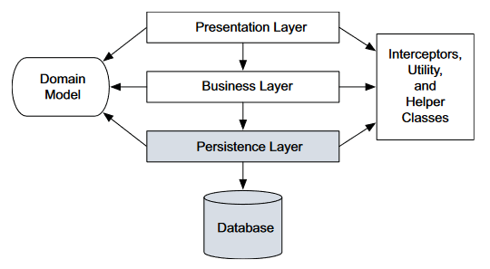

```
??? неоднозначные утверждения
!!! утверждения входят в конфликт с прочитанным в других местах
```


# Архитектура

Java EE, она же Jakarta EE - это набор спецификаций. JPA - одна из них. А Hibernate - это реализация спецификации JPA. Понял, да?

В Hibernate одно из важных понятий на старте является *сущность* (entity).



Для напоминания:

* Каждый уровень взаимодействует только с уровнем, лежащим непосредственно под ним, и ничего не знает о других уровнях.
* Программируем на основе интерфейсов - каждый уровень зависит от интерфейсов, а не от конкретных реализаций с нижележащего уровня. ??? Тут есть вопрос - где размещать интерфейсы - в верхнем уровне или нижнем? А может быть вообще в отдельном пакете? Тогда реализация ничего не будет знать о пользователе, а пользователь - о реализации, и оба они будут зависеть только от "спецификации".

Интересным было то, что все слои работают классами доменной модели. ??? Впрочем, далее было написано, что у слоев могут быть и свои "вариации" этих классов. Например, если уровень представления работает на другом компьютере, то ему очевидно недоступны напрямую сущности, и требуется какой-то промежуточный класс для передачи. Для других случаев нужны конкретные примеры, а просто представить это, придумать самому, как-то смутно.

В домене находятся, грубо говоря, два типа сущностей:

* Хранимые - т.е. объекты, которые непосредственно будут сохраняться\извлекаться из БД
* "Не хранимые" - эти, соответственно, сохранять не требуется. Например, какие-нибудь объекты со стратегиями вычисления цены и подобное.

Одним словом, пока предполагается, что доменные сущности используются в хранении непосредственно сами.

!!! Кроме того, было написано, что сущности-таки могут иметь поведение. Т.е. POJO классу не запрещается иметь "мозги", а не просто геттеры и сеттеры. Как-то специально читать про POJO не хочу, потому что уже почитал... Только смуту наводит. Думаю с практикой автоматически придет понимание, что они есть такое.

!!! Код предметной области не должен обращаться к JDBC ни напрямую, ни через промежуточные абстракции. Однако в юлиане у нас сервисы работают с репозиториями. А репозиторий - не что иное, как абстракция над JDBC. И в принципе выглядит довольно логично. Пока не могу представить, как обойтись без этого.

Hibernate в целом дает *прозрачность* хранения. Это значит, что класс сущности почти не надо как-то особенным образом оформлять, чтобы гибернейт мог его сохранить. Кое-какие ограничения конечно есть, например:

* Должен обязательно быть id
* Коллекции должны иметь тип интерфейса, а не конкретной коллекции
* Не может быть вложенным классом
* Не может быть финальным (и финальных методов в нем тоже быть не должно)
* Другое)

Есть разные допущения насчет того, что конструктор может быть не обязательно публичным, но точно не приватным, что свойства могут не иметь геттеров\сеттеров, но тогда надо отдельно возиться. Короче говоря, есть разные штуки, которые должны проясниться в процессе, а разбираться в них насухую сейчас - только время тратить.


# Утверждения, факты

Факты могут быть не гарантированные, это просто название раздела.

## Ограничения на хранимые классы

* Члены-коллекции сущностей должны иметь тип интерфейса, а не конкретный класс, чтобы участвовать в хранении.
* Классы и их методы не могут быть final
* Класс может расширяться нехранимый класс или реализовывать интерфейс
* Хранимый класс не может быть вложенным
* Класс обязан иметь конструктор без аргументов. Этот конструктор может не быть public, но как минимум должен быть уровня видимости пакета. Но поскольку есть еще и другие спецификации, которые могут требовать публичного конструктора, то лучше наверное его делать или публичным или вообще не объявлять, чтобы использовать пустой конструктор по умолчанию.

## Рекомендации к хранимым классам

* В классах обычно бывают поля пользовательского типа. Например, в каком-нибудь Item мб поле Owner. Для хибера они формируют связь между сущностями. Так вот, методы доступа к ним можно публичными не делать только ради хранения, если этого не требует сама бизнес-логика.

# Концепции, термины

## Ключи

Есть несколько терминов, связанных с ключами. Здесь написано, как я их понял:

* Потенциальный ключ (candidate key) - это столбец или набор столбцов, с помощью которых *можно* однозначно идентифицировать запись. Он должен быть *уникальным* и *несократимым* (т.е. если мы выбрали потенциальным ключом три поля, то выкинуть никакое из этих полей нельзя. А если все-таки можно, и при этом возможность однозначной идентификации записи осталась, значит это поле и не должно было быть в CK).

  Чтобы использовать потенциальный ключ в качестве первичного, поля пот-ключа должны:

  * Однозначно идентифицировать запись
  * Не изменяться с течением времени
  * Не иметь возможности быть незаполенными (null)

  Требование не изменяться - это конкретное требование Hibernate. Ведь вообще в реляционных БД первичные ключи могут меняться - там есть же всякие "on update cascade", когда изменение PK ведет к автообновлению в других таблицах. Так вот хибер так не играет - придется сперва поменять схему БД.

* Первичный ключ (primary key) - это *фактический* столбец или набор столбцов, который выбран для идентифицикации запись. Грубо говоря, в какой-то ситуации однозначно определить запись можно было бы по полям "фамилия, имя, отчество, дата рождения", а на деле первичным ключом сделали какой-нибудь искуственный идентификатор. Тогда "фио + др" - это потенциальный ключ, а id - первичный ключ.

  Поля CK, не вошедшие в PR, следует объявить *уникальными*. Тогда они будут почти как первичный ключ с логической точки зрения, но останется возможность их изменения.

* Естественный ключ (natural key) - это ключ, который имеет смысл к реальном мире. Например, номер полиса, паспорта, автомобиля и т.д. Пишут, что выбор такого ключа чреват проблемами, т.к. на деле естественные ключи могут менять свое значение со временем. К тому же нередко естественный ключ состоит из нескольких столбцов, а это сложнее в обслуживании.

* Суррогатный ключ (surrogate key) - это искуственный ключ, который генерирует приложение или БД. Настоятельно рекомендуют пользоваться именно таким ключом.

Резюме: в качестве реального PK используем во всех таблицах суррогатный идентификатор, а все поля, которые мы *могли бы* теоретически использовать в качестве PK, если бы не использовали суррогатный, просто объявляем уникальными и непустыми.

## Сущности и объекты значения (VO)

У VO отсутствует хранимая идентичность. То есть проще говоря в базе данных у него не хранится никакой идентификатор. Создать его можно только при извлечении сущности. То есть когда извлекается значение полей сущности заодно извлекается и значение полей VO и из них создаётся объект. и существует он до тех пор пока существует сущность, частью которой он является. И этот объект не может являться частью другой сущности то есть он неразрывно связан с сущностью из-за пределами её не существует. Идеальными примерами VO являются все вещи выражаемые примитивными типами строка целое число ну и пользовательские типы без идентичности.

* "Хорошо детализированная предметная модель" - значит больше классов, чем таблиц
* Сущность обладает собственным жизненным циклом, а объек-значение - не обладает. Он живет, пока живет сущность, частью которой он является.
* В джаве такое деление означает, что сущность лежит в *разделяемой ссылке*, т.е. эта ссылка может находиться во многих других объектах и они ею пользуются. Если объект-пользователь удаляется, то сущность остается.
* Изначально лучше оформлять все объекты как объекты-значения (VO), и делать их сущностями только когда это действительно нужно
* ??? Не заниматься отображением коллекций, а искать альтернативы
* ??? Стараться упрощать ассоциации
* Можно делать геттер для ...

## Метаданные

Кроме банального это "данные о данных" пока не могу объяснить что это, применительно к хиберу.

* JPA поддерживает два способа объявления метаданных: аннотации и XML. Сегодня более распространены аннотации.

* ??? У хибера есть какие-то собственные "расширения" аннотаций

* Обычно используется либо тот, либо другой способ

* Метаданные включаются в скомпилированный класс и доступны через рефлексию

* Спека Bean Validation (JSR 303) описывает декларативную валидацию, Hibernate Validator - ее эталонная реализация.

  Плюсы такой валидации через метаданные в том, что раз они по сути при компиляции "зашиваются" в класс и являются частью класса и значит доступны любому пользователю класса - на любом уровне приложения (представление, хранение, бизнес-логика). Когда мы пишем валидацию в методе, то по сути выполняем ее только когда выполняется метод и таким образом лишаем другие компоненты возможности выполнить валидацию когда им захочется. А с метаданными они всегда через рефлексию могут посмотреть, все ли в порядке.

* Стандартные аннотации JPA лежат в javax.persistence

* Конкретная реализация JPA может предоставлять свои дополнительные аннотации

* Можно писать свои аннотации для валидации (стр. 77, но лучше отдельно гуглить, в книге мало)

* Валидация выполняется автоматически при попытке сохранить и обновить данные

* Есть рекомендация писать хибер-аннотации с указанием полного пакета org.hibernate.annotations

* ??? (стр. 75) Аннотации бывают не только уровня класса\метода, т.е. "местечковые", но и глобальные, уровня пакета. В них удобно размещать глобальные запросы. При этом есть различия между такими аннотациями если речь идет о JPA и хибер-версиях. Потом вернуться к этому, т.к. пока не к чему прилепить.

* Теоретически, конкретная реализация Bean Validation нужно только при компиляции, чтобы зашить метаданные в класс. При выполнении программы, если клиентский код не читает метаданные, то реализация не нужна. Допустим, хибер аннотации читает, значит ему нужна реализация. Но если в classpath не будет реализации Bean Validation, то хибер выполнять валидацию не будет. Эта настройка - validation-mode находится в persistence.xml (стр. 78)

  

  

## Прочее

* Равенство (эквивалентность) и идентичиность

  Идентичность - это когда две ссылки указывают на один и тот же объект в памяти. Т.е. "два" объекта идентичны, только если это на самом деле один и тот же объект. Т.е. получается физическая идентичность.

  Равенство - это когда объекты действительно разные, но при этом логически равны. Логическое равенство определяется предметной областью.

# Вопросы

* У базовой сущности, да и вообще, поле id и такие как createdAt, modifiedAt объявлены как protected, а не private. Неспроста?
* Нужно ли после выполнения запроса закрывать EntityManager?

# Околокод

* @Future - аннотация применяется к датам. Очевидно значит, что дата дб > now()