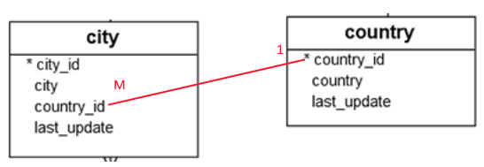

Перечитывая конспект, я охуел. Поэтому решил попробовать сделать более наглядную версию оформления связей, пошаговую - на каждом шаге буду добавлять только одну аннотацию к полю и объяснять, что она делает.

При этом я думаю опускать все лишние поля, вроде id и прочих, потому что про их мэпинг дб отдельный конспект. Думаю что можно сделать конспект из огрызков кода, а если нужно посмотреть полную версию, то можно это сделать в репо dvdrental.

И энивей такое ощущение, что чем больше расписываешь, чем больше объясняешь, тем меньше становится понятно и тем труднее это все потом читать. Потому что хочется получить быстрый ответ, а тут писанины на 20 листов. Как этот парадокс обойти, я пока не знаю. Я думаю уже, что вообще не стоит писать никаких объяснений. Потому что если пошагово расписать что делать, думаю мысли о том как это работает придут сами.

Может быть реально за "быстрым" ответом нужно лезть в код, а если из кода не понятно, тогда уж ничего не поделаешь и надо читать долгий конспект?

# Важное

* В сущностях нужно обязательно реализовывать методы хэша и равенства. Без этого косяки могут вылезти на ровном месте. Например, я использовал в примерах HashSet для хранения коллекций, а для хэш-таблиц эти методы критичны. Из-за кривой лобковой реализации у меня список городов в стране не заполнялся и я охуел, пока нашел в чем дело.

  Ну и соответственно, если пользоваться лобком, то только для геттеров и сеттеров. Нельзя с его помощью реализовывать хэш и равенство, это дерьмо собачье, а не реализация.

  

# 1М и М1



Классы можно организовать двумя способами:

* Однонаправленная связь:

  ```java
  class City {
      private Country country;
  }
  ```

  ```java
  class Country {
  }
  ```

  Город знает о своей стране, а страна ничего знает о своих городах.

* Двунаправленная связь:

  ```java
  class City {
      private Country country;
  }
  ```

  ```java
  class Country {
      private Set<City> cities;
  }
  ```

  Город знает о своей стране, а страна имеет список своих городов.

## Однонаправленная

Много городов составляют страну, значит связь города:страны это М:1. Применяем аннотацию @ManyToOne к полю страны:

```java
class City {
    @ManyToOne
    private Country country;
}
```

Теперь нужно указать, какой столбец в таблице городов используется для связи с таблицей стран - для этого добавляем еще аннотацию @JoinColumn к полю страны:

```java
class City {
    @ManyToOne
    @JoinColumn(name = "country_id")
    private Country country;
}
```

В классе Country ничего делать не надо, раз он понятия не имеет о городах.

## Двунаправленная

Теперь сделаем, чтобы все-таки в стране был список городов.

Класс городов остается как в прошлом пункте, а в класс страны добавляем поле со списком, аннотированное через @OneToMany:

```java
class Country {
    @OneToMany(mappedBy = "country")
    private Set<City> cities = new HashSet<>();
}
```

* Есть разница, какой интерфейс коллекции использовать для хранения. Сейчас я не знаю, чем именно они отличаются, просто знаю, что эффект разный и пока использую только Set. Поэтому важно у сущностей реализовывать методы хэша и равенства.

* В @OneToMany в параметр mappedBy пишем *поле класса* City, которое содержит ссылку на объект страны.

* Что характерно, параметр mappedBy есть у @OneToMany и у @OneToOne, но его нет у @ManyToOne. Все потому что таблица со "многими", как мне сейчас кажется, физически всегда является владельцем связи, т.е. содержит ссылку на таблицу с "одним". Как следствие, "один" класс не имеет личной возможности как-то получить своих "многих", поэтому мы и указываем, через какое поле класса "многих" установлена связь на уровне БД.

  Это скорее не объяснение, а просто поток сознания. Скорее всего, когда я такое объяснение прочитаю в следующий раз, я подумаю, "ты че, совсем мудак что ли блять?". Потому что объяснить это мне кажется невозможно, это можно только почувствовать и каждый раз объяснение будет другое.

## Жадная и ленивая выборка

В текущем варианте при выборе города сразу же будет запрос и на его страну, потому что по умолчанию используется жадная выборка. Можно сменить ее на ленивую, добавив параметр fetch в аннотацию @ManyToOne и @OneToMany:

```java
class City {
    @ManyToOne(fetch = FetchType.LAZY)
    @JoinColumn(name = "country_id")
    private Country country;
}
...
Было с жадной:
select c1_0.city_id, c2_0.country_id, c2_0.last_update, c2_0.country, c1_0.last_update, c1_0.city 
from city c1_0
    left join country c2_0
        on c2_0.country_id=c1_0.country_id
where c1_0.city_id=?

Стало с ленивой:
select c1_0.city_id, c1_0.country_id, c1_0.last_update, c1_0.city 
from city c1_0
where c1_0.city_id=?
```

А вот в случае со страной, список городов кажется по умолчанию ленивый:

```java
Если не указывать тип выборки:
select c1_0.country_id, c1_0.last_update, c1_0.country 
from country c1_0
where c1_0.country_id=?

Если указать EAGER:
select c1_0.country_id, c2_0.country_id, c2_0.city_id, c2_0.last_update, c2_0.city, c1_0.last_update, c1_0.country 
from country c1_0 
    left join city c2_0 
        on c1_0.country_id=c2_0.country_id 
where c1_0.country_id=?

class Country {
    @OneToMany(mappedBy = "country", fetch = FetchType.EAGER)
    private Set<City> cities = new HashSet<>();
}
```

А если указать жадную в обоих классах, получается два запроса, но я их писать сюда не буду, потому что это уже какой-то треш.

В общем, мне кажется лучше явно везде указывать тип выборки, чтобы наверняка.

## Каскадное сохранение

Без каскадного сохранения нужно вызывать persist для каждой сущности, а с каскадным - достаточно вызвать только на одной. При этом надо не забывать правильно вкладывать объекты друг в друга, т.к. сохранение в БД это одно, а ссылки внутри программы - это наша забота:

```java
class City {
    @ManyToOne(cascade = CascadeType.PERSIST, fetch = FetchType.EAGER)
    @JoinColumn(name = "country_id")
    private Country country;
}
```

```java
class Country {
    @OneToMany(cascade = CascadeType.PERSIST, mappedBy = "country", fetch = FetchType.EAGER)
    private Set<City> cities = new HashSet<>();
}
```

```java
private void addCityAndCountry() {
    Country country = new Country();
    country.setName("Москва");

    City city = new City();
    city.setName("Россия");
    city.setCountry(country);  // не забываем
    country.getCities().add(city);  // про взаимное вложение
    
    manager.getTransaction().begin();
    manager.persist(country);
    //manager.persist(city);  теперь не нужно
    manager.getTransaction().commit();
}
```

