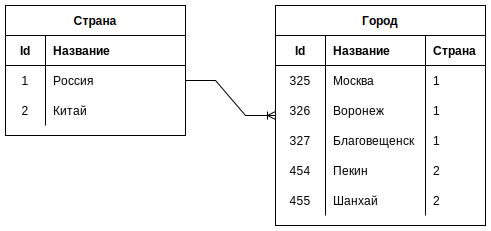

# Главная и подчиненная таблицы

Вернемся к основам. Связь в БД может быть только между двумя таблицами. Даже когда две таблицы A и B связаны через третью C, то все равно мы говорим о связи между парами A + C и B + C. И в этой связи одна таблица всегда главная, а другая - подчиненная.

Если в таблице A есть ссылка на таблицу B, то таблица A является подчиненной, а B - главной. Т.е. главная таблица как бы независимая, самостоятельная, она ничего не знает о других таблицах.

Слева таблица стран, а справа - таблица городов.

Главная таблица здесь именно со странами, потому что она ничего не знает о городах. А таблица городов- подчиненная, потому что она ссылается на страны.

# Владелец связи

Таблица городов также является ***владельцем связи***, потому что у нее есть ссылка на таблицу стран.

# Виды связей

> Я попробовал для порядка расписать, как определить тип связи и понял, что сделать это, оказывается, довольно непросто. Так что рекомендация тут одна - просто прочувствовать суть на конкретных примерах и руководствоваться здравым смыслом, а не какими-то правилам и алгоритмами

## 1М и М1

Между таблицами Страна:Город связь *один-ко-многим* (1М), потому что в *одной* стране *много* городов. А между таблицами Город:Страна связь *многие-к-одному* (М1), потому что *много* городов находятся в *одной* стране. Т.е. М1 это можно сказать "1М наоборот".

Типичная ошибка - взять город и подумать так "каждому городу соответствует только одна страна, значит Город:Страна это связь *один-к-одному* (1:1)". Такая логика - неправильная, потому что, хотя конечно каждый конкретный город связан только с одной страной, но в таблице городов может быть несколько городов, связанных с одинаковой страной.

## ММ

Связь *многие-ко-многим* (ММ) всегда организуется через промежуточную таблицу, в которой во всевозможных комбинациях расположены id связываемых таблиц.

Каждый сотрудник мог обслужить много клиентов, но и каждого клиента могли обслуживать много сотрудников. Нередко такую связь можно выразить через какую-нибудь значимую бизнес-сущность. В данном случае - заказы.

Здесь в паре Сотрудники-Заказы (1М, один сотрудник оформлял много заказов) таблица Сотрудники является главной, а Заказы подчиненной. В паре Клиенты-Заказы (1М, один клиент делал много заказов) аналогично, Клиенты - главная таблица, а Заказы - подчиненная.

Надо сказать, что промежуточная таблица может использоваться не только для реализации ММ, но и М1 в том случае, когда на стороне "многих" нежелателен null. Например, User может купить Item на аукционе, значит у Item должно быть поле для хранения покупателя. Но до тех пор, пока Item никто не купил, это поле будет null. К слову, хранения null в БД вообще желательно избегать, т.к. они понижают качество данных. Поэтому для избежания null можно ввести промежуточную таблицу, например Buyer, в которой запись с id Item и id User появляется только после покупки и т.о. мы избегаем null.