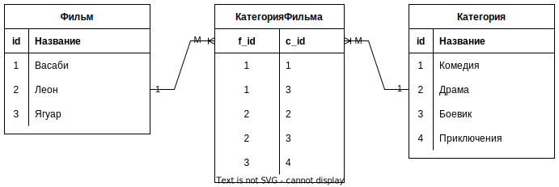

# Как надо думать

Когда хотим замапить связь, думать всегда начинаем со стороны БД. 

В БД любая связь существует *только между двумя* таблицами и при этом одна из них является *владельцем связи*, т.е. имеет ссылку на другую таблицу. Все связи в БД являются *однонаправленными*, поскольку вторая таблица попросту не может иметь ссылку на первую.

Здесь таблица city - владелец связи, т.к. у нее есть столбец country_id:


# 1М и М1, голые java классы

## Однонаправленная связь

```java
public class City {
    private Country country;  // Есть ссылка на страну
}
```

```java
public class Country {
    // Нет ссылок на города, поэтому "однонаправленная"
}
```

## Двунаправленная связь

```java
public class City {
    private Country country;  // Есть ссылка на страну
}
```

```java
public class Country {
    // И есть ссылки на города, поэтому "двунаправленная"
	private Set<City> cities = new HashSet<>();
}
```

# Мапим 1М и М1

Тип связи всегда можно определить логически на основе таблиц БД. Проще начинать мапинг с владельца связи, в данном случае с City, потому что во владельце всегда можно применить аннотацию @JoinColumn, указав в ней столбец связи. Тогда для противоположной таблицы сразу понятно что надо использовать mappedBy.

## Однонаправленная

```java
@Table(name = "city")
public class City {
    @ManyToOne
    @JoinColumn(name = "country_id")
    private Country country;
}
```

```java
@Table(name = "country")
public class Country {

}
```

Когда пишем классы, думаем все равно относительно БД:

* В таблице city может быть много городов, у которых одна и та же страна
* Значит между city - country связь М1 => используем аннотацию @ManyToOne
* Таблица city в БД является владельцем связи
* Значит, у нее есть поле с id страны, по которому можно вытащить объект страны
* => указываем этот *столбец таблицы БД* в аннотации @JoinColumn

## Двунаправленная

```java
@Table(name = "city")
public class City {
    @ManyToOne
    @JoinColumn(name = "country_id", nullable = false)
    private Country country;
}
```

```java
@Table(name = "country")
public class Country {
    @OneToMany(mappedBy = "country")
    private Set<City> cities = new HashSet<>();
}
```

Начинаем думать аналогично как в однонаправленной, а когда мапим класс Country, думаем так:

* С одной страной может быть связано много городов
* Значит, между country - city связь 1М => используем аннотацию @OneToMany
* В таблице БД country нет столбца, который бы указывал на город
* Значит, мы не можем пользоваться @JoinColumn'ом и указать столбец, по которому надо связаться с парной таблицей
* => нужно использовать параметр mappedBy аннотации @OneToMany и указать в нем *поле класса* парной таблицы, которое содержит мэппинг

Двунаправленную связь М1 можно тоже делать через промежуточную таблицу в случае, если в столбце со ссылкой нежелателен null. Например, если мы проектируем аукцион, то у Лота будет ссылка на Владельца. Но пока Лот не купили, он будет лежать в БД с null'ом в этой ссылке. Если же мы сделаем через промежуточную таблицу, то null не будет, поскольку поле Владельца уйдет из таблицы Лота в эту промежуточную таблицу.

# ММ, голые java классы

При мэпинге ММ все делается так же как и в М1, потому что ММ в БД всегда делается через промежуточную сущность, а это по сути М1 + М1.



```java
public class Film {
    private Set<FilmCategory> filmCategory = new HashSet<>();
}
```

```java
public class Category {
    private Set<FilmCategory> filmCategory = new HashSet<>();
}
```

```java
public class FilmCategory {
    private Film film;
    private Category category;
}
```

# Мапим ММ

Начинаем думать с владельца связи, FilmCategory, потому что так проще:

```java
@Table(name = "film_category")
public class FilmCategory {
    @ManyToOne
    @JoinColumn(name = "film_id", insertable = false, updatable = false)
    private Film film;

    @ManyToOne
    @JoinColumn(name = "category_id", insertable = false, updatable = false)
    private Category category;

    @EmbeddedId
    private Id id = new Id();

    private FilmCategory() { }

    public FilmCategory(Film film, Category category) {
        // Связи в классах мы должны сделать руками, как будто никакого хранения нет
        this.film = film;
        this.category = category;

        this.id.categoryId = category.getId();
        this.id.filmId = film.getId();

        film.getFilmCategory().add(this);
        category.getFilmCategory().add(this);
    }

    @Embeddable
    public static class Id implements Serializable {
        @Column(name = "film_id")
        private Long filmId;

        @Column(name = "category_id")
        private Long categoryId;
    }
}
```

```java
@Table(name = "film")
public class Film {
    @OneToMany(mappedBy = "film")
    private Set<FilmCategory> filmCategory = new HashSet<>();
}
```

```java
@Table(name = "category")
public class Category {
    @OneToMany(mappedBy = "category")
    private Set<FilmCategory> filmCategory = new HashSet<>();
}
```

В классах нужно обязательно реализовать hashCode, equals, настроить тип выборки и прочее. Здесь приведена только суть, относящаяся непосредственно к пониманию мэпинга.