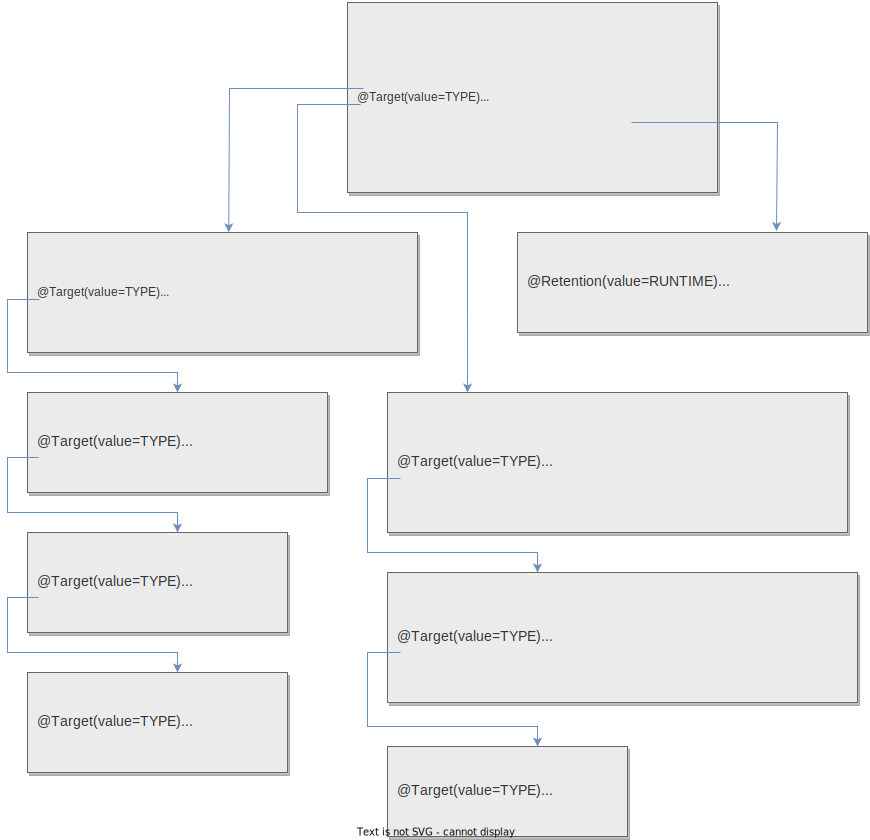

Надо шаг за шагом расковырять все эти аннотации. Я уверен, что это не сложно в своей основе, просто дофига всего и немного запутанно.

# Указатель

```
Индекс
```


# Мысли

## Первое

Надо разобраться, что означает вот такая запись:

```java
@Target(value={METHOD,ANNOTATION_TYPE})
   @Retention(value=RUNTIME)
   @Documented
   // @Inherited (просто для примера, у Bean ее нет)
public @interface Bean
```

Потому что все аннотации спринга в доке описаны именно так.

Во-первых, конструкцией `@interface` объявляется аннотация. Соответственно, `public @interface Bean` объявляет аннотацию Bean, которую мы потом будем использовать как @Bean.

Во-вторых, @Target, @Retention, @Documented в данном случае означает, что будущая аннотация Bean по сути является комбинацией этих аннотаций с заданными параметрами. Т.е., применяя в будущем к какому-то элементу аннотацию Bean, мы считай применяем к нему все эти три аннотации, с указанными параметрами.

## Второе

Нужно понимать, какие аннотации являются частью джавы, а какие принадлежат спрингу. В самой джаве не так уж много встроенных аннотаций (см. [тут](https://docs.oracle.com/javase/8/docs/api/java/lang/annotation/package-summary.html)). @Target, @Retention и @Documented как раз являются одними из них. 

@Target определяет, к какому элементу можно применить аннотацию. Например, к методу, классу, полю, конструктору и т.д. См. гугл для всех возможных целей. Значение @Target(value={METHOD,ANNOTATION_TYPE}) как выше значит, что аннотацию Bean можно будет применять к методу и к аннотациям.

@Retention определяет, так сказать, "как долго аннотация будет прилеплена к элементу". @Retention(value=RUNTIME) означает, что аннотация будет доступна во время выполнения. Т.е. мы с помощью рефлексии сможем узнать, что такая аннотация есть у класса. А например @Retention(value=RetentionPolicy.SOURCE) означает, что аннотация доступна только во время компиляции. Т.е. во время выполнения ее у класса уже не будет.

@Documented не столь важно. То ли что аннотация должна попадать в средства автодокументирования, то ли что-то такое.

@Inherited. В этом примере не используется, но важно заранее ее запомнить. Применяется только к аннотациям. Значит, что если бы аннотацию Bean можно было применить к классу и Bean была бы аннотирована @Inherited'ом, то потомки класса тоже автоматически получили бы себе аннотацию Bean.

## Третье, @SpringBootApplication

Наконец-то подбираемся к спрингу. Основной класс, запускающий магию, аннотируется @SpringBootApplication. У нее вот такой состав:

```java
@Target(value=TYPE)
   @Retention(value=RUNTIME)
   @Documented
   @Inherited
   @SpringBootConfiguration
   @EnableAutoConfiguration
   @ComponentScan(excludeFilters={@ComponentScan.Filter(type=CUSTOM,classes=TypeExcludeFilter.class),})
public @interface SpringBootApplication
```

Теперь надо каждую из этих аннотаций расковырять.



Начать можно с самых "нижних"

### @Indexed

Суть спринга - формировать приложение из бинов. А бины надо создавать из каких-то классов. Причем тут fail-fast принцип - спринг сразу создает все бины на старте приложения и если при этом возникают какие-то ошибки, приложение даже не запускается.

Так вот, у спринга может быть так называемый "индекс" - список классов-кандидатов, из которых будут создаваться бины. Индекс автоматически формируется при компиляции, если подключить зависимость **spring-context-indexer**, и сохраняется в файл META-INF/spring.components (только смотреть надо конечно в target папке, а не в исходниках). Классы попадают в индекс, если они отмечены аннотацией Indexed (ну или другими, которые включают в себя эту аннотацию. UPD. И не только, еще в javax есть аннотации, которые ведут к попаданию класса в индекс. В общем, не суть, какие именно, важно что попадают).

Пример индекса (он представляет собой обычный текстовый файл):

```
com.somegroup.spronk.cure.indexedbased.SampleComponent1=org.springframework.stereotype.Component
com.somegroup.spronk.cure.indexedbased.SampleRepository1=org.springframework.stereotype.Component
com.somegroup.spronk.cure.javaxbased.NamedService=javax.inject.Named
```

Ключ - имя нашего класса, а значение - аннотация, которой он помечен.

Здесь есть еще одна тонкость: если посмотреть на аннотацию @SpringBootConfiguration, то она включает в себя аннотацию @Configuration и @Indexed. При этом @Configuration включает @Component, а он включает @Indexed. Сперва мне это показалось странным - получается, что @SpringBootConfiguration как бы два раза содержит в себе @Indexed. Однако это не случайно - от непосредственного наличия аннотации @Indexed зависит, какая аннотация будет указана в ключе у класса в индексе:

Поскольку у @SpringBootConfiguration аннотация @Indexed указана *непосредственно*, то в индекс класс попадает именно с аннотацией @SpringBootConfiguration. А вот к примеру аннотация @Repository:

```java
@Target(value=TYPE)
   @Retention(value=RUNTIME)
   @Documented
   @Component
public @interface Repository
```

У нее нет непосредственно аннотации @Indexed, зато у нее есть @Component, который *непосредственно* содержит @Indexed. Поэтому класс, помеченный @Repository, попадет в индекс не с аннотацией @Repository, а с аннотацией @Component. Надеюсь теперь принцип понятен, и почему @Indexed может как бы "дублироваться".

:question::question::question: Говорят, во-первых, что при использовании индекса, все модули проекта должны иметь индекс. И, во-вторых, что при наличии индекса якобы не идет поиск в classpath. Можно отключить использование индекса

```
spring.index.ignore=true
```

Но куда это писать - отдельная тема. Например, [тут](http://www.javabyexamples.com/spring-candidate-component-index).

### @Component

```java
@Target(value=TYPE)
   @Retention(value=RUNTIME)
   @Documented
   @Indexed
public @interface Component
```

Такой аннотацией отмечается компонент, иначе и не скажешь. Сама концепция "компонент" означает класс, который будет автоматически найден при сканировании классов~~, лежащих в classpath'е (если используется поиск на основе аннотаций конечно).~~ UPD. Не обязательно, что в classpath'е, потому что может быть и в индексе. Впрочем, это не столь важно. Важно, что он в принципе найдется, либо там, либо тут.

Компонент - самый общий вид, хм, "компонента". Есть более специализированные "компоненты":

```java
@Target(value=TYPE)
   @Retention(value=RUNTIME)
   @Documented
   @Component
public @interface Repository
```

### @Configuration

```java
@Target(value=TYPE)
   @Retention(value=RUNTIME)
   @Documented
   @Component
public @interface Configuration
```

Этой аннотацией мы отмечаем классы, которые содержат методы, создающие бины. Пример:

```java
@Configuration
public class ServiceConfiguration {
    @Bean
    public MarriageService marriageService() {
        return new MarriageService();
    }
    @Bean
    public CityService cityService(MarriageService marriageService) {
        return new CityService(marriageService);
    }
}
```

Пример использования этого класса:

```java
AnnotationConfigApplicationContext ctx = new AnnotationConfigApplicationContext();
ctx.register(ServiceConfiguration.class);
ctx.refresh();
```

Есть возможность разносить конфигурацию бинов по нескольким классам, потом объединять их, но вообще ни это, ни собственно использование конфигураций не является темой этого мануала. Тут важно понять просто для чего эта аннотация нужна, а не как ею пользоваться.

В демки по spring config записал хорошие примеры.

#### @Bean

```java
@Target(value={METHOD,ANNOTATION_TYPE})
   @Retention(value=RUNTIME)
   @Documented
public @interface Bean
```

Отмечает методы, которые создают бины.

### @Import

Используется для объединения нескольких классов, аннотированных @Configuration, в один класс, в котором получатся все суммарные настройки.


### @SpringBootConfiguration

```java
@Target(value=TYPE)
   @Retention(value=RUNTIME)
   @Documented
   @Configuration
   @Indexed
public @interface SpringBootConfiguration
```


# Черновик

* Индекс

