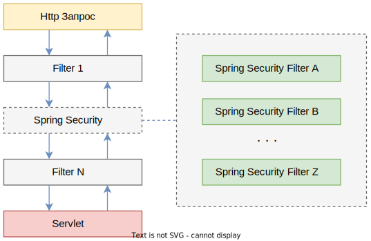

# Концепция Spring Security

Обработка HTTP-запросов в джаве строится на сервлетах. Объект запроса попадает в сервлет, там происходит его обработка и сервлет записывает результат в объект ответа, который и уходит клиенту. Есть особая категория сервлетов - *фильтры*. Их можно расположить в любом количестве перед "конечным" сервлетом для выполнения разных вспомогательных задач. Например, добавлять к объекту запроса какую-то информацию, или прерывать прохождение запроса к сервлету (например, если клиент не авторизован). Т.о. в лучшем случае запрос проходит по всей цепочке фильтров к сервлету, а потом обратно по всей цепочке (уже в обратном порядке) идет назад и уходит пользователю. Ну а в худшем просто не доходит до конечного сервлета.

Spring Security технически представляет собой как раз такой вот фильтр. Монолитный, т.е. в цепочке фильтров он будет занимать один "слот". Однако внутри он сам может состоять из цепочки своих внутренних фильтров. Все это можно изобразить примерно так:



Пример дефолтной цепочки фильтров в Spring Security, через которые проходит запрос:

```
Запрос -> SecurityContextPersistenceFilter, HeaderWriterFilter, CsrfFilter, LogoutFilter, UsernamePasswordAuthenticationFilter, DefaultLoginPageGeneratingFilter, DefaultLogoutPageGeneratingFilter, BasicAuthenticationFilter, RequestCacheAwareFilter, SecurityContextHolderAwareRequestFilter, AnonymousAuthenticationFilter, SessionManagementFilter, ExceptionTranslationFilter, FilterSecurityInterceptor -> Запрос наконец-то попадает в контроллер
```

# Аутентификация и авторизация, http-коды

Эти понятия означают следующее:

* Аутентификация - процесс определения "Кто вы?".

  "Вы - администратор".

  На запрос, не прошедший *аутентификацию*, возвращается код `401 - Unauthorized`. Хотя по названию созвучно с "не авторизован", но на самом деле этот код означает именно "не аутентифицирован", т.е. не был определен как пользователь, зарегистрированный в системе.

* Авторизация - процесс определения "Что вы можете делать?" после того, как стало известно, кто вы.

  "Вы - администратор, поэтому вы можете получать доступ ко всем ресурсам ("ходить по всем ссылкам приложения")"
  
  На запрос аутентифицированного пользователя, который не имеет прав доступа к запрошенному ресурсу, возвращается код `403 - Forbidden`.

# Базовый пример

## Зависимости

```xml
<dependency>
    <groupId>org.springframework.boot</groupId>
    <artifactId>spring-boot-starter-security</artifactId>
</dependency>
```

## Бины

Общая идея в том, что нам нужно настроить три вещи:

* Сервис получения информации о пользователях
* Способ кодирования пароля
* Настройки безопасности для ресурсов ("доступ к ссылкам")

Все эти вещи объединяются в конфиге безопасности.

### Бин конфига безопасности

```java
@EnableWebSecurity(debug = true)  // 1
public class SecurityConfig extends WebSecurityConfigurerAdapter {

    private MyUserDetailsService userDetailsService;  // 2

    @Autowired
    public SecurityConfig(MyUserDetailsService userDetailsService) {
        this.userDetailsService = userDetailsService;
    }

    @Bean  // 4
    public PasswordEncoder passwordEncoder() {
        return NoOpPasswordEncoder.getInstance();
    }

    @Override  // 3
    public void configure(AuthenticationManagerBuilder auth) throws Exception {
        auth.userDetailsService(userDetailsService);
    }

    @Override  // 5
    protected void configure(HttpSecurity http) throws Exception {
        http
            .sessionManagement()  // 5.1
                .sessionCreationPolicy(SessionCreationPolicy.STATELESS)
                .and()
            .authorizeRequests()  // 5.2
//                .antMatchers("/api/admin/**").hasAuthority("admin")
//                .antMatchers("/api/user/**").hasAnyAuthority("admin", "user")
                .antMatchers("/api/admin/**").hasRole("admin")
                .antMatchers("/api/user/**").hasAnyRole("admin", "user")
                .anyRequest().permitAll()
                .and()
            .httpBasic();  // 5.3
    }
}
```

Комментарии:

1. Помечаем класс как конфигурационный бин, чтобы спринг его нашел

2. Мы должны предоставить фреймворку информацию о пользователях. Для этого можно написать собственный сервис или воспользоваться готовыми (например, in-memory список пользователей). Потребуем такой сервис в качестве бина через конструктор.

3. В этом переопределенном методе передадим фреймворку этот сервис, предоставляющий информацию о пользователях. В данном случае используется сервис, реализующий интерфейс `UserDetailsService`. Другие варианты будут рассмотрены отдельно.

4. Пароли должны подвергаться шифрованию перед передачей на сервер и храниться в зашифрованном виде.  TODO: ??? Поэтому в данный момент я не понимаю, зачем указывать способ шифрования какой-то кроме `NoOpPasswordEncoder`. Ведь если к нам приходит зашифрованный пароль, и в базе хранится зашифрованный, то мы должны просто сравнить их. Может быть как раз поэтому и указывается NoOpPasswordEncoder, чтобы спринг понимал, что с паролем ничего дополнительно делать не надо. Энивей, в данном примере используется незашифрованный пароль для простоты и варианты с шифрованием разумнее оформить отдельно, чтобы не перегружать каркас деталями.

5. В этом переопределенном методе осуществляется комплексная настройка безопасности.

   1. По умолчанию, если послать данные авторизации через, например Insomnia, спринг их запомнит в сессии и в последующих запросах их уже можно будет не передавать. Мы же переопределяем это поведение, чтобы он не запоминал и данные нужно было передавать в каждом запросе.

   2. Настраиваем доступы к ресурсам. В начале указываем конкретные, в конце - общие, по принципу как и в обработке исключений.

      Шаблон `.antMatchers("/api/admin/**")` означает, что следующие правила (в данном случае правило, что доступ только для админов) будет применяться ко всем путям, которые начинаются с `/api/admin` (и в том числе к самому этому пути). Далее аналогично для `/api/user`, ну и `.anyRequest().permitAll()` означает, что все остальные ресурсы доступны всем (даже не авторизованным), а `.authenticated()` означало бы, что всем аутентифицированным.

      `Authority` - это этакая "базовая" характеристика пользователя. `Role` является подвидом Authority. Поэтому здесь можно использовать любой из этих элементов для настройки доступа к ресурсам.

      Важная деталь: если использовать методы Role, то нужно учитывать, что роли в спринге префиксуются как `ROLE_`. Поэтому когда мы пишем `.hasRole("admin")`, то предполагается, что значение, с которым будет происходить сравнение, выглядит как `ROLE_admin`. Это ROLE_ будет автоматически убрано и получится совпадение, admin == admin. Об этом еще будет упомянуто в комментариях к сервису MyUserDetailsService, который предоставляет фреймворку информацию о пользователях

   3. `.httpBasic()` означает, что используется т.н. [базовая схема аутентификации](https://developer.mozilla.org/en-US/docs/Web/HTTP/Authentication), т.е. в запрос добавляется заголовок `Authorization` с логином \и паролем.

   В общем, при необходимости можно кастомизировать достаточно сильно.

### Бин сервиса информации о пользователях

Этот сервис отвечает за формирование объекта пользователя, который содержал бы всю необходимую фреймворку информацию о пользователе. Например, логин, пароль, его полномочия (authorities), роль. Информацию эту можно брать откуда угодно - из БД, из сторонненго сервиса, хранить в памяти. В общем, способ хранения не важен, для некоторых есть уже готовые классы, главное что на выходе должен получаться объект, понятный фреймворку. В данном примере сымитируем хранение в БД:

```java
@Service
public class MyUserDetailsService implements UserDetailsService {  // 1
    private UserCredentialsRepo userCredentialsRepo;  // 2

    @Autowired
    public MyUserDetailsService(UserCredentialsRepo userCredentialsRepo) {
        this.userCredentialsRepo = userCredentialsRepo;
    }

    @Override  // 3
    public UserDetails loadUserByUsername(String login)
            throws UsernameNotFoundException {
        UserCredentials userCredentials = userCredentialsRepo.findByLogin(login);  // 4

        if (userCredentials == null) {  // 5
            throw new UsernameNotFoundException("Unknown user: " + login);
        }

        UserDetails user = User.builder()  // 6
                .username(userCredentials.getLogin())
                .password(userCredentials.getPassword())
                .roles(userCredentials.getRole())
//                .authorities(userCredentials.getRole())
                .build();

        return user;
    }
}
```

Комментарии:

1. Реализуем выбранный интерфейс. Для нашего сценария это `UserDetailsService`
2. Внедрим собственный сервис, который по логину найдет нам пользователя в нашей БД. Этот пользователь может быть в каком угодно формате, мы его впоследствии преобразуем в понятный для фреймворка вид.
3. Переопределяем метод, через который фреймворк передаст нам логин пользователя
4. Используя собственный сервис, ищем пользователя
5. Если не нашли, положено выбросить исключение `UsernameNotFoundException`
6. Пользуемся строителем, чтобы создать объект пользователя, который будет понятен фреймворку. В частности, когда мы используем метод `.roles`, то к переданной роли строитель добавит префикс `ROLE_`. Об этом упоминалось выше, в настройке доступа к ресурсам, когда используется метод `.hasRole()`. Поэтому важно пользоваться именно строителем, чтобы получился объект правильного формата и все подобные тонкости спринг брал на себя.

Оставшиеся классы, относящиеся к доменной логике: наше **внутреннее представление пользователя**, не зависящее от фреймворка:

```java
@Getter @Setter
public class UserCredentials {
    private String login;
    private String password;
    private String role;

    public UserCredentials() { }

    public UserCredentials(String login, String password, String role) {
        this.login = login;
        this.password = password;
        this.role = role;
    }
}
```

Наше **Представление ролей**:

```java
public enum UserRoleEnum {
    ADMIN("admin"), USER("user");

    private final String alias;

    private UserRoleEnum(String alias) {
        this.alias = alias;
    }

    public String getAlias() {
        return alias;
    }

    @Override
    public String toString() {
        return alias;
    }
}
```

Наш **Сервис, имитирующий извлечение пользователя из БД**:

```java
@Service
public class UserCredentialsRepo {
    private static Map<String, UserCredentials> users = new HashMap<>() {{
        put("tom", new UserCredentials("tom", "ptom", UserRoleEnum.USER.toString()));
        put("sid", new UserCredentials("sid", "psid", UserRoleEnum.USER.toString()));
        put("polly", new UserCredentials("polly", "ppolly", UserRoleEnum.ADMIN.toString()));
    }};

    public UserCredentials findByLogin(String login) {
        return users.get(login);
    }
}
```

## Контроллер

Теперь для вполне обычного контроллера будут работать правила безопасности:

```java
@RestController
@RequestMapping(path = "/api")
public class HelloController {

    @GetMapping("/hello/{name}")
    public ResponseEntity hello(@PathVariable String name) {
        String message = String.format("Hello, %s", name);
        return ResponseEntity.ok(message);
    }

    @GetMapping("/admin")
    public ResponseEntity admin() {
        String message = "Admin start page";
        return ResponseEntity.ok(message);
    }

    @GetMapping("/admin/hello")
    public ResponseEntity adminHello() {
        String message = String.format("Hello, admin!");
        return ResponseEntity.ok(message);
    }

    @GetMapping("/user")
    public ResponseEntity user() {
        String message = "User start page";
        return ResponseEntity.ok(message);
    }

    @GetMapping("/user/hello")
    public ResponseEntity userHello() {
        String message = "Hello, user!";
        return ResponseEntity.ok(message);
    }
}
```

## Отправка запроса

Запрос можно отправить с помощью, например, клиента `Insomnia`:

* Создаем новый запрос, адрес ресурса например `http://localhost:8080/api/user/hello`
* Для добавления заголовка с данными аутентификации необходимо на вкладке `Basic` выбрать пункт `Basic Auth` и заполнить username и password. Есть разные способы передать эти данные, например, в теле через форму, но для данных примеров нужен именно Basic Auth, важно не перепутать.