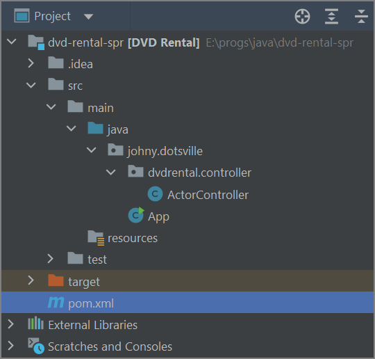
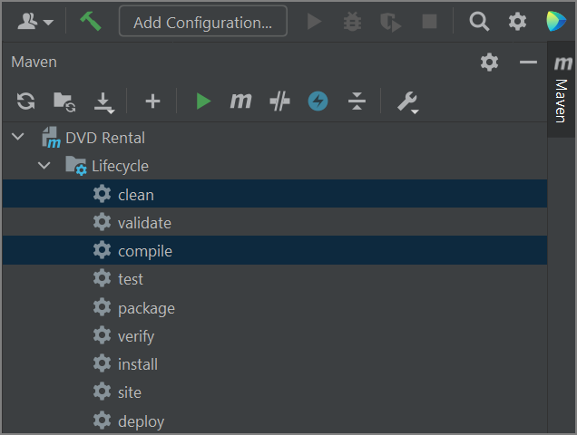

# Спринг приложение вручную

Однажды у меня перестали работать проекты, которые генерируются на spring.io Они компилировались, но, хоть убей, пакеты не идея не видела даже после инвалидации кэшей и прочей чепухи. Тогда удалось создать вручную.

UPD. Проблемы были из-за несоответствий версий джавы. Возможно это все из-за всратой винды случилось (но это не точно). В любом случае, на виртуалке с чистой виндой и идейными SDK все вроде заработало нормально. Мавен тоже идейный, т.е. кроме как в идее, вообще никаких упоминаний джавы в винде нету.

* Создаем обычный maven-проект через идею

* В нем не будет никаких пакетов, но зато папка java будет отмечена как папка с исходным кодом. Это можно понять по ее синему цвету.

  

  Кстати говоря, можно щелкнуть по ней правой кнопкой и выбрать *Mark Directory As > Source Root*, если по каким-то причинам она не отмечена как корень исходников.

* В POM придется вручную добавить несколько вещей, в итоге он должен получиться примерно таким:

  ```xml
  <parent>
      <groupId>org.springframework.boot</groupId>
      <artifactId>spring-boot-starter-parent</artifactId>
      <version>2.7.0</version>
  </parent>
  
  <groupId>johny.dotsville</groupId>
  <artifactId>dvd-rental-spring</artifactId>
  <version>1</version>
  <name>DVD Rental</name>
  
  <properties>
      <maven.compiler.source>11</maven.compiler.source>
      <maven.compiler.target>11</maven.compiler.target>
  </properties>
  
  <dependencies>
      <dependency>
          <groupId>org.springframework.boot</groupId>
          <artifactId>spring-boot-starter-web</artifactId>
      </dependency>
  </dependencies>
  
  <build>
      <plugins>
          <plugin>
              <groupId>org.springframework.boot</groupId>
              <artifactId>spring-boot-maven-plugin</artifactId>
          </plugin>
      </plugins>
  </build>
  ```

  В parent указываем базовый проект. Не берусь сказать в деталях, но вкратце это что-то вроде сборника зависимостей, плагинов и настроек, которые команда спринг собрала в такой "общий" проект, чтобы мы могли от него унаследоваться и начать формошлёпить без лишней мороки.

  Далее указываем зависимость для веб-разработки spring-boot-starter-web. Это аналогично что-то вроде сборника всего того, что нужно конкретно для веба.

  И завершаем указанием билд-плагина.

* Теперь можно попробовать выполнить clean + compile в меню мавена справа. И *File > Invalidate Caches* конечно же на всякий случай :D

  

* Создадим в папке java пакет и поместим в него класс App с кодом запуска спринг-приложения:

  ```java
  package johny.dotsville;
  
  import org.springframework.boot.SpringApplication;
  import org.springframework.boot.autoconfigure.SpringBootApplication;
  
  @SpringBootApplication
  public class App {
      public static void main(String[] args) {
          SpringApplication.run(App.class, args);
      }
  }
  ```

* Создадим контроллер, чтобы можно было убедиться, что все работает:

  ```java
  package johny.dotsville.dvdrental.controller;
  
  import org.springframework.web.bind.annotation.RestController;
  import org.springframework.web.bind.annotation.GetMapping;
  
  @RestController
  public class ActorController {
      @GetMapping("/actor")
      public String getMessage() {
          return "If God wanted me to be smart, he would have made me born this way";
      }
  }
  ```

* Скомпилируем и в терминале наберем команду:

  ```
  mvn spring-boot:run
  ```

  Приложение попробует запуститься и если будут какие-то ошибки, они появятся в терминале. Если все в порядке, то по адресу *localhost:8080/actor* мы увидим заветное сообщение.
  
* Для остановки приложения в терминале нажимаем *Ctrl + C*

# Дополнительно

* Можно посмотреть, какие зависимости включают в себя спринговые "стартеры". Например, spring-boot-starter-data-jpa вот эти https://mvnrepository.com/artifact/org.springframework.boot/spring-boot-starter-data-jpa/2.7.0. В папке репозитория появляется правда больше, чем видно на сайте, но остальные видно подтягивают входящие в стартер зависимости.