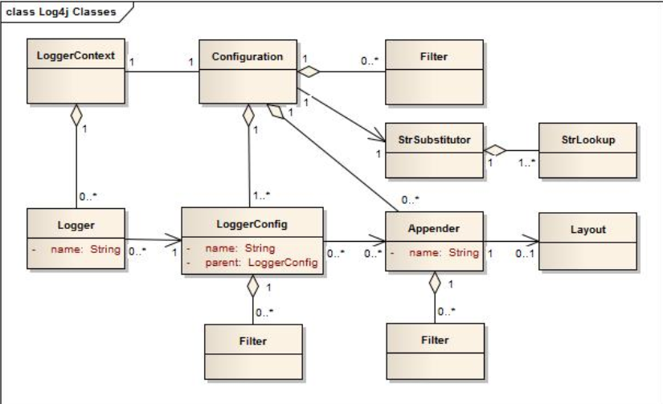

Вообще там оказалось довольно много настроек и всяких штук. Я сначала пытался разобраться по-полной, но потом понял, что это слишком дорого и поэтому для начала решил ограничиться минимальным функционалом, который мне нужен уже сейчас. Поэтому в начале будет практичная эссенция, а дальше уже отрывки из документации, которые удалось понять. Пусть будут на всякий случай, если вдруг придется когда-нибудь копать дальше.

TODO:

- [ ] Настройка расположения файла с логами. Чтобы он появлялся, например, в той же папке, откуда запущена jar-программа.

# Log4j2, эссенция

## Maven

(Если не используется спринг) Нам понадобятся две зависимости:

* log4j-api - содержит интерфейсы логгера
* log4j-core - содержит реализацию

```xml
<properties>
    <log4jversion>2.17.2</log4jversion>
</properties>

<dependencies>
    <dependency>
        <groupId>org.apache.logging.log4j</groupId>
        <artifactId>log4j-core</artifactId>
        <version>${log4jversion}</version>
        <scope>compile</scope>
    </dependency>
    <dependency>
        <groupId>org.apache.logging.log4j</groupId>
        <artifactId>log4j-api</artifactId>
        <version>${log4jversion}</version>
    </dependency>
</dependencies>
```

## Конфигурация

Если вкратце, то конфигурировать логгер можно двумя способами: программно и через файл конфигурации. Через файл конфигурации считается предпочтительнее, об этом написано даже в документации. Этот файл может быть в четырех форматах: property-стиль, yaml, json, xml.

Чтобы фреймворк смог найти файл конфигурации, нужно назвать его соответственно log4j2.properties, log4j2.yaml, log4j2.json, log4j2.xml и задать путь до него через classpath. Причем приоритеты соответствуют перечисленному порядку, т.е. если он найдет .properties-файл, дальше уже не будет искать. В простом случае можно положить конфиг в папку resources, поскольку в итоге ресурсы копируются в папку со скомпилированными классами, и все будет работать.

Конфигурация обычно происходит на старте приложения. Если фреймворк не сможет найти файл с конфигурацией, он примет конфигурацию по умолчанию, которая означает, что логгирование будет производиться только в консоль и уровень событий только ERROR и FATAL.

Пример простой конфигурации:

```xml
<?xml version="1.0" encoding="UTF-8"?>
<Configuration status="WARN">
    <Properties>
        <Property name="logfilename">E:/tmp/test.log</Property>
    </Properties>
    <Appenders>
        <Console name="KonsoleLog" target="SYSTEM_OUT">
            <PatternLayout pattern="%d{HH:mm:ss.SSS} [%t] %-5level %logger{36} - %msg%n"/>
        </Console>
        <File name="FileLog" filename="${logfilename}">
            <PatternLayout pattern="%d{HH:mm:ss.SSS} [%t] %-5level %logger{36} - %msg%n"/>
        </File>
    </Appenders>
    <Loggers>
        <Logger name="johny.dotsville" level="trace" additivity="false">
            <AppenderRef ref="FileLog"/>
        </Logger>
        <Logger name="johny.dotsville.bar" level="trace" additivity="true">
            <AppenderRef ref="KonsoleLog"/>
        </Logger>
        <Root level="error">
            <AppenderRef ref="KonsoleLog"/>
        </Root>
    </Loggers>
</Configuration>
```

Здесь нужно кое-что объяснить, т.к. специально написаны несколько важных вещей. Суть:

* Configuration status="WARN" - это настройка для отображения внутренних сообщений фреймворка. Если выставить debug или trace, тогда в консоль будут выводиться эти самые внутренние сообщения. Может пригодиться, когда фреймворк не работает так как надо.

  Пример таких сообщений:

  ```
  2022-05-23 11:39:02,682 main DEBUG PluginManager 'Core' found 127 plugins
  2022-05-23 11:39:02,684 main DEBUG PluginManager 'Level' found 0 plugins
  2022-05-23 11:39:02,715 main DEBUG PluginManager 'TypeConverter' found 26 plugins
  2022-05-23 11:39:02,725 main DEBUG createProperty(name="logfilename", value="E:/tmp/test.log", value="E:/tmp/test.log")
  ```

* Properties - так же как например и в pom мавена у нас есть возможность задать здесь некоторые переменные, присвоить им значения, и удобно пользоваться ими в конфиге.

* Appernders - раздел с аппендерами. Аппендеры непосредственно занимаются добавлением события в конечную точку - консоль, файл, сеть, БД и т.д. Аппендеров довольно много, здесь показаны два самых простых.

* Loggers - раздел с "логгерами". На самом деле здесь описываются не логгеры, а объекты типа LoggerConfig, о которых можно почитать в разделе про архитектуру. Но чисто умозрительно, с обывательской точки зрения, можно считать, что здесь описываются как раз логгеры. 

  Через AppendersRef задается, какие аппендеры будут срабатывать, когда поступит запрос на логирование от этого логгера. Можно в один логгер добавить несколько аппендеров, чтобы логирование разом происходило в несколько конечных точек.

* *name="johny.dotsville.bar"*

  Видно, что здесь используются два логгера с именами johny.dotsville и johny.dotsville.bar. Чтобы понять, что это значит, взглянем на то, как в программе создается логгер:

  ```java
  package johny.dotsville.bar;  // <-- Важно
  
  import org.apache.logging.log4j.Logger;
  import org.apache.logging.log4j.LogManager;
  
  public class SomeClass {
      private static final Logger logger = LogManager.getLogger(SomeClass.class);  // <-- Важно
      
      public static void main(String[] args) {
          logger.info("Сообщение уровня info");
      }
  }
  ```

  В каждом классе, в котором мы хотим использовать логирование, мы создаем static final поле для логгера. Когда мы запрашиваем логгер, мы должны указать его имя. Стандартной практикой является имя такое же как полное имя класса, который пользуется логгером. Во-первых, так в лог можно легко залогировать для наглядности имя класса, который породил запись, а во-вторых, такое имя делает удобным персональную настройку логгеров.

  Как именно? Класс SomeClass находится в пакете johny.dotsville.bar, значит его полное имя johny.dotsville.bar.SomeClass и в конфиге у нас есть логгер с именем johny.dotsville.bar. Значит, когда мы запросим логгер в SomeClass, он получит эти настройки. Имя ищется не точь-в-точь, а максимально похожее. Т.е. если у нас будет пакет johny.dotsville.bar.need.more и там мы запросим логгер, то он тоже получит настройки johny.dotsville.bar (если мы конечно не напишем дополнительные настройки для, например, johny.dotsville.bar.need)

  Поскольку полное имя класса является стандартной практикой, можно просто написать *LogManager.getLogger();* и он автоматически возьмет имя класса, но для наглядности я все же написал полностью.

  Логгер с конкретным именем создается единожды и потом используется повторно.

* *level="trace" additivity="false"*

  Через level задаем уровень событий, которые хотим логгировать. Уровни логгирования по старшинству, по "степени важности": *ALL < TRACE < DEBUG < INFO < WARN < ERROR < FATAL*. Это значит, если задать уровень логгирования DEBUG, то будут записываться логи DEBUG и более важные, т.е. INFO, WARN, ERROR, FATAL.

  additivity - важный и интересный параметр. Дело в том, что логгеры образуют иерархию в зависимости от своих имен. И additivity true означает фактически "залогировать текущим аппендером, и аппендером логгера, который выше по иерархии". Так что при такой конфигурации:

  ```xml
  <Logger name="johny.dotsville" level="trace" additivity="false">
      <AppenderRef ref="FileLog"/>
  </Logger>
  <Logger name="johny.dotsville.bar" level="trace" additivity="true">
      <AppenderRef ref="KonsoleLog"/>
  </Logger>
  ```

  если мы воспользуемся логгером johny.dotsville.bar, то фактически получим две записи - в консоль и в файл. Если же поставим additivity false, тогда залоггируется только в консоль.

* Root - корневой логгер. Он должен присутствовать обязательно. Фактически, можно указать только корневой логгер, написать туда все точки, в которые нужно логгировать и на этом все, если не нужна какая-то гибкая настройка.

## Паттерн записи лога

Дефолтный формат лога:

```
%d{HH:mm:ss.SSS} [%t] %-5level %logger{36} – %msg%n
15:07:36.280 [main] ERROR johny.dotsville.App - Ошибок нет, но в лог запишем
```

* %d - дата
* %t - имя потока
* %-5level - метка уровня логгирования. 5 означает сколько символов отводится под нее. Например, при значении 10, после ERROR получится еще 6 пробелов и потом уже будет johny.dotsville.App, потому что ERROR это 5 позиций, +еще 5 до 10, и потом еще 1 обязательный пробел.
* %logger{36} - имя логгера, а 36 - ограничение длины имени до 36 символов (правда у меня не получилось на практике увидеть отличия при изменении этого параметра)
* %msg - очевидно сообщение
* %n - очевидно перевод строки

## Параметризация сообщений

* Поскольку не всякое сообщение попадет в лог в зависимости от настроек, имеет смысл параметризовать сообщение:

  ```java
  public static void main(String[] args) {
      String name = "JohNy";
      logger.info("Сообщение уровня info: {}", name);
  }
  ```

  Если в сообщении будет много параметров и они будут сложные, например, какие-нибудь манипуляции с датами, тогда мы потратим время на вычисление конечного сообщения, а оно в итоге может даже не пройти фильтры и не попасть в лог. При использовании параметризации, фреймворк выполняет фактическое вычисление сообщения только тогда, когда достоверно известно, что оно должно попасть в лог.

# Spring логгирование

## logback

В спринге по умолчанию используется логгер *logback*. Чтобы его настроить, в resources кладем файл *logback-spring.xml*

```xml
<?xml version="1.0" encoding="UTF-8"?>
<configuration>

    <property name="LOGS" value="./logs" />
    <property name="filename" value="ati-remake.log" />

    <appender name="Console"
              class="ch.qos.logback.core.ConsoleAppender">
        <layout class="ch.qos.logback.classic.PatternLayout">
            <Pattern>
                %black(%d{ISO8601}) %highlight(%-5level) [%blue(%t)] %yellow(%C{1.}): %msg%n%throwable
            </Pattern>
        </layout>
    </appender>

    <appender name="RollingFile"
              class="ch.qos.logback.core.rolling.RollingFileAppender">
        <file>${LOGS}/${filename}</file>
        <encoder
                class="ch.qos.logback.classic.encoder.PatternLayoutEncoder">
            <Pattern>%d %p %C{1.} [%t] %m%n</Pattern>
        </encoder>

        <rollingPolicy
                class="ch.qos.logback.core.rolling.TimeBasedRollingPolicy">
            <!-- rollover daily and when the file reaches 10 MegaBytes -->
            <fileNamePattern>${LOGS}/archived/${filename}-%d{yyyy-MM-dd}.%i.log
            </fileNamePattern>
            <timeBasedFileNamingAndTriggeringPolicy
                    class="ch.qos.logback.core.rolling.SizeAndTimeBasedFNATP">
                <maxFileSize>10MB</maxFileSize>
            </timeBasedFileNamingAndTriggeringPolicy>
        </rollingPolicy>
    </appender>

    <!-- LOG everything at INFO level -->
    <root level="info">
        <appender-ref ref="RollingFile" />
        <appender-ref ref="Console" />
    </root>

    <logger name="ati.remake" level="trace" additivity="false">
        <appender-ref ref="RollingFile" />
        <appender-ref ref="Console" />
    </logger>

</configuration>
```

В остальном использование логгера стандартное:

```java
import org.slf4j.Logger;
import org.slf4j.LoggerFactory;
...
private static final Logger logger = LoggerFactory.getLogger(CompanyTransferService.class);
```

## Другие логгеры

Чтобы использовать какой-то другой логгер, нужно исключить из стартера logback и отдельно подключить нужный логгер. На примере log4j2:

```xml
<dependency>
    <groupId>org.springframework.boot</groupId>
    <artifactId>spring-boot-starter</artifactId>
    <exclusions>
        <exclusion>  <!-- Отключаем стандартный -->
            <groupId>org.springframework.boot</groupId>
            <artifactId>spring-boot-starter-logging</artifactId>
        </exclusion>
    </exclusions>
</dependency>

<dependency>  <!-- Подключаем нужный -->
    <groupId>org.springframework.boot</groupId>
    <artifactId>spring-boot-starter-log4j2</artifactId>
    <version>1.3.8.RELEASE</version>
</dependency>
```

Далее создаем в resources файл *log4j2.xml* и пользуемся как обычно.

# Термины (log4j)

Многое взято отсюда https://logging.apache.org/log4j/2.x/manual/architecture.html



* Appender - событие может быть записано в файл, выведено в консоль или еще как-то обработано. Вот за эти конкретные способы, что делать с событием, и отвечают аппендеры. Один аппендер может выводить в консоль, другой аппендер - писать в файл. Два аппендера могут работать одновременно, чтобы событие у нас и выводилось в консоль, и писалось в файл. Аппендеры, насколько я понял???, связаны с LoggerConfig, а LoggerConfig'и могут образовывать наследственные цепочки и событие уходит не только в аппендер, так сказать, "текущего" LoggerConfig'а, то но и в аппендеры, которые указаны в родительском LoggerConfig'е текущего LoggerConfig'а.

* LoggerContext - это опорная точка системы логирования. ??? В зависимости от обстоятельств может быть несколько контекстов, но наверное это нечастое явление. Хотя вот цитата из доки "Every LoggerContext has an active Configuration", т.е. получается их как будто реально несколько.

  ??? Контекст содержит (maintains) список всех логгеров, запрошенных приложением, а также имеет ссылку на конфигурацию (Configuration, и похоже это не то же самое что LoggerConfig).

* Configuration - содержит фильтры (Filter 0..*, что бы это ни было), аппендеры, ну на картинке видно что там есть вообще. Как видно, похоже, объект конфигурации всегда один. Видать тот, который из xml генерируется. Пишут, что когда происходит реконфигурация, то существует два объекта Configuration - старый и новый. И только когда все логгеры переключатся на новую конфигурацию, только тогда удаляется старый объект конфигурации. Еще бы знать, что такое реконфигурация? Это когда просто поменяли какие-то настройки или что?

* Logger - сам по себе напрямую действий не выполняет. ??? Хотя не понятно, как так не выполняет? У него есть методы debug и прочие. Он имеет имя и связан с LoggerConfig.

* LoggerConfig - создается, когда в Configuration объявляются логгеры. Т.е. насколько я понял, если в конфигурационном файле мы объявим несколько логгеров (там вроде ведь было что-то такое???), то у нас будет такое же количество и LoggerConfig'ов. В LoggerConfig содержит набор фильтров, те самые, которые пропускают или не пропускают сообщения разных уровней (DEBUG, INFO, WARN, ERROR и т.д.) к собственно аппендерам.

* Filter - это дополнительное средство, позволяющее пропустить\запретить записать событие в лог. Надо смотреть на практике, но суть в том, что грубо говоря событие проверяется на разных этапах. Например, согласно уровню логгирования в LoggerConfig - тут оно может не пройти по уровню. Потом оно может попасть в аппендер и насколько я понял ??? там тоже может быть заблокировано. А фильтры - это еще дополнительные к этим методы проверки. Есть фильтры, которые выполняются до того как событие попадет к проверке в LoggerConfig; есть фильтры, которые срабатывают после LoggerConfig, но до попадания ко всем аппендерам; есть которые срабатывают после LoggerConfig, но до конкретного аппендера; после LoggerConfig и во время каждого аппендера. Что-то такое короче. Ну и каждый фильтр может вернуть одно из трех решений: Accept, значит событие считается нормальным и другие фильтры не должны его проверять (??? ну допустим фильтры не должны, а LoggerConfig например должен?). Deny - значит событие считается заблокированным. Neutral - значит фильтр не решил, блокировать или разрешать событие, и его должны проверить другие фильтры.


# Некоторые факты

* ConfigurationFactory - ??? это плагины, предназначенные для чтения конфигурации. Log4j комплектуется четырьмя: для чтения из XML, JSON, YAML и Property-стиля.

  Каждый вариант ведет к созданию объекта конфигурации. Когда происходит автоконфигурация, log4j вызывает каждую фабрику и она пытается найти конфигурационный файл соответствующего себе формата в classpath. И если находит, то создает по нему объект конфигурации. Порядок поиска и как должен называться файл конфига: log4j2.properties, log4j2.yaml, log4j2.json, log4j2.xml

* Плюсы логирования над обычным sout в том, что можно переключаться между уровнями логирования и таким образом логировать только то, что нужно, а не все подряд. При этом исходных код изменять не приходится. Например, раскидываем по коду logger.debug, logger.error и пока разрабатываем, ставим уровень debug и получаем подробное логирование. Когда все написали, проверили и выложили например на прод, выставили в опциях уровень логирования error и у нас уже строчки logger.debug не срабатывают.

  Такой механизм включения\отключения в Log4j версий 1.х реализовывался через отношения между объектами Logger. А в версиях 2.х - через отношения между объектами LoggerConfig. Это позволяет отвязать конкретный объект логгера от настройки того, какой уровень он должен логгировать. В итоге несколько логгеров могут использовать один LoggerConfig. ??? Ну тут прикол скорее всего в какой-то автоматизации, т.е. LoggerConfig по каким-то правилам заполнится и сразу несколько логгеров получат эти настройки

  

