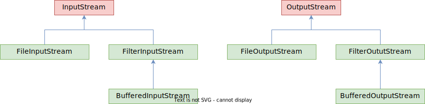
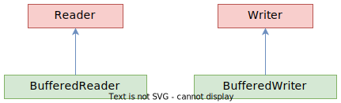

# Вопросы

- [ ] Что собой концептуально представляет поток (Stream)?
  - [ ] С потоком всегда связаны два понятия, располагающиеся "по разные стороны" потока. Что это за понятия?
  - [ ] Какие две ключевые операции связаны с потоком?
    - [ ] На какие виды делятся эти операции (связано с количеством обрабатываемых данных)?
    - [ ] Как эти операции соотносятся с абстрактными классами InputStream, OutputStream, Reader, Writer из пакета java.io?
  - [ ] Как и почему "символьная" работа с потоком упрощает обработку текстовых данных (связано с кодировками) по сравнению с "байтной" работой?
    - [ ] В каких сценариях работа с потоком как с байтами (или массивом байтов) может быть выгоднее, чем работа с ним как с символами?
- [ ] Как буферизованная обработка помогает эффективнее взаимодействовать с потоками?
  - [ ] Расскажите про возможность комбинирования разных типов потоков на примере объектов InputStream, InputStreamReader, BufferedReader
- [ ] Что такое каналы (pipes)?

# Задачи IO, источники и приемники

Пакет IO в предназначен для чтения\записи данных между источниками и приемниками.

Наиболее типичные источники\приемники данных:

- Files
- Pipes (средство обмена данными между тредами)
- Network Connections
- In-memory Buffers (e.g. arrays)
- System.in, System.out, System.error

Наиболее типичные задачи ввода\вывода:

- File Access
- Network Access
- Internal Memory Buffer Access
- Inter-Thread Communication (Pipes)
- Buffering
- Filtering
- Parsing
- Reading and Writing Text (Readers / Writers) 
- Reading and Writing Primitive Data (long, int etc.)
- Reading and Writing Objects

# Стримы (Stream)

Вся работа крутится вокруг концепции потока (стрима, Stream). Поток - это концептуально бесконечная последовательность данных. Поток присоединяется к источнику или приемнику данных. В поток можно писать или читать.

Чтение\запись в основе бывает двух видов:

* Чтение\запись байтов (классы java.io.InputStream и OutputStream)
* Чтение\запись символов (классы java.io.Reader и Writer)

Все эти четыре класса являются абстрактными и могут только в совсем базовые операции. Например, InputStream может, по сути, просто читать байты из источника. Может побайтно, может - по нескольку байт в массив. Метод чтения возвращает -1, если данных в источнике не осталось.

Посимвольная обработка нужна, чтобы упростить работу с текстом, т.к. один символ может кодироваться не одним байтом, а например двумя и больше.

Существуют буферизованные потоки, например, BufferedInputStream, BufferedReader. Во-первых, чтение пачками выгоднее, чем по одному байту\символу. Во-вторых, "пачка" может быть не просто набором, а, например, целой строкой и это делает обработку в разы удобнее.

Вообще, для перечисленных выше задач существуют разные реализации этих абстрактных классов, которые могут в более высокоуровневые вещи. Например, считать строку целиком.

## Схема классов (сокращенная)

Чтобы запомнить, кто из них байтовый, а кто символьный, можно прибегнуть к аналогии, если бы классы были людьми: читатели (Reader) и писатели (Writer) читают буквы (*символы*), поэтому Reader и Writer - работают с потоком как с символами. Значит ...Stream - работают с байтами.

### Байтовые



### Символьные




## Комбинирование стримов

Некоторые потоки можно комбинировать, чтобы добиваться нужного эффекта. Допустим, можно получить InputStream. Он оперирует байтами. А мы хотим прочитать его как строки. Для этого мы его передаем в InputStreamReader. Поскольку он Reader, то оперирует символами и таким образом преобразует прочитанные байты в символы. И все это мы еще помещаем в BufferedReader для увеличения скорости.

```java
// Грубоватый пример такой комбинации
URL url = new URL(fullUrl);
InputStream is = url.openStream();  // throws an IOException
BufferedReader br = new BufferedReader(new InputStreamReader(is));

while ((line = br.readLine()) != null) {
    System.out.println(line);
}
```

# IO примеры

## Файл - файл, байты

Читаем байты из файла и сразу же записываем прочитанные байты в другой файл. Сравнение скорости побайтного чтения и чтения пачкой:

```java
public class Main {
    public static void main(String[] args) throws Exception {
        String source = "E:/tmp/demo.mp4";  // 1200kb
        String target = "E:/tmp/demo_copy.mp4";

        try (
                InputStream istream = new FileInputStream(source);
                OutputStream ostream = new FileOutputStream(target);
        ) {
            runWithTimeTrack(() -> readBytesAsBatch(istream, ostream, 4096));  // 28 ms
            //runWithTimeTrack(() -> readOneByteAtTime(istream, ostream));  // 7626 ms
        }
    }

    private static void readOneByteAtTime(InputStream istream, OutputStream ostream) {
        try {
            int data;
            while ((data = istream.read()) != -1) {
                ostream.write(data);
            }
        } catch (Exception ex) {
            ex.printStackTrace();
        }
    }

    private static void readBytesAsBatch(InputStream istream, OutputStream ostream, int batchSize) {
        try {
            int readenBytesCount;
            byte[] data = new byte[batchSize];
            while ((readenBytesCount = istream.read(data)) != -1) {
                ostream.write(data, 0, readenBytesCount);
            }
        } catch (Exception ex) {
            ex.printStackTrace();
        }
    }

    private static void runWithTimeTrack(Runnable action) {
        LocalDateTime start = LocalDateTime.now();
        LocalDateTime from = LocalDateTime.from(start);
        System.out.println("Начали: " + start);

        action.run();

        LocalDateTime finish = LocalDateTime.now();
        System.out.println("Закончили: " + LocalDateTime.now());
        long millis = from.until(finish, ChronoUnit.MILLIS);
        System.out.println("Потрачено: " + millis);
    }
}
```


