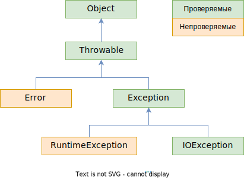

# Вопросы

- [ ] Какая связь между классами Throwable, Error, Exception, IOException, RuntimeException?
  - [ ] Что для компилятора означают проверяемые и непроверяемые (checked и unchecked) исключения? Какие из указанных выше исключений к какой категории относятся?
  - [ ] Что логически представляют собой исключения из ветки Error? Можно ли их выбросить самостоятельно? Аналогично расскажите про ветку Exception
  - [ ] Какой класс исключений из упомянутых подходит под определение "ошибки программиста"?
- [ ] Зачем к методу применять оператор throws?
  - [ ] Как он помогает "отсрочить" обработку проверяемых исключений?
  - [ ] Почему не стоит указывать в throws непроверяемые исключения? Объяснить с технической и логической точек зрения
- [ ] Объясните, как вы понимаете следующие правила
  - [ ] "Выбрасывать исключения надо как можно раньше, а обрабатывать как можно позже"
  - [ ] "Методы подкласса не должны выбрасывать более общее исключение, чем методы суперкласса"
- [ ] При объявлении своего исключения нужно два конструктора. Расскажите, что это за конструкторы? Какие параметры они принимают и что происходит у них внутри?
- [ ] Оператор catch
  - [ ] Что делает оператор catch вот в такой форме catch (FileNotFoundException | UnknownHostException ex) { ... ? Почему нельзя так поймать два исключения, если одно является потомком другого?
  - [ ] Почему в catch нужно располагать исключения в порядке, начиная с самого конкретного, а заканчивая самым общим?
- [ ] Для чего у исключений есть методы .initCause(ex) и .getCause()?
- [ ] Расскажите о работе try-catch-**finally** на следующих сценариях:
  - [ ] В try возникло исключение, его обработали в catch
  - [ ] В try возникло исключение, и в catch возникло еще исключение. Доработает ли программа до конца? Если нет, то в каком месте она остановится?
  - [ ] Что будет при исключении в try, если блока catch нет вообще, а есть только finally? А если исключение возникнет и в finally тоже?
    - [ ] Что такое suppressed (подавленные) исключения, которые можно получить из объекта исключения методом .getSuppressed? Как они образуются? Что нужно добавить в сценарий выше, чтобы поймать подавленное исключение?
  - [ ] Какая особенность есть у finally, когда дело касается оператора return? Если return есть и в блоке try, и в блоке finally и при этом не произошло исключений, то какой return сработает?
- [ ] Чем полезен паттерн, когда блок try-finally оборачивается в блок try-catch?
- [ ] Зачем нужен интерфейс AutoClosable с единственным методом .close? Как это связано с техникой "try с ресурсами"?
  - [ ] Как выглядел бы код, аналогичный по эффекту коду try с ресурсами?
  - [ ] В каком порядке выполняется код из .close, catch и finally, если в try с ресурсами возникает исключение? А если исключения не было?
  - [ ] Что если в .close возникает исключение? Как это связанно с suppressed-исключениями? Опишите на сценариях, когда в try есть исключение и когда его там нет

# Матчасть

## Схема классов

Базовый класс всех исключений - это класс *Throwable*. Да, это именно класс, а не интерфейс. Причем класс обычный, не абстрактный.

От него идут две крупные ветки:

* *Error* - это исключения, связанные с внутренними ошибками виртуальной машины джавы и нехваткой ресурсов. Самостоятельно выбросить исключение из этой ветки невозможно. Примеры: *StackOverflowError* (при бесконечной рекурсии), *OutOfMemoryError* (недостаточно памяти для создания новых объектов). Соответственно, ловить такие исключения смысла нет.
* *Exception* - это исключения, которые можно выбросить самостоятельно. Концептуально тоже делятся на:
  * *IOException* - логически, это ошибки, не зависящие от программиста (попытка чтения несуществующего файла. Например, сначала проверили существование, а потом пользователь удалил файл. Попытка получить объект Class, когда передано неправильное имя класса и т.д.)
  * *RuntimeException* - это "ошибки программиста", т.е. ошибки, которые могут возникнуть из-за невнимательности при программировании (обращение по null-ссылке, попытка получить элемент массива с несуществующим индексом и т.д.)

## Проверяемые и непроверяемые исключения

Все исключения делятся на **проверяемые** и **непроверяемые**. Непроверяемые - это наследники *Error* и *RuntimeException*. Проверяемые - это все остальные (по сути, *Throwable*,  *Exception* и *IOException* с наследниками). Проверяемые значит что компилятор в местах потенциального возникновения ошибки будет искать обработчик исключения, и если его нет, даст ошибку компиляции.



# Практика

## Оператор throws

При объявлении метода можно указать список исключений, которые он может выбросить. Делается это оператором `throws`:

```java
class MyExceptionA extends Exception {  }  // Проверяемое
class MyRtExceptionB extends RuntimeException {  }  // Непроверяемое

class Bar {
    public Bar() throws IOException {  // В конструкторах тоже можно указывать возможные исключения
    }
    
    // через throws указываем потенциальные исключения
    public void MethodA() throws MyExceptionA, MyRtExceptionB {  
        System.out.println("Bar.MethodA works fine");
    }
}

public class Main {
    public static void main(String[] args) {
        Bar bar = new Bar();  // Ошибка компиляции, т.к. не ловим проверяемое IOException
        bar.MethodA();  // Ошибка компиляции, т.к. MyExceptionA - тоже проверяемое исключение
                        // На MyRtExceptionB не ругается, т.к. оно НЕпроверяемое
    }
}
```

Ошибка тут будет только из-за *IOException* и *MyExceptionA*, потому что оно проверяемое (ведь наследуется от *Exception*). На *MyRtExceptionB* компилятор ругаться не будет, потому что оно непроверяемое, т.к. наследуется от *RuntimeException*. Отсюда вывод, что с *технической точки зрения* в *throws* имеет смысл указывать только исключения, относящиеся к проверяемым. С логической точки зрения, указывать в throws непроверяемые исключения не стоит, потому что они являются "ошибками программиста" и теоретически вообще не должны возникать. Поэтому их надо ловить на самом высоком уровне клиентского кода.

> Следует помнить о правиле, что методы подкласса не должны выбрасывать более общее исключение, чем методы суперкласса. Потому что если клиентский код ловит более частное исключение, то из-за полиморфизма мы не поймаем исключение, выброшенное потомком, если оно более общее.
>
> Мини-демо:
>
> ```java
> public class ParentExc extends RuntimeException {
> }
> ```
>
> ```java
> public class ChildExc extends RuntimeException {
> }
> ```
>
> ```java
> public class ParentClass {
>     public void m() {
>         throw new ChildExc();
>     }
> }
> ```
>
> ```java
> public class ChildClass extends ParentClass {
>     @Override
>     public void m() {
>         throw new ParentExc();
>     }
> }
> ```
>
> ```java
> public static void main(String[] args) {
>         ParentClass a = new ChildClass();  // <-- При таком раскладе не поймаем
>         try {
>             a.m();  // Выбрасывается ParentExc - более общее
>         } catch (ChildExc ex) {  // А мы рассчитываем на ChildExc
>             System.out.println("Поймали исключение ChildExc");
>         }
>         System.out.println("main() ends");
>     }
> ```

Насколько я понял, этот оператор нужен в основном для того, чтобы помечать собственные методы, которые могут сгенерировать *IOException* (или другое проверяемое исключение), но обработку хочется делегировать клиентскому коду. Допустим, мы в методе хотим читать из файла с помощью объекта *FileWriter*:

```java
import java.io.FileWriter;
...
public void MethodB() {
    FileWriter writer = new FileWriter("notes3.txt", false);  // Ошибка компиляции тут
}
...
.MethodB();
```

Если написать так, то не скомпилируется (ошибка *Unhandled exception: java.io.IOException*), потому что мы не обрабатываем потенциальные IO-ошибки. Но если подписать *throw*s:

```java
import java.io.FileWriter;
...
public void MethodB() throws IOException {
    FileWriter writer = new FileWriter("notes3.txt", false);
}
...
.MethodB();  // Ошибка компиляции теперь тут
```

То ошибка компиляции уйдет из непосредственно самого метода в место его вызова. Т.е. мы таким образом делегируем обработку потенциального исключения клиентскому коду.

> Есть такое правило - "выбрасывать исключения как можно раньше, а обрабатывать как можно позже". Потому что методы-работяги должны работать и только сообщать о проблемах, а думать как эти проблемы решать должен высокоуровневый клиентский код

## Создание и выброс исключений

При объявлении своего исключения делаем два конструктора:

```java
class MyRtExceptionB extends RuntimeException {
    public MyRtExceptionB() { }
    public MyRtExceptionB(String message) {
        super(message);
    }
}
```

Выбрасывать можно двумя способами:

```java
MyRtExceptionB exc = new MyRtExceptionB("Тестовая ошибка");
try {
    throw exc;  // Первый, через заранее созданный объект
}
catch (Exception ex) {
    System.out.println(ex.getMessage());
    throw new MyRtExceptionB("Палата №6");  // Второй, сразу же выбрасываем новый объект
}
```

## Способы перехвата

* В Java действует то же правило, что и в C# - первыми надо ловить более специфичные исключения:

  ```java
  try {
      throw new MyRtExceptionB();
  }
  catch (Exception ex) {
      System.out.println("Поймал исключение типа Exception");
  }
  catch (MyRtExceptionB ex) {  // Ошибка, даже не скомпилится, т.к. сюда попасть невозможно
      System.out.println("Поймал исключение типа MyRtExceptionB");
  }
  ```

  Дополнительная фишка - если компилятор видит попытку поймать вид исключения, который не может выброситься, он тоже не компилирует:

  ```java
  try {
      throw new MyRtExceptionB();
  }
  catch (MyExceptionA ex) {  // Ошибка компиляции, такое исключение не может возникнуть
      System.out.println("Поймал исключение типа MyExceptionA");
  }
  catch (Exception ex) {
      System.out.println("Поймал исключение типа Exception");
  }
  ```

* Если для двух видов исключений требуется одинаковая обработка, можно совместить их в одном блоке *catch* (доступно с Java 7):

  ```java
  try {
      if (args[0].length() > args[1].length())
          throw new FileNotFoundException();
      else
          throw new UnknownHostException();
  }
  catch (FileNotFoundException | UnknownHostException ex) {
      System.out.println("Поймал исключение, а толку?");
  }
  ```

  > Таким образом можно ловить исключения только в случае, когда одно не является потомком другого. Оба исключения из примера являются потомками *IOException*, поэтому все нормально. Но написать например `catch (Exception | UnknownHostException ex)` нельзя, была бы ошибка *Types in multi-catch must be disjoint: 'java.net.UnknownHostException' is a subclass of 'java.lang.Exception'*.

## Повторная генерация и цепочка исключений

Повторный выброс делается так:

```java
try {
    ...     
}
catch (Exception ex) {
    throw ex;
}
```

Цепочка формируется куда удобнее, чем в C#:

```java
try {
    try {
        throw new MyRtExceptionB("Что-то пошло не так");
    }
    catch (Exception ex) {
        MyRtExceptionB reason = new MyRtExceptionB("Демонстрация цепочек исключения");
        reason.initCause(ex);  // <-- В новое исключение добавляем исходную причину
        // reason.addSuppressed(ex);  // <-- Есть даже раздел под "подавленные" исключения
        // reason.getSuppressed();
        throw reason;
    }
}
catch (Exception ex) {
    Throwable cause = ex.getCause();  // <-- Получаем причину пойманного исключения
    System.out.println(cause.getMessage());
    System.out.println(ex.getMessage());
    ex.printStackTrace();
}

Что-то пошло не так
Демонстрация цепочек исключения
com.company.sampleprog.MyRtExceptionB: Демонстрация цепочек исключения
	at com.company.sampleprog.Main.main(Main.java:17)
Caused by: com.company.sampleprog.MyRtExceptionB: Что-то пошло не так
	at com.company.sampleprog.Main.main(Main.java:14)
```

## finally и особенности работы перехвата

Блок finally выполняется всегда, что бы ни случилось.

* Сценарий "Нормальный": исключение ловится, обрабатывается и новых исключений не возникает:

  ```java
  try {
      System.out.println("Начали выполнять try");
      throw new Exception();
  }
  catch (Exception ex) {
      System.out.println("Зашли в catch");
  }
  finally {
      System.out.println("Зашли в finally");
  }
  System.out.println("Добрались до последней части программы");
  
  Начали выполнять try
  Зашли в catch
  Зашли в finally
  Добрались до последней части программы
  ```

  После нормальной обработки исключения программа идет дальше своим ходом.
  
* Сценарий "Снова здарова": в catch опять возникает исключение, которое не ловится:

  ```java
  try {
      System.out.println("Начали выполнять try");
      throw new RuntimeException("test");
  }
  catch (Exception ex) {
      System.out.println("Зашли в catch");
      if (args.length < 20)
          throw new RuntimeException("test");
  }
  finally {
      System.out.println("Зашли в finally");
  }
  System.out.println("Добрались до последней части программы");
  
  Начали выполнять try
  Зашли в catch
  Зашли в finally
  ```

  finally отработал, но программа отвалилась, до последней строчки не добрались.

* Сценарий "Друзья помогут": В catch опять возникает исключение, которое ловится в вызывающем коде:

  ```java
  try {
      try {
          System.out.println("Начали выполнять try");
          throw new RuntimeException("test");
      } catch (Exception ex) {
          System.out.println("Зашли в catch");
          if (args.length < 20)
              throw new RuntimeException("test");
      } finally {
          System.out.println("Зашли в finally");
      }
      System.out.println("Добрались до последней части программы");  // X
  } catch (Exception ex) {
      System.out.println("Попали во внешний catch");
  }
  finally {
      System.out.println("Попали во внешний finally");
  }
  System.out.println("Hello, exceptions!");
  
  Начали выполнять try
  Зашли в catch
  Зашли в finally
  Попали во внешний catch
  Попали во внешний finally
  Hello, exceptions!
  ```

  До строчки *X* не добрались, но важно то, что сначала  выполнился внутренний finally и только потом попали во внешний catch.

* Сценарий "Поехавший": finally есть, а catch нету вообще:

  ```java
  try {
      if (args.length < 20)
          throw new RuntimeException("test");
  }
  finally {
      System.out.println("Зашли в finally");
  }
  System.out.println("До свидания");
  
  Зашли в finally
  ```
  
  ```java
  try {
      try {
  	    throw new RuntimeException("test");
      } finally {
      	System.out.println("Зашли в finally");
      }
  }
  finally {
      System.out.println("Попали во внешний finally");
  }
  System.out.println("До свидания");
  
  Зашли в finally
  Попали во внешний finally
  ```
  
    Все finally все равно выполняются, но до последней строчки не доходим, программа отваливается.

## finally и return

Поскольку finally выполняется всегда, то нужно осторожнее пользоваться return'ом, потому что return в finally перебивает остальные return'ы:

```java
public String MethodA() {
    try {
        return "Думаешь, вернется это?";
    }
    finally {
        return "Ничего подобного!";
    }
    return "Вот это поворот!";  // Строго говоря, эта строчка недостижима, так что compile error
}

Ничего подобного!
```

## try-finally паттерн

```java
try {
    try {
        throw new Exception();
    } finally {
        throw new Exception();
    }
}
catch (Exception ex) {
    System.out.println("Сделали вид, что обработали");
}
```

Плюсы такого паттерна в том, что мы разом ловим потенциальные исключения и в блоке try, и в блоке finally. При этом если какие-то ошибки происходят в try, их гарантированно можно обработать в finally, например, освободить ресурсы.

## try с ресурсами

### Интерфейсы AutoCloseable, Closeable

try c ресурсами это что-то вроде шарпового using'а, совмещенного с блоком catch. С Java 7 можно вместо такого:

```java
try {
    FileInputStream fin = new FileInputStream(args[0]);
    try {
        byte[] bytes = fin.readAllBytes();
    } finally {
        fin.close();
    }
}
catch (IOException ex) {
    System.out.println("А у вас молоко убежало!");
}
```

писать вот так:

```java
try (FileInputStream fin = new FileInputStream(args[0]),    // Можно указывать сразу несколько
    FileInputStream fin2 = new FileInputStream(args[1])) {  // ресурсов в одном блоке
    byte[] bytes = fin.readAllBytes();
}
catch (IOException ex) {  // Выполнится после освобождения ресурсов
    System.out.println("А у вас молоко убежало!");
}
finally {  // Выполнится после освобождения ресурсов
    ...
}
```

При этом класс, использованный таким образом в try, должен реализовывать интерфейс `AutoCloseable`. В нем единственный метод `.close()`, содержащий код по освобождению ресурсов.  Он выполняется перед catch и finally.

До Java 7 был интерфейс `Closeable`, тоже с одним методом *.close()*. Его особенностью было то, что он выбрасывал IOException. Поэтому, чтобы сделать возможность выбрасывать более общие исключения, они добавили AutoCloseable (он выбрасывает Exception), а Closeable сделали его потомком. Так что теперь предпочтительнее использовать AutoCloseable.

Сначала всегда выполнится тело .close(), а только потом поймается исключение. Пример:

```java
class MyAutoCloseable implements AutoCloseable {
    public void close() {
        System.out.println("Выполняем MyAutoCloseable.close()");
    }
}
...
try (MyAutoCloseable fin = new MyAutoCloseable()) {
    throw new Exception();
}
catch (Exception ex) {
    System.out.println("А у вас молоко убежало!");
}
finally {
    System.out.println("Выполяется finally");
}

Выполняем MyAutoCloseable.close()
А у вас молоко убежало!
Выполяется finally
```

### suppressed исключения

Подавленные исключения возникают, когда возникшее в блоке try исключение мы не обработали, и при этом в finally тоже возникло исключение. Тогда try'йное исключение называется "подавленным" и вкладывается в finally'ное. Получить его можно через метод .getSuppressed, он вернет массив Throwable.

Применительно к Autoclosable, может быть ситуация, когда и внутри .close() будет исключение. При этом есть два сценария:

1. Исключение было только в .close()
2. Исключение было и в try, и в .close()

Пример:

```java
class MyAutoCloseable implements AutoCloseable {
    public void close() throws Exception {
        System.out.println("Выполняем MyAutoCloseable.close(), сейчас будет исключение");
        throw new Exception("Исключение внутри MyAutoCloseable.close()");
    }
}
...
try (MyAutoCloseable fin = new MyAutoCloseable()) {
    //throw new Exception("Исключение в try");  // Сценарий 1, когда исключения в try нет
    throw new Exception("Исключение в try");  // Сценарий 2
}
catch (Exception ex) {
    System.out.println(ex.getMessage());  // try'йное исключение - внешнее, контейнер
    Throwable[] suppressed = ex.getSuppressed();  // .close'ное (или finally'ное) - подавленное, "вложенное"
    if (suppressed.length != 0)
        for (Throwable sup : suppressed)
            System.out.println(sup.getMessage());
}
finally {
    System.out.println("Выполяется finally");
}

// Сценарий 1
Выполняем MyAutoCloseable.close(), сейчас будет исключение
Исключение внутри MyAutoCloseable.close()
Выполяется finally

// Сценарий 2
Выполняем MyAutoCloseable.close(), сейчас будет исключение
Исключение в try
Исключение внутри MyAutoCloseable.close()
Выполяется finally
```

То есть в первом сценарии, когда в try нет исключения, а в .close() есть, исключение из .close() попадает в catch само как есть.

А во втором сценарии исключение из .close() добавляется вовнутрь исходного try-исключения. Таким образом, если нам надо получить именно исключения, возникшие в .close(), нужно искать их как подавленные в исходном исключении через метод getSuppressed().

