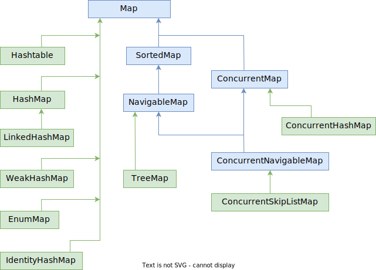

# Вопросы

> Вопросы я составил собственные, которые лично мне показались имеющими смысл. Всякие извращения добавлять не стал, можно про них почитать например [тут](https://habr.com/ru/post/162017/)

Общее

- [ ] Какие есть интерфейсы в Java Collection Framework?
  - [ ] Назовите отношения между интерфейсами:
    * List, Iterable, Collection, RandomAccess
    * Set, NavigableSet, SortedSet
    * Queue, BlockingQueue, Deque, BlockingDeque, TransferQueue
    * Map, ConcurrentMap, NavigableMap, SortedMap, ConcurrentNavigableMap
  - [ ] Какие основные действия эти интерфейсы позволяют выполнять с данными?
    - [ ] TODO: мб перечислить здесь некоторые операции и спросить, кто может, а кто не может их выполнять?

Списки и массивы

- [ ] Зачем нужен интерфейс RandomAccess? Есть ли в нем какие-нибудь методы?
- [ ] Расскажите об устройстве разных видов списков: односвязный, двусвязный, линейный, кольцевой
- [ ] Упорядочены ли элементы в списках и массивах? Т.е. можно ли надеяться на то, что при обходе элементы будут всякий раз идти в одинаковом порядке? Почему?

Хэш-таблицы

- [ ] Какая структура данных лежит в основе хэш-таблицы?

  - [ ] Какую роль играет хэш-функция в сохранении элемента в хэш-таблицу? Что принимает и что возвращает хэш-функция?

- [ ] Упорядочены ли элементы в хэш-таблице? Т.е. можно ли надеяться на то, что при обходе элементы будут всякий раз идти в одинаковом порядке? Почему? Как это связано с хэш-кодом элемента и изменением размера таблицы при перехэшировании?

- [ ] При добавлении элемента в ХТ может случиться коллизия. Что это значит и как это связано с хэш-функцией?

  - [ ] Что означает термин "кластер", когда речь идет о коллизиях?

  - [ ] Есть несколько способов решения коллизий, расскажите про каждый:

    * Связный список
    * Линейное пробирование (и его подвид квадратичное пробирование)
    * Повторное хэширование

    Какой из них является наиболее эффективным?

- [ ] Что такое параметр load factor у хэш-таблицы? Что происходит, когда заполненность таблицы приближается к его значению? Какой load factor признан оптимальным и используется по умолчанию в структурах данных, основанных на хэш-таблицах?

- [ ] Почему, если изменить уже сохраненный в хэш-таблицу элемент, можно больше его не найти, а в худшем случае - найти вообще другой элемент?


Деревья

- [ ] Если говорить о деревьях в целом, то сколько детей и родителей может быть у каждого элемента?
- [ ] Что значит "бинарное сбалансированное" дерево?
  - [ ] Сколько родителей и детей может быть у элемента в бинарном дереве?
  - [ ] По какому принципу в бинарном дереве элементы попадают в левую и правую ветку?
  - [ ] В чем заключается "сбалансированность" бинарного дерева и зачем она нужна?
  - [ ] Является ли красно-черное дерево бинарным? А сбалансированным?
- [ ] Какая скорость выполнения операций у дерева?

Очереди и стеки

- [ ] Упорядочены ли элементы в очереди и стеке? Т.е. можно ли надеяться на то, что при обходе элементы будут всякий раз идти в одинаковом порядке?
- [ ] Расскажите про принципы LIFO и FIFO. Как они связаны с очередью и стеком?
- [ ] Чем двусторонняя очередь ("дек") отличается от обычной очереди?
- [ ] Какие классы можно использовать, если нужна очередь или стек?

Множество и словарь

- [ ] Какая связь между структурой данных "множество" и математическим понятием "множество"?
  - [ ] Могут ли в множестве быть одинаковые элементы? А в словаре?
- [ ] В каком виде хранятся данные в словаре (концептуально, не привязываясь к реализации)?
- [ ] Как можно найти конкретный элемент в множестве? А в словаре?
- [ ] Как порядок элементов в множестве и словаре зависит от лежащей в их основе структуры данных? Можно ли как-то сохранить порядок, в котором элементы добавляются?
- [ ] Что будет, если изменить данные в уже сохраненном в хэш-таблицу элементе? А в случае словаря?
- [ ] Какая скорость выполнения операций у множества и словаря?
- [ ] Какие классы можно использовать, если нужно множество или словарь?

# Структуры данных базовые

Предисловие: под "элементы упорядочены" предполагается, что при каждом обходе элементы будут идти в одном и том же порядке. "Элементы не упорядочены" значит, что порядок зависит от реализации и в общем не следует рассчитывать на то, что элементы при обходе каждый раз будут выданы в одном и том же порядке.

> Базовыми структурами данных я их назвал по признаку организации в памяти. Т.е. либо элементы лежат последовательно, либо в разных участках памяти и имеют ссылку на связанные с ними участки.

## Массив (вектор)

Массив (array) или "вектор" (vector) - это СД, в которой:

* Элементы упорядочены
* Элемент можно получить по числовому индексу

## Список

"List" - это СД, в которой:

* Элементы упорядочены
* Помимо данных, элементы хранят ссылки на другие элементы

В зависимости от того, на какие именно элементы хранятся ссылки, списки бывают:

* Односвязный список - каждый элемент хранит ссылку только на следующий элемент
* Двусвязный список - каждый элемент хранит ссылку и на следующий, и на предыдущий элемент

И в дополнение к этому:

* Линейный список - у списка есть начало и конец, т.е. ярко выраженный первый и последний элемент
* Кольцевой список ("циклический") - "последний" элемент и "первый" связаны, т.е. образуется этакое "кольцо"

Т.о. комбинации этих видов дают 4 типа связных списка: ЛОС, ЛДС, КОС, КДС

> Какие бывают списки кроме "связных" - найти почему-то не удалось, хотя не раз встречалось утверждение, что "связный" список это только одна из разновидностей списка, который сам по себе является абстрактным понятием

Сам список это больше "техническая" структура данных, она не определяет правила добавления и извлечения элементов. На основе списка строятся СД "очередь" и "стек", которые, используя эту "техническую" основу, определяют логику добавления и извлечения.

## Дерево

*Дерево* - это структура данных, в которой у каждого элемента мб 0..n дочерних элементов. Да, именно несколько, а не обязательно только 2. У такого "обычного" дерева только одно требование - у каждого элемента мб только один родитель.

*Двоичное (бинарное) дерево* - это дерево, у которого:

* У каждого элемента не более двух детей
* "Левые" дети всегда меньше родителя, а "правые" дети - всегда больше родителя

*Сбалансированное дерево (B-дерево)* - это дерево, у которого высота левого и правого поддеревьев отличается не более чем на 1.

*Красно-черное дерево* - это подвид сбалансированного дерева. КЧ-дерево является двоичным. Тут высота может быть считается как-то по-другому, судя по картинкам не всегда разница между ветками в высоту равняется 1, но суть в том, что оно все-таки сбалансированное, т.е. поиск в нем происходит быстрее, чем если оно было несбалансированным. Ну а все остальные принципы у него как у двоичного дерева, т.е. левые - меньше, правые - больше, и только по два ребенка у родителя.

## Хэш-таблица

> Все нижеописанное является теоретической основой, без привязки к реализации. Т.е. вопросы вроде "а что пропускается через хэш-функцию в Map - ключ или что?" - не для этого раздела, а для раздела, посвященного Map'у.

Хэш-таблица используется, когда требуются быстрые вставка\удаление\поиск. Ее особенностью является отсутствие определенного порядка хранения элемента.

Хэш-таблица - это "обычный массив с необычной индексацией". Это значит, что в основе ХТ лежит обычный массив, но просто индекс ячейки, в которую нужно поместить элемент при добавлении, вычисляется особым способом - с помощью хэш-функции.

Хэш-функция принимает элемент и возвращает *индекс* массива для хранения этого элемента.

Если в ячейке пусто, то элемент просто добавляется. Если уже занято, эта ситуация называется коллизией и приходится размещать два (и более) элемента в одном месте. Коллизия решается разными способами:

* Связный список - каждая ячейка массива хранит не сами элементы, а ссылку на связный список с элементами. В случае коллизии в список просто добавляется новый элемент

* Линейное пробирование - если ячейка занята, то проверяется следующая за ней ячейка. Если она свободна, то элемент добавляется в нее, иначе поиск свободной ячейки продолжается дальше. Т.е. в отличие от способа со списком, все элементы хранятся непосредственно в ячейках массива. Есть и другие способы поиска свободной ячейки, например, *квадратичное пробирование* - когда берется не $i+1$, а $(i+1)^2$, $(i-1)^2$, $(i+2)^2$, $(i-2)^2$ и т.д. Но как ни крути, коллизии всегда приводят к образованию *кластеров* - нескольких разных элементов с одинаковым хэш-кодом - и приходится обойти весь кластер, чтобы найти нужный элемент

* Повторное хэширование - имеется несколько хэш-функций *H1, H2... Hn*. Сначала элемент проходит через H1. Если она выдает ячейку, которая уже занята, тогда элемент проходит через H2 и т.д., пока не найдется свободная ячейка. Хэш-функции подбираются таким образом, чтобы выдаваемые ими индексы ячеек гарантированно не повторялись. Этот метод эффективнее первых двух. Пример Hk хэш-функции:

  ```
  Hk(key) = [GetHash(key) + k * (1 + (((GetHash(key) >> 5) + 1) % (hashsize - 1)))] % hashsize
  ```

>На деле, описания методов разрешения коллизий вызывают кучу вопросов, путаницу в терминологии и вообще трудно составить однозначную картину. Но поскольку конкретная реализация спрятана под капотом, это в общем-то и не важно. Просто помним, что коллизии бывают и что разрешаются они разными способами.

С хэш-таблицей связаны несколько терминов:

* Bucket - это ячейка массива. В одной ячейке может храниться и несколько элементов, если они организованы в список.
* Capacity - это текущее количество бакетов в хэш-таблице (ячеек массива).
* Initial capacity - это количество бакетов на момент создания хэш-таблицы.
* Load factor - это число, которое показывает, насколько допустимо заполнить таблицу до проведения перехэширования. Выражается отношением `m/n`, где m - текущая заполненность, а n - общее количество слотов ("размер таблицы"). Дефолтное значение load factor примерно 0.75. Пример: пусть всего у нас будет 17 слотов. 11/17=0.64, а 13/17=0.76 Это значит, что когда в таблице окажется 13 элементов, будет проведено перехэширование. Т.е. выделится массив в два раза больше текущего, для каждого элемента повторно вычислится хэш-функция и элементы займут свои места в новом массиве.

# Структуры данных логические

Здесь структуры данных перечислены по принципу работы. В их основе могут лежать разные базовые СД. Например, множество может быть реализовано через дерево или через хэш-таблицу. Очередь можно при желании реализовать и через массив, хоть он для этого и не подходит.

## Стек

"Stack" - это СД, для которой характерно:

* Элементы упорядочены
* Работа по принципу LIFO - "последним вошел, первым вышел". Элементы добавляются и извлекаются с одного конца, который называется "вершиной" стека
* Классические операции добавления и извлечения - push и pop. При извлечении элемент удаляется из стека

## Очередь

"Queue" - это СД, для которой характерно:

* Элементы упорядочены
* Работа по принципу FIFO - "первым вошел, первым вышел". У очереди есть "голова" (head) и "хвост" (tail). Добавляются элементы в хвост, а извлекаются из головы
* Классическая операция добавления - push, а извлечения pop. При извлечении элемент удаляется из очереди

## Двусторонняя очередь

Или "Дек", "Deque" - Double Ended QUEue -  это СД, для которой характерно:

* Элементы упорядочены
* Можно добавлять и удалять элементы на обоих концах очереди

## Множество

Множество "Set" - это СД, некий аналог математического множества. Как правило, основные характеристики:

* Отсутствие повторяющихся элементов
* Отсутствие определенного порядка в хранении элементов

Основные операции - объединение, пересечение, разность, подмножество (является ли одно множество подмножеством другого).

Множество не предназначено для извлечения элемента. Поиск заключается только в ответе на вопрос "Есть ли такой элемент или нет". Хотя конечно можно обойти все множество, каждый элемент сравнить с каким-то условием и при совпадении вернуть, но если такое нужно делать, значит выбор множества - неправильное решение.

## Словарь (ассоциативный массив)

"Словарь" или "ассоциативный массив", "Map", "Dictionary" - это СД, для которой характерно:

* Данные хранятся в виде пары ключ-значение
* Доступ к элементам осуществляется по этому ключу
* Отсутствие определенного порядка в хранении элементов

Словарь хорошо подходит для поиска и извлечения элементов.

# Схема интерфейсов

https://docs.oracle.com/en/java/javase/12/docs/api/java.base/java/util/doc-files/coll-overview.html


# Реализации

Абстрактные классы не показаны, чтобы не загромождать схемы и чтобы было сразу видно, какой конкретный класс какой интерфейс реализует.

## List


## Set


## Queue


## Map



