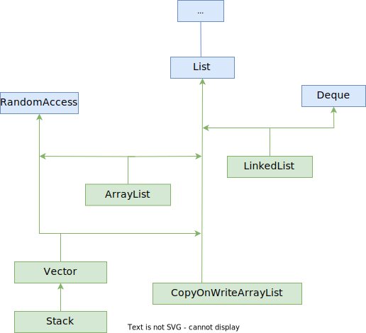

Сильно возиться со списками очень не хочется, потому что вроде бы все просто, но при желании можно закопаться очень далеко и глубоко, настолько, что может ничего из этого и не пригодится почти никогда.

# Резюме

Упорядоченная коллекция, для которой характерно следующее:

* Соблюдается порядок элементов. Т.е. в каком порядке добавили, в таком и обошли

* Произвольный доступ, т.е. можно получить элемент по индексу

  Нужно учитывать, что производительность может быть плохой в зависимости от реализации. LinkedList тоже поддерживает доступ по индексу, но пользоваться этой возможностью лучше не надо

* Дублирующиеся элементы не запрещены

Список умеет все то же, что и коллекция, плюс:

* Сортировать свои элементы
* Возвращать\устанавливать элемент по индексу
* Все, что может быть связано с индексацией: удалять промежуток, возвращать промежуток



Зачем существуют классы AbstractCollection и AbstractList (не показаны на схеме, чтобы не загромождать ее), если есть интерфейсы Collection и List? Если концептуально, то в абстрактных классах находится дефолтная реализация некоторых методов. Но почему бы ее не поместить тогда в интерфейсы, в дефолтные методы? Как минимум потому, что такая возможность появилась только в Java 8, а фреймворк коллекций был и раньше.

# RandomAccess

Это абсолютно пустой интерфейс, нужный по сути только для пометки, что коллекция "нативно" поддерживает доступ по индексу. Этим интерфейсом помечены классы ArrayList и Vector < Stack, но не помечен LinkedList.

# Краткий обзор методов

```java
public interface List<E> 
    extends Collection<E> {
         .add(item);
        +.add(index, item);
         .addAll(Collection);
        +.addAll(index, Collection);
    
        +.get(index);
        +.set(index, item);
    
        +.sort();
    
        +.indexOf(Object);
        +.lastIndexOf(Object);
        
        +.replaceAll(lambda);
        
        +.subList(from, to);
    
         .remove(Object);
        +.remove(index);
         .removeAll(Collection);
         .removeIf(Predicate);
    
         .retainAll(Collection);    
    
        +.listIterator();
        +.listIterator(index);
    
         .contains(Object);
         .containsAll(Collection);
    
         .size();
         .isEmpty();
         .clear();
    ...
         .equals(Object);
    
         .stream();    
         .parallelStream();
    
         .spliterator();
        
         .toArray();
         .toArray(T[] arr);
}
```

## listIterator

Возвращает "списочный" итератор, который в отличие от обычного итератора, умеет двигаться не только вперед, но и назад.

# Представители

## LinkedList

Список, где элементы идут в памяти не подряд и имеют ссылку друг на друга (двусвязный список).

На его основе также написана реализация Deque, потому что удобно. Эта реализация позволяет использовать LinkedList и в качестве стека в том числе, методы позволяют, но об этом в разделе про очереди. В качестве списка же LinkedList умеет все из интерфейса List и даже доступ по индексу, хотя и не так эффективно, как ArrayList.

## ArrayList

Список, основанный на массиве, который может изменять свой размер:

```java
public class ArrayList<E>
    extends AbstractList<E>
    implements List<E>, RandomAccess, Cloneable, Serializable {
        +.removeRange(from, to);
    
        +.ensureCapacity(100);
}
```

Особенности:

* При заполнении изменяет свой размер на +50% от текущего
* Разрешает хранить null
* Несинхронизированный

```java
import java.util.ArrayList;

ArrayList<String> arr1 = new ArrayList<>(
    Arrays.asList("Tom", "Huck", "Becky", "Sid", "Joe")
);
```

### Добавление, резервирование

При создании обычного массива все ячейки сразу инициализируются и доступны для использования. При создании ArrayList, несмотря на резервирование места под некоторое количество элементов, фактически никаких элементов до реального добавления не существует и работать с ними, соответственно, нельзя.

Для резервирования места под определенное количество элементов есть два способа:

```java
Employee john = new Employee("John Carter");
Employee abby = new Employee("Abby Lockhart");
Employee carry = new Manager("Carry Weaver");

var employees = new ArrayList<Employee>(128);  // 1. Указываем сразу при объявлении

var employees = new ArrayList<Employee>();
employees.ensureCapacity(40);  // 2. Расширяем память под элементы в произвольный момент
employees.add(john);  // Добавить элемент в конец
employees.add(abby);
employees.add(carry);
employees.ensureCapacity(500);
```

Добавлять можно не только в конец ArrayList, но и в указанную позицию, со сдвигом остальных элементов:

```java
employees.add(2, john);
```

При этом эта вторая позиция очевидно должна существовать, иначе `IndexOutOfBoundsException`. Конкретно в этом примере  у нас три элемента уже добавлено и можно было написать `.add(3, john)` и тогда это было бы аналогично обычному add и элемент добавился бы в конец списка. А вот `.add(4, john)` уже вызвало бы исключение, поскольку реально существует только три элемента.

Доступ к элементам возможен только через специальные методы `.get(i)` и `.set(i, item)` (в отличие от C#, где можно было использовать синтаксис [i] даже со списком):

```java
Employee emp = employees.get(2);
employees.set(3, emp);
```

### Перегон в обычный массив

Первый способ подразумевает предварительное создание массива, а потом уже копирование в него элементов. Характерен тем, что можно указать нужный тип массива самостоятельно:

```java
Employee[] arr = new Employee[employees.size()];
employees.toArray(arr);

for (Employee item : arr)
	System.out.println(item);
```

Второй способ подразумевает автоматическое создание массива и запись в него элементов. Но при этом создается массив типа Object:

```java
// Employee[] arr = employees.toArray();  // Ошибка, toArray() возвращает Object[]
Object[] arr = employees.toArray();

for (Object item : arr) {
	System.out.println(item);
    System.out.println(((Employee)item).getName());
}
```

Как следствие, придется приводить элементы, прежде чем обращаться с ними как с сотрудниками.

## Vector

По сути это тоже список, основанный на массиве, то же самое что ArrayList, за исключением того, что Vector *синхронизированный*, т.е. если поток А что-то делает с вектором, то другие потоки не могут с ним ничего делать, пока поток А не освободит его.

Кроме того, отличается в мелочах, например, когда заканчиваются слоты, вектор увеличивает размерность массива на 100%, в то время как ArrayList на 50% и вектор позволяет указать явно, на сколько надо увеличивать.

ArrayList - это выбор для большинства случаев. Его можно синхронизировать самостоятельно, если нужно, так что вектор - легаси.

## Stack

Не нужно использовать. Об этом сказано даже в документации джавы. Дремучее легаси с ошибками - наследуется от вектора, значит имеет лишние, не характерные для стека операции.
