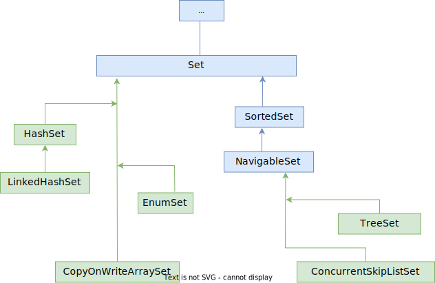

# Вопросы

- [ ] Все реализации Set базируются на соответствующих реализациях Map: HashSet на HashMap, TreeSet на TreeMap, LinkedHashSet на LinkedHashMap. Объяснить за счет чего это возможно.
  - [ ] Когда мы добавляем в Set элемент, то что сохраняется в ключ, а что - в значение нижележащей записи Map'ы?

# Set



## В двух словах

Set - это "множество из математики", а множество не может содержать два одинаковых элемента. Следовательно, используй Set, если:

* Нужен набор *без повторяющихся элементов*. Если попробовать добавить повторяющийся элемент, он просто не добавится, исключений не возникнет.

При этом:

* Порядок элементов не важен? Используй HashSet
* Хочешь, чтобы элементы шли в том порядке, в котором добавляешь? Используй LinkedHashSet
* Хочешь, чтобы элементы были отсортированы и можно было делать всякое вроде "найти элементы больше такого-то"? Используй TreeSet
* В HashSet и LinkedHashSet можно добавить null, в TreeSet - нельзя, будет исключение. Почему - читай ниже

Все реализации Set основаны на одноименных реализациях Map. Это возможно за счет того, что запись мэпы имеет два слота - один под ключ, и один под данные. Поэтому под капотом любого сета есть мэп, и добавляемый в Set элемент просто сохраняется как ключ, а в данные сохраняется пустой объект-болванка.

## Интерфейс Set

* Нужно с осторожностью добавлять в Set изменяемые объекты. Т.к. на момент добавления элемент может быть уникальным, но если его изменить, он может перестать быть уникальным и тогда поведение Set может быть непредсказуемым: у измененного объекта меняется хэш и поэтому его уже не удастся найти в множестве, или если его хэш каким-то образом совпадет с другим объектом, тогда ответ на вопрос "есть ли такой элемент" может быть заведомо ложным

```java
public interface Set<E>
	extends Collection<E> {
		// Ничего нового к методам Collection не добавляет
}
```

## Интерфейс SortedSet

* Поддерживает порядок элементов *по возрастанию*. Добавляемый элемент должен реализовать интерфейс Comparable, чтобы можно было сравнить его с другими и найти ему место.

```java
public interface SortedSet<E>
	extends Set<E> {
        +.comparator();    +.headSet();
        +.first();         +.tailSet();
        +.last();          +.subSet();
}
```

В этом интерфейсе появляются новые методы именно за счет наличия порядка среди элементов:

* first\last - первый\последний элемент

* headSet\tailSet - вернуть подмножество, элементы в котором младше\старше указанного. Например:

  ```java
  [1, 2, 3, 4, 5, 6, 7, 8]
  headSet(4) = [1, 2, 3]  // Сам элемент не входит
  tailSet(4) = [4, 5, 6, 7, 8]  // Здесь, включая сам элемент
  ```

  P.S. У конкретной реализации, например, TreeSet, в headSet есть второй параметр - включать или нет сам элемент. Но в общем интерфейсе такого параметра нет. Поэтому в таких случаях стоит помнить, что конкретные реализации могут иметь что-то собственное.

* subSet - вернуть подмножество между двумя элементами. Например:

  ```java
  [1, 2, 3, 4, 5, 6, 7, 8]
  subSet(4, 6) = [4, 5]
  ```

  Аналогичная ситуация и здесь. У TreeSet есть настройки включения\исключения элементов.

## Интерфейс NavigableSet

Это множество с более продвинутыми операциями поиска.

```java
public interface NavigableSet<E>
	extends SortedSet<E> {
        +.ceiling();    +.pollFirst();
        +.floor();      +.pollLast();
        +.higher();     +.descendingIterator();
        +.lower();      +.descendingSet();
}
```

Методы похожи на SortedSet, только более гибкие:

* ceiling\floor - вернуть *один* элемент, который больше\меньше (или равен) заданного. Если такого нет, возвращает null:

  ```java
  [10, 20, 32, 45, 56, 74]
  ceiling(6) = 10  // Т.к. первое число, больше 6, это 10
  floor(6) = null  // Т.к. меньше 6 нет элементов
  floor(15) = 10
  ```

* higher\lower - вернуть один элемент, который *строго* больше\меньше заданного. Если такого нет, возвращает null.

* descendingSet - возвращает то же множество, только элементы расположены по убыванию.

* pollFirst\pollLast - возвращает и удаляет младший\старший элемент.

В NavigableSet уже появляется возможность выставлять включение\исключение элемента при выборе подмножества.

# Представители обычные

## HashSet

* Реализует интерфейс Set
* Не потокобезопасен
* Итераторы fail-fast
* Логически основан на принципе хэш-таблицы, фактически базируется на HashMap
* Порядок итерации не подчиняется никаким правилам и со временем может измениться (наверное, после перехэширования)
* Разрешается вставлять null. Можно вставлять null несколько раз, но поскольку это множество, а значит дубликтов нет, то в результате будет только один null элемент
* Обеспечивает постоянное время к операциями добавления, удаления, поиска и определения размера.

Если производительность обхода важна, нельзя задавать слишком большую изначальную емкость и также нужно чтобы заполненность не была слишком низкой. Т.е. если емкость 100 элементов, а фактически добавлено 15, то обход этих 15 будет занимать времени как обход всей 100.

HashSet реализован на основе HashMap. Метод добавления внутри выглядит так:

```java
public class HashSet<E>
    extends AbstractSet<E>
    implements Set<E>, Cloneable, java.io.Serializable
{
    ...
    private transient HashMap<E,Object> map;  // <-- В основе лежит HashMap
    ...
    private static final Object PRESENT = new Object();  //  <-- Заглушка для значения
    ...
    public boolean add(E e) {  // <-- Добавление реализовано через метод Map'ы
        return map.put(e, PRESENT)==null;
    }
}
```

Т.е. добавляемый элемент становится ключом map'ы, а значение - пустой объект-заглушка.

### Насчет null

Можно посмотреть чуть подробнее в конспекте про Map, раздел HashMap, но если вкратце, то когда в качестве ключа добавляется null, то вместо того чтобы считать хэш от null, просто используется 0. Поэтому null по сути является полноценным значением.

## LinkedHashSet

* Реализует интерфейс Set
* Разрешается вставлять null
* Поддерживает порядок итерации - как добавили, так и обошли
* Постоянное время для вставки, удаления, поиска
* Обход занимает ровно столько времени, сколько фактически содержится элементов, за счет того, что это все-таки список

LinkedHashSet под капотом работает на основе LinkedHashMap, а внутри LinkedHashMap каждый элемент представлен вот таким классом:

```java
static class Entry<K,V> extends HashMap.Node<K,V> {
    Entry<K,V> before, after;
    Entry(int hash, K key, V value, Node<K,V> next) {
        super(hash, key, value, next);
    }
}
...
transient LinkedHashMap.Entry<K,V> head;
...
transient LinkedHashMap.Entry<K,V> tail;
```

Т.е. стандартный узел дополняется еще ссылками на следующий и предыдущий элемент. Кроме того, есть ссылки на начало и конец списка. Таким образом, элементы попадают в хэш-таблицу как обычно, но просто еще имеют ссылки друг на друга.

В остальном принцип такой же как и у HashSet+HashMap: элемент хранится в ключе map'ы, а в качестве данных - пустой объект-заглушка.

## TreeSet

* Базируется на TreeMap (поэтому все остальные пункты просто скопированы из описания TreeMap)

  ```java
  private transient NavigableMap<E,Object> m;
  ...
  public TreeSet() {
      this(new TreeMap<>());
  }
  ```

* Использует красно-черное дерево

* Поэтому для операций добавления, удаления, извлечения и contains дает сложность $log_{2} n$

* Порядок элементов - так называемый natural ordering, т.е. элементы или должны реализовывать интерфейс Comparable, или структуре при создании нужно передать Comparator, чтобы она знала, как сравнивать элементы

* null не допускается. Но когда-то давно, до 7 джавы, допускалось добавлять null первым элементом, после чего уже ничего нельзя было добавить и ничего не работало, но теперь null запрещен

* Не синхронизирован

# Представители конкурентные