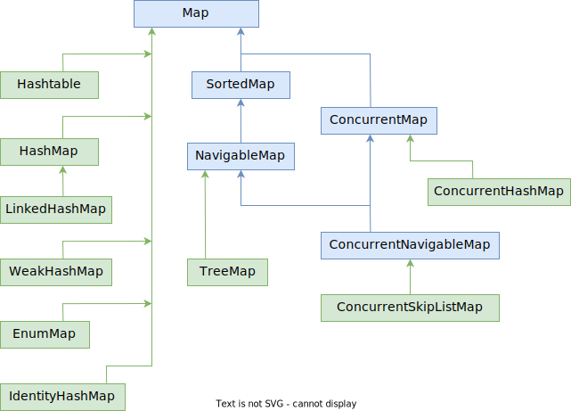

# Map

Map - это структура, хранящая пары "ключ - значение". Одному ключу может соответствовать строго одно значение.

# Представители

## Hashtable

## HashMap

Разрешен null в ключах и значениях. Не гарантирует определенный порядок элементов и сохранение этого порядка с течением времени. Добавление\удаление за константное время, итерация - за вре

## TreeMap

